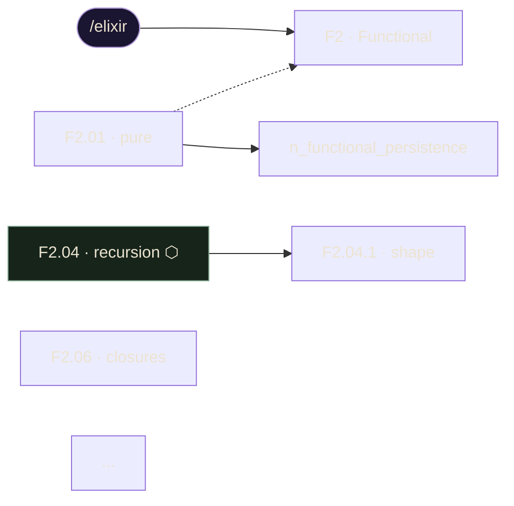

# 02 — Navigation graph: extraction and emission

This document specifies `internal/graph` and the `cms graph` command. The navigation graph
is the **structural** model of the course: which pages exist and how a reader moves between
them. Nodes are pages; edges are the structural links — pager prev/next, hub→subpage, and
breadcrumb. The graph is emitted as Graphviz `dot`, Mermaid, or JSON.

The graph is derived from the manifest (`docs/specs/01-manifest.md`) for its node set and its
intended structure, and optionally cross-checked against the built filesystem
(`docs/specs/00-overview.md` §3) for which nodes are actually present. It is read-only.

## 1. Node model

A node is one page. Nodes come from the manifest, not from scraping HTML, so the graph is
stable and independent of authoring state.

```go
type NodeKind int

const (
    KindRoot    NodeKind = iota // the /elixir section root
    KindChapter                 // a chapter hub (F0..F6)
    KindModule                  // a numbered module
    KindSubpage                 // a deep-dive subpage
)

type Node struct {
    ID       string        // stable graph id (see §1.1)
    Kind     NodeKind
    Label    string        // human label, e.g. "F2.04 · recursion"
    Route    string        // clean URL, e.g. "/elixir/functional/recursion"
    File     string        // resolved file path under root (see §3), "" if unresolved
    Status   string        // manifest status: live|built|planned|soon
    Linkable bool          // status in {live, built}
    Exists   bool          // file present on disk (only set when a root is supplied)
}
```

### 1.1 Node identity

Node IDs are derived from the route so they are stable and emitter-safe (Graphviz/Mermaid
identifiers cannot contain `/`, `.`, or spaces). The ID is the route with the leading
`/elixir` stripped, slashes replaced by `_`, and a leading `n` prefix:

- `/elixir` → `n_root`
- `/elixir/functional` → `n_functional`
- `/elixir/functional/recursion` → `n_functional_recursion`
- `/elixir/functional/recursion/shape` → `n_functional_recursion_shape`

IDs are unique because routes are unique.

### 1.2 Node set

The node set is the full declared structure, regardless of status (planned pages are nodes
too, so the graph shows the whole course shape):

1. one `KindRoot` node for `/elixir`;
2. one `KindChapter` node per chapter in `manifest.Chapters`;
3. one `KindModule` node per module in `manifest.Modules`;
4. one `KindSubpage` node per subpage in `manifest.Subpages`.

`Status`, `Linkable`, and `Label` come from the manifest. `File`/`Exists` are filled by the
resolver in §3 when `--root` is supplied; otherwise `Exists` is false and `File` is empty,
and the graph is a pure manifest view.

## 2. Edge model

```go
type EdgeKind int

const (
    EdgeBranch    EdgeKind = iota // root -> chapter (structural spine)
    EdgePager                     // prev/next reading order between sibling pages
    EdgeHubDive                   // a hub/module -> one of its subpages
    EdgeBreadcrumb                // a page -> its parent (chapter/module/root)
)

type Edge struct {
    From string   // node ID
    To   string   // node ID
    Kind EdgeKind
}
```

Edges are derived from the manifest's structure, matching how the built pages wire
themselves (the pager block, the on-page hub cards, and the breadcrumb trail):

- **Branch** (`EdgeBranch`): `n_root → n_<chapter>` for every chapter. The spine shown at the
  top of the course map.

- **Pager** (`EdgePager`): the linear reading order. Within a chapter the modules read
  F‹c›.01 → F‹c›.02 → … → F‹c›.09. Where a module has subpages, the reading path threads
  **through** them: the hub links forward to its first subpage, the subpages chain in order,
  and the last subpage links on to the next module. Concretely, the ordered reading sequence
  for a chapter is produced by walking its modules in order and, for each module that has
  subpages, splicing the module's subpages (in `Subpages[n]` order) immediately after the
  module node. `EdgePager` edges connect each consecutive pair in that flattened sequence.
  This reproduces the F2 navigation described in the brief: `… → F2.03 → F2.04(hub) →
  F2.04.shape → F2.04.tail-calls → F2.04.patterns → F2.05(hub) → F2.05.map → …`.
  Pager edges are emitted as the forward direction; the pager is bidirectional on the page,
  but the graph records the forward order and the emitters may render it undirected where the
  format prefers (see §4).

- **Hub→dive** (`EdgeHubDive`): `n_<module> → n_<module>_<subpage>` for each subpage of a
  module. These are the on-page hub cards that link a hub directly to each of its dives, in
  addition to the pager thread. A module with subpages therefore has both one `EdgeHubDive`
  to each subpage and `EdgePager` edges into and out of the threaded sequence.

- **Breadcrumb** (`EdgeBreadcrumb`): every non-root node points at its parent — a subpage at
  its module, a module at its chapter, a chapter at the root. This is the breadcrumb trail
  (`.crumbs`) each page carries.

Edge determinism: edges are generated in a fixed order — all `EdgeBranch` (chapter order),
then all `EdgePager` (chapter order, then reading order), then all `EdgeHubDive` (module
order, then subpage order), then all `EdgeBreadcrumb` (node order). Duplicate edges (same
From/To/Kind) are deduplicated.

## 3. Clean-URL → file resolution

When `--root DIR` is supplied, each node's `File`/`Exists` is filled by the shared resolver
(`docs/specs/00-overview.md` §3), which mirrors the server's folder-routing. For a content
root `R` and a route `/elixir/<path>`:

| Route shape | Candidate file(s), in order |
|---|---|
| `/elixir` (root) | `R/index.html` |
| `/elixir/<path>` (leaf) | `R/<path>.html`, then `R/<path>/index.html` |
| `/elixir/<path>` (hub/dir) | `R/<path>.html`, then `R/<path>/index.html` |

`Resolve(root, route) (file string, exists bool)`:

1. Strip the `/elixir` prefix to get `<path>` (the empty string for the root).
2. For the root, the single candidate is `R/index.html`.
3. Otherwise try `R/<path>.html`; if it exists, return it.
4. Otherwise try `R/<path>/index.html`; if it exists, return it.
5. If neither exists, return the **leaf** candidate `R/<path>.html` as `File` with
   `exists = false`, so callers can report the route's expected location.

The leaf-before-index order matters where a hub also has a sibling leaf; it matches the
server's `try_files` cascade so `cms`'s "backing file" agrees with what the server sends.
The resolver does no path-traversal beyond joining cleaned components; routes come from the
manifest and never contain `..`. (Audit, which resolves *hrefs scraped from pages* rather
than manifest routes, applies the additional traversal guard in
`docs/specs/03-link-audit.md` §6.)

`KindRoot` and `KindChapter` and hub modules resolve to `index.html`; leaf modules and
subpages resolve to `<path>.html` first. Because the manifest stores slugs while some built
files use a different filename (the F2.03/F2.04 divergence), a node may resolve to
`exists = false` even though a related file is present on disk — that mismatch is what the
audit reports and `--fix` repairs (`docs/specs/03-link-audit.md`).

## 4. Output formats

`cms graph [--format dot|mermaid|json] [--out FILE]`. Default format `dot`. `--out` writes to
a file; otherwise output goes to standard output. All three formats include every node and
every edge.

Node styling encodes status so the rendered graph is legible at a glance. The classes are
named after the manifest statuses (`live`, `built`, `planned`, `soon`) plus `root`, `hub`
(a module with subpages), and `lab` (the ninth module of a chapter), matching the brief's
Mermaid classDefs and the page design tokens.

### 4.1 dot (Graphviz)

```dot
digraph elixir {
  rankdir=LR;
  node [shape=box, style="rounded,filled", fontname="Manrope"];

  // nodes (one block, sorted by node ID)
  n_root              [label="/elixir", fillcolor="#1a1530", color="#b39ddb", fontcolor="#ece4d0"];
  n_functional        [label="F2 · Functional", fillcolor="#16241a", color="#7ba387", fontcolor="#ece4d0"];
  n_functional_pure   [label="F2.01 · pure", fillcolor="#241f12", color="#d4a85a", fontcolor="#ece4d0"];
  n_functional_closures [label="F2.06 · closures", fillcolor="#161d38", color="#2a3252", fontcolor="#a39c89"];
  ...

  // edges, grouped by kind via style
  n_root -> n_functional [color="#7ba387"];                 // branch
  n_functional_pure -> n_functional_persistence;            // pager
  n_functional_recursion -> n_functional_recursion_shape [style=dashed]; // hub->dive
  n_functional_pure -> n_functional [style=dotted, constraint=false];    // breadcrumb
}
```

- `rankdir=LR` for the spine; subpage threads read naturally left to right.
- Fill/stroke colors by status, taken from the design tokens: `live` gold `#241f12`/`#d4a85a`,
  `built` gold (same), `planned`/`soon` ink `#161d38`/`#2a3252`, hub sage `#16241a`/`#7ba387`,
  root purple `#1a1530`/`#b39ddb`. (`live` and `built` share styling; both are linkable.)
- Edge style by kind: branch solid (sage), pager solid (default), hub→dive dashed,
  breadcrumb dotted with `constraint=false` so it does not distort ranking.

### 4.2 mermaid



- Root node uses the stadium shape `(["..."])`; all others the box shape `["..."]`.
- Hub modules carry a `⬡` marker and lab modules a `▣` marker in the label, matching the
  brief's legend.
- `-->` for branch/pager/hub→dive (Mermaid does not vary edge style by class), `-.->` for
  breadcrumb edges so the reading order stays visually dominant.
- One `classDef` block, then `class` assignments grouping nodes by status/kind.

### 4.3 json

```json
{
  "root": "/elixir",
  "nodes": [
    {
      "id": "n_functional_recursion",
      "kind": "module",
      "label": "F2.04 · recursion",
      "route": "/elixir/functional/recursion",
      "file": "functional/recursion/index.html",
      "status": "built",
      "linkable": true,
      "exists": true,
      "isHub": true,
      "isLab": false
    }
  ],
  "edges": [
    { "from": "n_functional_recursion", "to": "n_functional_recursion_shape", "kind": "hub-dive" },
    { "from": "n_functional_pure", "to": "n_functional_persistence", "kind": "pager" }
  ]
}
```

- `kind` is the lowercase node/edge kind (`root|chapter|module|subpage`,
  `branch|pager|hub-dive|breadcrumb`).
- `file` is the resolved path relative to the supplied root, or omitted/empty when no root is
  given. `exists` is present only when a root is supplied.
- `isHub` is true for modules that have subpages; `isLab` for lab modules.
- Arrays are sorted: `nodes` by `id`, `edges` by `(kind, from, to)`. The JSON is emitted with
  two-space indentation and a trailing newline, so output is byte-stable.

## 5. Flags and exit codes

| Flag | Default | Meaning |
|---|---|---|
| `--format` | `dot` | One of `dot`, `mermaid`, `json`. Any other value is a usage error (exit 2). |
| `--out` | (stdout) | Write the graph to this file (created/truncated) instead of stdout. |
| `--root` | (none) | Optional content root. When supplied, fill `File`/`Exists` per §3. |

`cms graph` is read-only and always exits `0` on success; `2` on a bad `--format` or an
unwritable `--out`. It does not fail on planned/missing pages — surfacing the full structure,
including unbuilt nodes, is the point.
