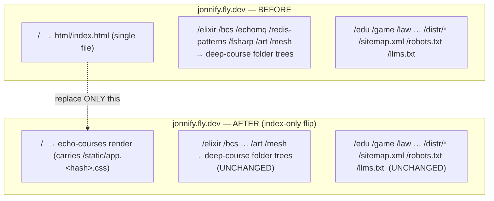

# ec.6 — Production cutover runbook { id="echo-courses-6-cutover-runbook" }

> _The Operator's step-by-step for cutting `jonnify.fly.dev`'s **courses index** (`/`) over to the deployed echo-courses render — with a pre-cutover gate, the recommended no-shadow topology, a one-step rollback grounded in the **installed** flyctl, and a production smoke that proves the deep-course roots survived._

This runbook is **Operator-executed**. The team's boundary for ec.6 is `docs/echo_courses` only (decision **D-1**): the team authored this guide, the reconciled spec, and the smoke battery, and verified the battery locally — it did **not** touch the live `jonnify` app and ran **no** `fly`. Every `fly` and every jonnify-app edit below is the **Operator's**.

## 0. The lay of the land (why this is a narrow flip) { id="rb-landscape" }

`jonnify.fly.dev` is a **large, Operator-owned static site** (`go/fly.toml` app `'jonnify'`; `go/Dockerfile` builds a Go static server whose source `main.go` is **not in this repo's VCS** — only `go/{Dockerfile,fly.toml,go.work,CLAUDE.md,.dockerignore}` are tracked). It serves, today:

- the **courses index at `/`** — a **single file**, the golden master `html/index.html` (`<title>Courses · jonnify</title>`; there is **no `/courses` route** in production — `grep href="/courses"` over the master = 0);
- the **deep courses** at `/elixir` `/bcs` `/echomq` `/redis-patterns` `/fsharp` `/art` `/mesh` and the deep agile course — each a **folder tree** of 88–146 HTML pages, `COPY`d wholesale by the Dockerfile (`COPY elixir/`, `COPY html/bcs/`, `html/echomq/`, `html/redis-patterns/`, `html/fsharp/`, `html/art/`, `html/mesh/`, `html/agile-agent-workflow/`);
- **a dozen other sections** (`/edu` `/game` `/law` `/physics` `/school` `/map` `/ai-rabota` `/ege` `/future` `/health` …), plus `/distr/*`, `/sitemap.xml`, `/robots.txt`, `/llms.txt`, and styled error pages.

`echo-courses` (`go/echo-courses`, a **separate** Fly app `'echo-courses'`) is the catalog-driven rebuild of **only the courses index** — served at both `/` and `/courses` — plus **five thin landings** reachable at `/courses/:slug` and at the course `Path`s on **its own** app. The five thin landings have **no links into the deep courses**.

The trap to avoid: on `jonnify.fly.dev`, the five "course paths" (`/elixir` …) **are the deep-course roots**. Routing them at the thin echo landings would **shadow** the 200-page deep courses. So the cutover is **index-only**: it changes `/` and nothing else (decision **D-2**).



## 1. Pre-cutover gate — verify the echo target { id="rb-pregate" }

**Goal:** prove the deployed echo-courses app is a correct, complete cutover target **before** touching `jonnify`. Run the **echo-app** phase of the smoke battery (`docs/echo_courses/ec.6.smoke.sh`, MODE `echo`) against the deployed echo app:

```bash
MODE=echo BASE=https://echo-courses.fly.dev docs/echo_courses/ec.6.smoke.sh
```

It asserts, and **exits non-zero on any failure** (it is a real gate):

- **routes → 200:** `/`, `/courses`, `/healthz`, `/sitemap.xml`, `/robots.txt` (the real echo routes — `go/echo-courses/cmd/server/main.go`);
- **the cutover fingerprint:** `/` carries `/static/app.<hash>.css` **and** `/static/app.<hash>.js` (the ec.5 content-hash assets), and **both** advertised hashed assets themselves resolve 200 (CSS missing ⇒ unstyled; JS missing ⇒ renders but dead);
- **the index identity:** `<title>Courses · jonnify</title>` and one card link to each of `/elixir`, `/redis-patterns`, `/echomq`, `/course/agile-agent-workflow`, `/bcs`.

> **The fingerprint matters.** The echo index and the legacy `html/index.html` share the **same** `<title>Courses · jonnify</title>`, so a title check cannot tell them apart. The legacy index inlines its CSS; the echo render links `/static/app.<hash>.css`. **That link is the only reliable "this is the echo render" signal** — every is-it-flipped check in this runbook keys on it.

If the echo app is not yet deployed, the Operator deploys it first (its own app — **not** part of the cutover): from the repo's `go/` directory (its `replace => ../echo` needs `./echo` in the build context),

```bash
cd go && fly deploy -c echo-courses/fly.toml      # Operator; echo-courses.fly.dev
```

Do **not** proceed to §2 until §1 is green.

## 2. The cutover topology — recommended: rebuild `/` only { id="rb-topology" }

Two mechanisms put the echo render at `jonnify.fly.dev/`. **Both leave every deep-course root and every other section byte-untouched; neither points a deep root at a thin landing.** The team recommends **A**.

### A. Rebuild jonnify's index file (RECOMMENDED) { id="rb-topology-a" }

Replace the **single file** the jonnify Dockerfile serves at `/` — the golden master `html/index.html` — with the echo render of the index, then redeploy jonnify.

1. **Capture the echo render of the index** (the bytes that will become the new `/`):
   ```bash
   curl -s https://echo-courses.fly.dev/ > /tmp/new-jonnify-index.html   # Operator
   ```
   Sanity-check it carries the fingerprint and the five cards:
   ```bash
   grep -oE '/static/app\.[a-f0-9]+\.css' /tmp/new-jonnify-index.html      # non-empty
   grep -oE 'href="/(elixir|bcs|echomq|redis-patterns|course/agile-agent-workflow)"' /tmp/new-jonnify-index.html | sort -u
   ```
2. **Resolve the static assets the new index references.** The echo render links `/static/app.<hash>.{css,js}` — those routes live on the **echo** app. The jonnify server must serve them too, or the new index will be unstyled (CSS) **or non-interactive (JS)**. The Operator's options, decided inside the (out-of-VCS) jonnify server: (i) vendor **both** hashed asset files into jonnify's static tree at the **same `/static/app.<hash>.{css,js}` paths**, or (ii) rewrite **both** asset URLs in `/tmp/new-jonnify-index.html` to absolute `https://echo-courses.fly.dev/static/app.<hash>.{css,js}` before installing it. Either keeps `/` styled **and** interactive with **no** change to any deep root. Confirm BOTH resolve after the flip (the §4 smoke + a manual `curl -so /dev/null -w '%{http_code}'` on each advertised `/static/app.<hash>.css` **and** `.js`) — handling only the CSS leaves a 404 JS bundle that renders fine but is dead.
3. **Rewrite the canonical + og:url from `/courses` to `/`** — the cross-app fix. The echo render is built for the **echo** app, where the index's stable canonical is `/courses` (echo serves the index at both `/` and `/courses`, and its sitemap lists `/courses`). So the captured bytes carry `<link rel="canonical" href="https://jonnify.fly.dev/courses">` and `<meta property="og:url" content="https://jonnify.fly.dev/courses">` — but **jonnify has no `/courses` route** (`grep href="/courses"` over the golden master = 0). Installed at jonnify's `/`, those two tags advertise a **404 canonical + og:url** — an invisible SEO/social defect (the page renders perfectly; only crawlers and link unfurls see the broken self-reference, which is why the §1/§4 status+fingerprint smoke cannot catch it). **Two options; the team recommends (i):**
   - **(i) RECOMMENDED — rewrite the two tags to jonnify's real index URL `/`** before installing `/tmp/new-jonnify-index.html`:
     ```bash
     sed -i '' 's#https://jonnify.fly.dev/courses#https://jonnify.fly.dev/#g' /tmp/new-jonnify-index.html   # Operator (macOS sed)
     # verify: both now point at the bare host '/', and no '/courses' remains
     grep -oE '(rel="canonical" href|property="og:url" content)="[^"]+"' /tmp/new-jonnify-index.html
     grep -c 'jonnify.fly.dev/courses' /tmp/new-jonnify-index.html   # want 0
     ```
     One file already changes (this rung's mechanism A); rewriting two of its own bytes adds no blast radius and keeps the deep roots byte-identical.
   - **(ii) ALTERNATIVE — also serve `/courses` on jonnify as an index alias** (an app-level route in the out-of-VCS jonnify server: `GET /courses` → the same index file). This makes the baked canonical resolve 200 instead of rewriting it, but it adds a new live route to jonnify (more surface, an out-of-VCS server edit) for no reader benefit, and the canonical would then point at `/courses` while the index lives at `/` — a non-canonical self-reference. Prefer (i).

   > **Why this is a cutover defect, not an echo bug.** `/courses` is the *correct* canonical for the index **on the echo app** (`internal/handler/courses.go:43` `indexPath = "/courses"`; the echo sitemap lists it). The defect is purely the cross-app move of static bytes — a render built for app A's path layout carries A's self-referential absolute URLs. This is the same class as A.2 (the asset paths), but **invisible** rather than visibly-broken, so it needs an explicit step.
4. **Install + redeploy jonnify** (Operator; the jonnify server source is out-of-VCS):
   ```bash
   # Operator installs /tmp/new-jonnify-index.html as the file jonnify serves at "/"
   # (the golden master html/index.html), then, from the REPO ROOT:
   fly deploy -c go/fly.toml          # app 'jonnify'; build context = repo root
   ```
   > **Deploy CWD is the repo root** for jonnify (the Dockerfile `COPY html/index.html`, `COPY elixir/`, etc. resolve from `/Users/jonny/dev/jonnify`; there is no `go/html/`). This differs from echo-courses, which deploys from `go/`.

**Why recommended:** exactly one file changes; the deep-course folder trees and every other section are byte-identical; rollback is the prior jonnify release (§3). The team authors **no** jonnify code — installing the new index file is the Operator's out-of-band step (the jonnify `main.go` is not in this VCS).

### B. Proxy `/` → the echo app { id="rb-topology-b" }

Route **only** the `/` path of `jonnify` to `echo-courses.fly.dev`, leaving every other path served by jonnify.

> **Fly has no native cross-app per-path router.** There is no `fly` command that says "send `jonnify/` to the echo app." Any such routing is an **app-level choice the Operator implements inside the (out-of-VCS) jonnify server** (e.g. a reverse-proxy handler for `GET /`). The team specifies the **topology** (only `/`, never a deep root), not the proxy code. If chosen, `/`'s upstream must forward `/static/app.<hash>.*` too (same asset concern as A.2). **The canonical/og:url `/courses` defect (A.3) applies here too** — the proxied bytes are the same echo render, so they advertise `https://jonnify.fly.dev/courses` (404 on jonnify). A proxy cannot easily rewrite the upstream body, so option B should either rewrite the canonical/og:url in the proxy response **or** serve `/courses` on jonnify (A.3 option ii); a plain pass-through proxy ships the broken canonical.

**Either way — the hard invariant:** `/elixir` `/redis-patterns` `/echomq` `/course/agile-agent-workflow` `/bcs` `/art` `/mesh` and every non-course section stay served by jonnify's own trees. **No deep-course root is ever pointed at a thin echo landing.**

## 3. One-step rollback — restore the prior jonnify release { id="rb-rollback" }

The cutover is a normal jonnify deploy, so rollback is **restoring the prior jonnify release**. The mechanism is pinned to the **installed flyctl** (`fly v0.4.6` darwin — stamp your own with `fly version`).

> **flyctl-version caveat (confirm before relying on it).** `fly v0.4.6` has **no one-command rollback**: `fly releases` only *lists* (no `rollback` subcommand), and `fly deploy` has `-i/--image` but no `--rollback`/`--image-from-release`. So on this CLI the rollback is the **two-step image restore** below. **Newer/other flyctl builds expose a single `fly releases rollback` (or `fly apps rollback`).** ⚠️ **Operator/Apollo: confirm which form your authed flyctl supports** (`fly releases --help`, `fly apps --help`) — do not assume the one-command form exists.

### 3a. The grounded two-step image restore (works on fly v0.4.6) { id="rb-rollback-2step" }

```bash
# 1. List jonnify releases WITH their image refs; note the version/image BEFORE the cutover.
fly releases -a jonnify --image                # Operator

# 2. Re-deploy that exact prior image (one step):
fly deploy -a jonnify --image <prior-image-ref>    # Operator
```

`fly image show -a jonnify` shows the **currently** deployed image (useful to record the cutover image before flipping, so "prior" is unambiguous).

### 3b. If your flyctl has the one-command form (confirm first) { id="rb-rollback-1cmd" }

```bash
fly releases rollback -a jonnify               # ⚠️ ONLY if `fly releases --help` lists it
```

**Pre-stage the rollback target.** Immediately **before** the cutover, the Operator records the pre-cutover release/image:

```bash
fly releases -a jonnify --image | head -3      # capture the current (soon-to-be-prior) ref
```

so step 3a.2 can restore it without guesswork. After a rollback, re-run the §1 echo-target check is **not** needed — instead re-run §4 against `jonnify.fly.dev` and confirm `/` no longer carries the echo fingerprint (it is back to the legacy inline-CSS index).

## 4. Production smoke — after the flip { id="rb-prodsmoke" }

Run the **jonnify** phase of the battery against the live domain (Operator):

```bash
MODE=jonnify BASE=https://jonnify.fly.dev docs/echo_courses/ec.6.smoke.sh
```

It asserts (and exits non-zero on any failure):

- **`/` is now the echo render** — returns 200, carries `/static/app.<hash>.css`, and keeps `<title>Courses · jonnify</title>`;
- **both `/` assets resolve 200 on jonnify** — the advertised `/static/app.<hash>.css` **and** `/static/app.<hash>.js` (proves the §2.A.2 asset handling was applied to both, not just the CSS);
- **the canonical/og:url were rewritten (§2.A.3)** — `/`'s body carries **no** `https://jonnify.fly.dev/courses` (a leaked `/courses` is the 404 canonical defect);
- **the deep-course roots STILL resolve 200 (not shadowed):** `/elixir`, `/redis-patterns`, `/echomq`, `/course/agile-agent-workflow`, `/bcs`, `/art`, `/mesh`;
- **other sections STILL resolve 200 (the flip was index-only):** `/sitemap.xml`, `/llms.txt` (extend with `/edu`, `/game`, … as wanted).

A **green** §4 confirms the cutover succeeded **and** shadowed nothing. A red `/static/app.<hash>.css` on `/` means the flip didn't land (still the legacy index); a red JS asset means the §2.A.2 handling missed the bundle; a leaked `/courses` means §2.A.3 was skipped (a 404 canonical shipped); a red deep root means the cutover shadowed it — **roll back (§3) and re-check**.

## 5. Drain on deploy (criterion 3) { id="rb-drain" }

The jonnify app config already drains in-flight requests on a rolling deploy: `go/fly.toml` sets `kill_signal = "SIGTERM"` and `kill_timeout = 10` under `[deploy] strategy = "rolling"`, with a `/healthz` check. No runbook action — verify the Operator's jonnify server honors `SIGTERM` with a graceful shutdown window **≤ `kill_timeout`** (the echo app's own `gracefulTimeout` is 10s under `kill_timeout = 15`; the jonnify server's drain window is the Operator's, out-of-VCS).

## 6. Quick reference { id="rb-quickref" }

| Step | Command (Operator) | Pass condition |
|---|---|---|
| Pre-cutover gate | `MODE=echo BASE=https://echo-courses.fly.dev docs/echo_courses/ec.6.smoke.sh` | exit 0 |
| (Deploy echo, if needed) | `cd go && fly deploy -c echo-courses/fly.toml` | echo app live |
| Record rollback target | `fly releases -a jonnify --image \| head -3` | note prior image ref |
| Cutover A (recommended) | install echo index as jonnify's `/` file → `fly deploy -c go/fly.toml` (from repo root) | deploy succeeds |
| Rollback (fly v0.4.6) | `fly deploy -a jonnify --image <prior-ref>` | prior release live |
| Production smoke | `MODE=jonnify BASE=https://jonnify.fly.dev docs/echo_courses/ec.6.smoke.sh` | exit 0 |

## 7. What the team did NOT do (boundary, D-1) { id="rb-boundary" }

- Did **not** edit the live `jonnify` app (its server source is not in this VCS) — installing the new index file and any proxy/asset wiring are the **Operator's**.
- Did **not** run any `fly` — every deploy/rollback above is the **Operator's**.
- Did **not** point any deep-course root at a thin landing (the no-shadow invariant, D-2).
- **Did:** reconcile `echo-courses.6.md`, author this runbook, author `ec.6.smoke.sh`, and verify the battery **locally** (MODE `echo`, `BASE=http://127.0.0.1:1323` against the dev server → 15/15 PASS, exit 0; against a dead endpoint → exit 1, proving it gates). The verify pass added the cross-app canonical/og:url `/courses` fix (§2.A.3), the both-asset (CSS + JS) resolution, and the MODE `jonnify` canonical-leak guard.

## 8. References { id="rb-refs" }

- Reconciled spec — `docs/echo_courses/echo-courses.6.md`
- Smoke battery — `docs/echo_courses/ec.6.smoke.sh`
- jonnify app config — `go/fly.toml` (app `'jonnify'`), `go/Dockerfile` (build context = repo root; `COPY html/index.html` at `/`, deep courses as folder trees)
- echo-courses app config — `go/echo-courses/fly.toml` (app `'echo-courses'`; deploy from `go/`), routes `go/echo-courses/cmd/server/main.go`, content-hash assets `go/echo-courses/internal/asset/asset.go` (ec.5)
- Golden master index — `html/index.html` (`<title>Courses · jonnify</title>`, no `/courses` route)
- Fly — releases https://fly.io/docs/flyctl/releases/ · deploy https://fly.io/docs/flyctl/deploy/ · `fly version` = `fly v0.4.6` (stamp your own)
