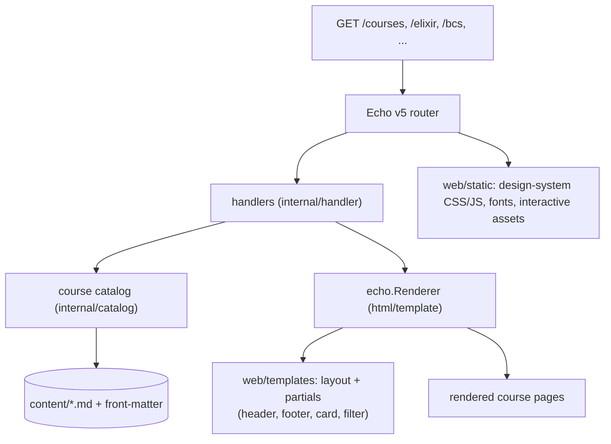
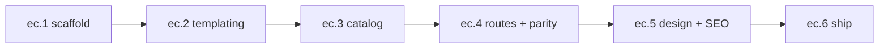

# echo-courses — rebuild the courses site on Echo { id="echo-courses-roadmap" }

> _Rebuild the published `jonnify.fly.dev/courses` site — the index, the five course pages, the track filter, and the jonnify design system — on a Go Echo v5 server with a templating engine, so pages are generated from a course catalog and content files rather than hand-authored HTML, with URL and visual parity so nothing already published breaks._

## 1. Vision

The courses site is published as static HTML: a `/courses` index listing five deep-dive courses, each on its own page, filtered by track, styled by the jonnify design system. Editing it means hand-editing HTML, and the five course URLs are inconsistent (`/elixir`, `/redis-patterns`, `/echomq`, `/course/agile-agent-workflow`, `/bcs`).

`echo-courses` moves that site onto an Echo v5 server driven by a templating engine. The index and cards render from a course catalog; each course page renders a base layout around per-course content; the design system and interactive elements are served as assets. The migration's first obligation is parity — every published URL keeps resolving, and the rendered pages match the published look — so the cutover is invisible to anyone with a bookmark or a link.

## 2. The published site (ground truth) { id="ground-truth" }

Five courses, taught in English, filterable by track, on the jonnify design system. Header reads `jonnify · courses`; footer reads `(с) jonnify`; the index advertises "5 deep dives".

| # | Title | Track tags | Published path |
|---|-------|-----------|----------------|
| 1 | Functional Programming | Elixir · BEAM | `/elixir` |
| 2 | Redis Patterns Applied | Redis · EchoMQ | `/redis-patterns` |
| 3 | EchoMQ in Depth | EchoMQ · protocol | `/echomq` |
| 4 | Agile Agent Workflow | Claude Agents · Portal | `/course/agile-agent-workflow` |
| 5 | Branded Component System | Identity · five runtimes | `/bcs` |

Index filter facets: **All (5)**, **Elixir (1)**, **Agents (1)**, **Redis (1)**, **EchoMQ (1)**, **BCS (1)**.

## 3. Program 5W + H { id="program-5wh" }

| | |
|---|---|
| **Who** | Platform (Fireheadz); audience is course readers arriving at published URLs. |
| **What** | An Echo v5 server that renders the courses index and the five course pages from a catalog + content files through a templating engine, preserving the published URLs, look, and interactive elements. |
| **When** | Sequenced `ec.1` → `ec.6`; each rung independently shippable; parity gates from `ec.4` onward. |
| **Where** | A Go module served behind Echo v5; deployed on Fly, cutting over `jonnify.fly.dev`'s course routes. |
| **Why** | Turn hand-edited HTML into catalog-driven pages — one place to add a course, consistent layout, server-rendered — without breaking any published link or changing the look. |
| **How** | Echo's `Renderer` seam with a Go template engine; a base layout + partials extracted from the published HTML; a course catalog loaded from content files; routes that preserve the published paths. |

## 4. Architecture { id="architecture" }

The catalog is the single source for the index; the renderer wraps per-course content in the shared layout; the design system and interactive elements ride as static assets. Echo v5 handlers take `*echo.Context` and call `c.Render(...)`.

## 5. Rungs { id="rungs" }

| Rung | Ships | Stands on | Size | Risk | Build topology |
|---|---|---|---|---|---|
| **ec.1** | Echo v5 server scaffold — module, `echo.New`, `/healthz`, static serving, graceful shutdown, project layout | Echo v5 | **S** | **NORMAL** | Flat-L2 |
| **ec.2** | templating engine + base layout — register the `Renderer`; extract layout + partials (header/footer/card/filter) from the published HTML | ec.1 | **M** | **NORMAL** | Flat-L2 |
| **ec.3** | course catalog + content model — `Course` model, `content/*` with front-matter, a loader seeded with the five courses | ec.2 | **M** | **NORMAL** | Flat-L2 |
| **ec.4** | routes + pages with URL parity — `/courses` index and the five detail routes on their published paths; the track filter | ec.3 | **M** | **NORMAL+** (parity surface) | Flat-L2 + parity battery |
| **ec.5** | design-system parity, assets, SEO — design-system CSS/JS/fonts + interactive assets; per-page meta, Open Graph, sitemap, robots | ec.4 | **M** | **NORMAL** | Flat-L2 |
| **ec.6** | ship on Fly — multi-stage Dockerfile, `fly.toml`, deploy, cut `jonnify.fly.dev` course routes over, smoke test | ec.1–ec.5 | **S** | **NORMAL** | Flat-L2 |

## 6. Sequencing { id="sequencing" }

## 7. Decisions to lock { id="decisions" }

Each is the recommended path; flipping any is a one-line change to the relevant rung.

1. **Templating engine — `html/template` (recommended) vs `templ`.** Echo plugs in any Go template engine. `html/template` is the standard-library, Renderer-native path and the lightest match for layout + partials + injected content. `templ` (a-h/templ) is the type-safe, compiled alternative if components and compile-time checks are wanted; it writes to the response writer rather than through the `Renderer`. Recommendation: `html/template` for the spine.
2. **URLs — preserve published paths (recommended) vs normalize to `/courses/:slug`.** The site is published; links exist. Preserve `/elixir`, `/redis-patterns`, `/echomq`, `/course/agile-agent-workflow`, `/bcs` exactly, and add `/courses/:slug` as an internal canonical that the published paths map to. Normalizing instead would require 301s from every old path.
3. **Content storage — Markdown + front-matter (recommended) vs HTML partials vs structured Go.** Per-course `content/<slug>.md` with a front-matter block (title, tracks, summary, canonical path) is editable and keeps the catalog declarative. Deep/interactive course bodies that resist Markdown can ship as an HTML partial per course, wrapped by the same layout, and be templatized progressively.

## 8. Cross-cutting acceptance gates { id="gates" }

Every rung is done only when, in addition to its own criteria:

1. **URL parity** — every published path (`/courses`, `/elixir`, `/redis-patterns`, `/echomq`, `/course/agile-agent-workflow`, `/bcs`) resolves with a 200 and renders the right course (enforced from `ec.4`).
2. **Visual parity** — rendered pages apply the jonnify design system and match the published header (`jonnify · courses`), footer (`(с) jonnify`), and layout.
3. **Fail-fast** — templates and content files parse at boot; a malformed template or missing course fails startup, never renders a half-page.
4. **Catalog is the single source** — the index, the filter counts, and the routes derive from the catalog; no course is listed in two places.
5. **No broken links** — internal links between the index and course pages resolve; a link checker over the rendered site is clean.
6. **Echo v5 idioms** — handlers take `*echo.Context`; rendering goes through the registered `Renderer`.

## 9. Non-goals { id="non-goals" }

- A CMS or admin UI (content is files in the repo).
- Authoring new course content (this migrates existing content).
- A database (the catalog is file-backed).
- Rewriting the design system (it is carried as assets).
- Client-side framework rewrites of the interactive elements (they are preserved as assets).

## 10. Glossary { id="glossary" }

- **Renderer** — Echo's `Renderer` interface; `c.Render(status, name, data)` writes a named template.
- **Layout / partial** — the shared page shell and the reusable fragments (card, filter, header, footer).
- **Catalog** — the in-memory list of `Course` records loaded from `content/`.
- **Slug** — a course's stable key (e.g. `elixir`, `bcs`); maps to its published path.
- **Track** — a course's tag facet (Elixir, Agents, Redis, EchoMQ, BCS) used by the filter.
- **Parity** — the migrated site resolves the same URLs and matches the published look.

## 11. References { id="references" }

- Published source — https://jonnify.fly.dev/courses
- Echo v5 — https://echo.labstack.com/ · quickstart https://echo.labstack.com/guide/quickstart/ · routing https://echo.labstack.com/guide/routing/
- Echo API — https://pkg.go.dev/github.com/labstack/echo/v5
