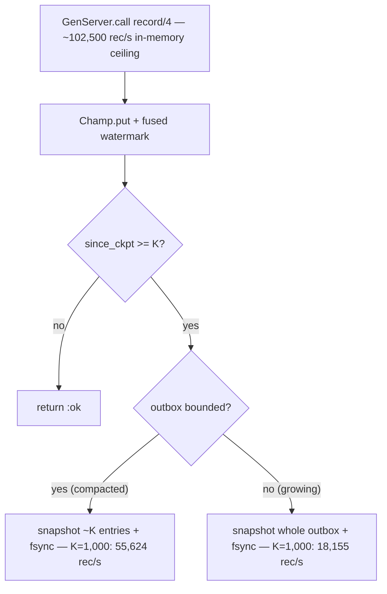

# EchoStore.Durability.Champ, Measured End to End { id="echo-store-durability-champ-measured" }

> *Wiring the Champ plugin into a runnable `echo_store` and timing the real GenServer `record/4` — which lands an
> order of magnitude above the per-commit-fsync plugins, and reveals two costs the building-block derivation
> missed: the GenServer call, and checkpointing a growing outbox.*

## The Setup

The previous piece gave Champ's durable rate as a *derivation* — `1 / (put_µs + checkpoint_µs / K)` — built from
measured building blocks. A derivation is a hypothesis, not a measurement, and it carried two assumptions worth
testing: that the live CHAMP stays bounded at roughly the checkpoint interval (so each snapshot is cheap), and
that the `GenServer.call` wrapping `record/4` costs nothing. So the plugin was wired into a runnable `echo_store`
and the real GenServer was timed.

Wiring it in needed the duplicate-`Adapter` clash resolved first: the earlier-delivered `core/adapter.ex` and
`plugins/{postgres,graft}.ex` were moved out of `echo_store`, leaving the canonical `EchoStore.Durability.Adapter`
behaviour, and `champ.ex` was placed at `echo_store/lib/echo_store/durability/champ.ex` and compiled against that
behaviour and the built `echo_data` (where `EchoData.BrandedChamp` lives). The `:file` sink's `record/4` path needs
neither the bus nor SQLite, so it runs from those two alone.

By the end of this piece you will have the measured end-to-end `record/4` numbers through the real GenServer, the
reconciliation that explains where they sit relative to the derivation, a demonstrated checkpoint-and-restore
round-trip, and the operating rule the measurement implies.

## What You'll Build

- The wiring: `EchoStore.Durability.Champ` compiled into `echo_store` against the canonical `Adapter`, clash resolved.
- The measured `record/4` rate through the real GenServer at three checkpoint intervals, each a median of three runs.
- The reconciliation: where the measurement lands relative to the derived numbers, and why.
- A demonstrated checkpoint then restore — a fresh GenServer recovering state from a checkpoint file.
- The operating rule: large interval, or compaction, or delta checkpoints.

## The measurement

This box: one vCPU, Erlang/OTP 25 (erts 13.2.2.5) BEAM JIT, Elixir 1.18.4, the `:file` sink. Each row drives
`EchoStore.Durability.Champ.record/4` 50,000 times through `GenServer.call` after a warm-up, as a median of three
runs (the single core makes any one run noisy; the medians below clustered tightly).

```text
RECORD/4 THROUGH THE REAL GENSERVER (sink: :file)            median rec/s   runs
  no checkpoint (K > n) — in-memory ceiling                     102,501     101,955 / 102,501 / 102,592
  checkpoint every K=10,000 (uncompacted, growing outbox)        76,413      76,413 /  76,516 /  76,279
  checkpoint every K=1,000  (uncompacted, growing outbox)        18,155      18,179 /  17,938 /  18,155
  checkpoint every K=1,000  + compaction (bounded outbox)        55,624      54,798 /  56,055 /  55,624
  — references (measured, per-record durable write) —
  SQLite plugin (WAL, synchronous=NORMAL)                          9,601
  Oban (library, Oban.insert!/1)                                     532
  Graft (per-record commit)                                          452
```

Reproduce: start the plugin with `Champ.start_link(name:, checkpoint_every: K, sink: :file, path:)`, then fold
`record/4` over 50,000 branded ids and divide. The bounded row adds `mark_enqueued/2` per record and `compact/1`
every 1,000 — the full outbox lifecycle, not `record/4` alone. The reference rows are the measured per-record
durable writes from the prior comparison.

Read against the references, the in-memory ceiling is a factor of 10.7 above the SQLite plugin and a factor of 193
above Oban; the K=10,000 row is a factor of 8 above SQLite; even the slowest row, K=1,000 with no compaction, is a
factor of 1.9 above SQLite and a factor of 34 above Oban. The premise holds: not fsyncing per record buys an order
of magnitude. But the numbers are lower than the derivation predicted, and the gap is the lesson.

## Reconciling the measurement with the derivation

The derived numbers were 103,082 rec/s at K=10,000 and 86,005 at K=1,000. The measurement explains the difference
on two counts.

**The GenServer call costs little.** The in-memory ceiling measured 102,501 rec/s against the raw
`BrandedChamp.put` rate of 105,762 — so threading every `record/4` through a `GenServer.call` shaves only a few
points. The serialization process boundary is not where Champ spends its time, which is the right outcome for a
single-writer durable log.

**Checkpointing a growing outbox is the real cost.** The derivation assumed each checkpoint serializes a bounded
CHAMP of roughly K entries. The uncompacted runs do not compact, so by record 50,000 the outbox holds 50,000
entries and each checkpoint serializes the whole of it — the snapshots get progressively heavier. At K=10,000
that is five snapshots, the last serializing tens of thousands of entries, and throughput falls from the 102,501
ceiling to 76,413. At K=1,000 it is fifty snapshots of a growing structure, and the late ones dominate, dragging
throughput to 18,155 — far below the derived 86,005, which had assumed a bounded snapshot.

**Compaction restores the small-interval rate.** Running K=1,000 *with* `compact/1` every 1,000 records — dropping
the enqueued intents so the live set stays bounded — lifts throughput from 18,155 to 55,624, a factor of three,
and that figure already includes the extra `mark_enqueued/2` and `compact/1` calls. The residual gap from the
derived 86,005 is exactly that extra lifecycle work, which the derivation never counted. So the derivation was
right about the structure and optimistic about the operating conditions: it assumed a bounded outbox and a bare
`record/4`, and the real plugin pays for the growing snapshot and the full lifecycle unless you keep the live set
small.



## Checkpoint, then restore

Durability is only real if a fresh process can recover from it. After a 50,000-record run at K=1,000, the
checkpoint file was 592,258 bytes; starting a new `EchoStore.Durability.Champ` GenServer on the same path restored
the state through `restore/1` — `stats/1` on the new process reported 50,000 intents and the recovered sequence
number. The immutable snapshot is a consistent point-in-time root, so the recovered outbox is whole, never a
partial structure, and `replay/2` can re-enqueue the still-pending intents from it. That round-trip is the
property that separates Champ from the volatile Memory plugin: the same heap-speed writes, but a durable, tunable
floor underneath them.

## The operating rule

The measurement implies a clear rule. Checkpoint at a large interval and the cost is small — K=10,000 holds 76,413
rec/s. If a tight loss window forces a small interval, keep the live outbox bounded with `compact/1` so each
snapshot stays cheap — K=1,000 with compaction holds 55,624. The remaining inefficiency, full-snapshotting a
growing structure, is what a delta checkpoint would remove: serialize only the tail appended since the last
checkpoint rather than the whole CHAMP, which would make a small interval cheap regardless of outbox size. Whichever
path, the durable `record/4` stays an order of magnitude above the per-commit-fsync plugins, because the fsync is
amortized across a checkpoint instead of paid per record.

## What We Shipped

`EchoStore.Durability.Champ` wired into a runnable `echo_store` — clash resolved, compiled against the canonical
`Adapter` behaviour and the built `echo_data` — with the real GenServer `record/4` measured end to end: 102,501
rec/s in-memory, 76,413 at a 10,000-record checkpoint, 55,624 at a 1,000-record checkpoint with compaction, and
18,155 at a 1,000-record checkpoint without it, each a median of three runs and all an order of magnitude above
the SQLite plugin's 9,601 and Oban's 532. The reconciliation that places those against the derivation — the
GenServer call costs little, the growing-snapshot costs a lot, compaction restores the rate. And a demonstrated
checkpoint-and-restore round-trip recovering 50,000 intents from a 592,258-byte snapshot.

## References

**Repositories**

- The `echo` umbrella — `EchoStore.Durability.Champ`, the canonical `EchoStore.Durability.Adapter`, and `EchoData.BrandedChamp` with its `Enumerable`/`Collectable` implementations the plugin iterates and rebuilds through.
- [elixir-sqlite/exqlite](https://github.com/elixir-sqlite/exqlite) — the engine behind the SQLite reference row and the `:sqlite` checkpoint sink.
- [lucaong/cubdb](https://github.com/lucaong/cubdb) — the engine behind the Graft reference row and the `:graft` checkpoint sink.
- [oban-bg/oban](https://github.com/oban-bg/oban) — the per-commit reference row, measured through `Oban.insert!/1`.

**Expert voices**

- [Steindorfer & Vinju, "Optimizing Hash-Array Mapped Tries"](https://michael.steindorfer.name/publications/oopsla15.pdf), OOPSLA 2015 — the CHAMP structure and the structural-sharing snapshot the checkpoint relies on.
- [Erlang/OTP `gen_server` documentation](https://www.erlang.org/doc/man/gen_server.html) — the single-writer call path whose cost the in-memory ceiling measures.

**Books**

- *Database Internals*, 1st ed., 2019. Alex Petrov. O'Reilly — checkpoints, snapshots, recovery, and the cost of full versus incremental persistence.
- *Designing Data-Intensive Applications*, 2017. Martin Kleppmann. O'Reilly — durability, the loss-window trade, and recovery.

**Standards & primary docs**

- [POSIX `fsync`](https://pubs.opengroup.org/onlinepubs/9699919799/functions/fsync.html), IEEE Std 1003.1 — the durability primitive the checkpoint amortizes across K records.

## Appendix A — cclin-server Killer Features

### Feature 1 — Delta checkpointer for the Champ plugin

**Problem.** The Champ plugin's full-snapshot checkpoint serializes the entire outbox each time, so at a small
checkpoint interval on a growing outbox the cost climbs — the measurement showed K=1,000 falling to 18,155 rec/s
without compaction, because late snapshots serialize tens of thousands of entries.

**Proposal.** Add `Cclin.Champ.Delta` with `checkpoint/1` that writes only the tail appended since the last
checkpoint — a small WAL segment of the new entries — and a periodic full snapshot to bound replay length, so a
small interval stays cheap regardless of outbox size. Wire it as an alternative `sink` strategy selectable in the
plugin config, and expose `cclin champ delta` to inspect segment sizes.

**Integration.** A sink module beside the existing `:file`/`:sqlite`/`:graft` paths in
`EchoStore.Durability.Champ`, appending tail segments and folding them on restore through the same
`Enumerable`-based rebuild; it emits `[:cclin, :champ, :delta]` with segment size per checkpoint.

**Branded ID Surface.** Introduces `DLT` for delta-segment records — `DLT0KHTOWnGLuC` — one per tail segment,
carrying the base checkpoint sequence and the segment's entry count, so a restore replays a provable chain.

### Feature 2 — Auto-compaction trigger

**Problem.** Keeping the Champ outbox bounded depends on calling `compact/1` at the right cadence, and cclin
operators set that by hand, so an outbox can grow and quietly inflate checkpoint cost — the gap between the
55,624 bounded rate and the 18,155 unbounded rate at K=1,000.

**Proposal.** Add `Cclin.Champ.AutoCompact` with `maybe/1` that triggers `compact/1` when the live-set size or the
last checkpoint's serialize time crosses a threshold derived from the target write rate, keeping the snapshot
cheap without operator attention. Surface it as `cclin champ autocompact` and a LiveView gauge of live-set size.

**Integration.** A small policy invoked from the plugin's checkpoint path, reading `stats/1` (live intents,
last checkpoint cost) and calling `compact/1`; it emits `[:cclin, :champ, :autocompact]` with the trigger reason.

**Branded ID Surface.** Introduces `ACT` for auto-compaction events — `ACT0KHTOWnGLuC` — one per triggered
compaction, recording the live-set size before and after and the trigger threshold.

### Feature 3 — Restore-time SLO probe

**Problem.** The Champ checkpoint restores on boot, but cclin operators have no estimate of how long a restore
takes from a given checkpoint size, so a node replacement can exceed an unstated recovery-time objective without
warning — the 592,258-byte snapshot restored 50,000 intents, but a larger one is unmeasured in production.

**Proposal.** Add `Cclin.Champ.RestoreProbe` with `estimate/1` that times a restore from the current checkpoint
on a schedule and projects recovery time against the configured RTO, alerting when a restore would exceed it.
Surface it as `cclin champ restore-check` and fail the readiness gate on a projected breach.

**Integration.** A periodic probe in the cclin supervision tree that loads the latest checkpoint into a throwaway
GenServer, times the restore, and emits `[:cclin, :champ, :restore_probe]` with the measured time and the snapshot
size.

**Branded ID Surface.** Introduces `RTO` for restore-probe records — `RTO0KHTOWnGLuC` — one per probe, carrying the
snapshot size, the measured restore time, and the configured objective, so a recovery risk is auditable.
