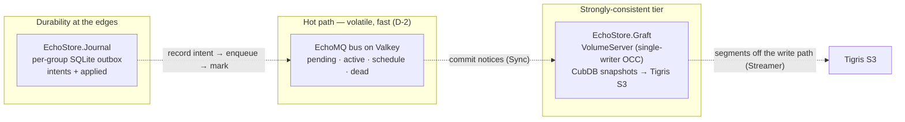

# Roadmap — to Oban Pro parity { id="echo_mq-roadmap-oban-pro" }

> _Where EchoMQ goes from a fast, fair, Valkey-native bus to covering Oban Pro's feature surface — built on the persistence layer already laid, with a risk mitigation named for every step. Supersedes the earlier roadmap; the operator dashboard is out of scope (a first-class Phoenix dashboard is already in alpha)._

Closing the distance to Oban **Pro** is not a performance problem — that work is done
— it is a **durability and coordination** problem. Pro's defining features (retained
history, recording, cross-queue workflows, batches, relay, the Smart engine's global
limits) all assume a store that remembers. EchoMQ's bus deliberately does not (decision
**D-2**: the bus stays volatile). The roadmap is therefore the story of building the
remembering *beside* the bus — which the persistence layer already begins — and then
spending it on Pro parity, one risk-managed phase at a time.

## The foundation already in place

Two bodies of work are shipped or in the tree; the parity phases stand on them.

### Performance

The v1→v3 migration replaced a nine-key lineage admission with
`EchoMQ.Jobs.enqueue/4`: a two-key atomic Lua script that fails the kind law first,
refuses a duplicate (`EXISTS → 0`, so producer retries are safe), writes the row, and
`ZADD`s into a score-0 `pending` set that preserves mint order. Throughput rides the
pipelined `EchoMQ.Connector`, the round-robin `EchoMQ.Pool`, and `enqueue_many/3`. The
contract is pinned by `EchoMQ.Conformance` (55 scenarios) and the BDD story catalogue.

### The persistent layer

This is the part that unlocks Pro parity, and the part that carries the risk. Its
master design decision is the risk control:

> **D-2 — the bus stays volatile.** Durability is never added *inside* the bus (which
> would tax the hot path); it lives at the two cheap, true edges and in a separate
> strongly-consistent tier.

- **`EchoStore.Journal` — the transactional outbox.** One SQLite file per group, one
  owner process. The `intents` table is the outbox: record the intent, enqueue on the
  bus, mark it enqueued; every crash window between those steps is covered by `replay/2`
  plus machinery that already exists — the bus deduplicates a re-enqueued `JOB` id, and
  newer-wins makes a re-applied version harmless. The `applied` table is the lane's
  memory of the last version applied per name; it survives the node, the cache, and the
  bus. Compaction is *coverage, not acknowledgment* — the hot path pays no per-intent
  completion write.
- **`EchoStore.Graft` — native-BEAM, strongly-consistent, page-based replication.** No
  foreign engine. `Graft.VolumeServer` is one single-writer process per volume — its
  mailbox *is* the global write lock, so commits serialize by construction, no lock
  primitive. Reads never touch the writer (lock-free ETS L1 or CubDB zero-cost
  snapshots). Commits are OCC: a `base_lsn` plus a staged page set, validated-or-aborted.
  `Graft.Streamer` ships deduplicated segments to Tigris S3 **off the write path**, so
  commit latency stays local; `Graft.Sync` carries low-latency commit notices over the
  bus while the bytes travel via Tigris. Volumes, segments, and commits are branded
  `VOL`/`SEG`/`CMT` ids.

The insight that makes the rest of this roadmap safe: **history and recording become a
choice with a storage cost, not a default tax**, because the bus stays volatile and the
durable tier is off the hot path.

## The parity phases

Each phase names the Oban Pro feature it covers, the EchoMQ mechanism (grounded in the
foundation above), the risks, and the mitigations. **All phases below are planned** —
the foundation is built; these features are not yet.

### Phase 1 — Durable history & recording

**Covers (Oban Pro):** Recording; and Oban core's signature retained-job-history.

**Approach.** Oban retains every job row in Postgres, so history is a property of the
store and every deployment pays for it. EchoMQ keeps the bus volatile and lands a
completed-job record — terminal state, result, timings — in a **Graft volume** keyed by
the `JOB` id, as an opt-in retention tier. Recording (capturing a job's output for
inspection) writes to the same volume. Browsing history is a CubDB snapshot read;
aggregate metrics read the volume, not the bus.

| Risk | Mitigation |
|---|---|
| Write-path latency from persisting every completion | Streamer ships off the write path; the completion still settles on the volatile bus, the record lands async (D-2) |
| Unbounded storage growth | retention TTL + Graft segment compaction; the morgue still bounds dead jobs separately |
| Data integrity / partial writes | single-writer OCC + CubDB immutable B-tree; the Journal's `applied` memory makes a replayed completion idempotent |
| Migrating the completion path | the v1→v3 template — a semantic change ledger, a dual path, machine-checkable returns, and conformance as the gate |
| Forcing the cost on everyone | opt-in (the library law: no auto-start); a deployment that wants Oban-style history turns it on |

### Phase 2 — Transactional-enqueue parity

**Covers (Oban):** enqueue in the same transaction as your business data — Oban's single
strongest property.

**Approach.** The `Journal` is already the outbox that recovers this guarantee: record
intent → enqueue → mark, with replay covering the crash windows. To reach *literal*
parity for Postgres apps, add a **Postgres Journal adapter** so the `intents` write runs
inside the app's own `Repo.transaction/1`. The enqueue intent then commits in the same
transaction as the row that triggered it; a committer process drains the outbox to the
bus at-least-once.

| Risk | Mitigation |
|---|---|
| Two stores (app DB + bus) cannot be one atomic write | the outbox pattern: the *intent* is transactional with the data; delivery is at-least-once + idempotent, which the bus already assumes |
| The committer is a new moving part | idempotent drain (bus `EXISTS → 0` dedup); the `applied` table is its memory; restart-safe via `replay/2` |
| Ordering of drained intents | mint-ordered `JOB` ids + the score-0 `pending` set preserve order through the drain |
| Default complexity | SQLite journal stays the default; the Postgres adapter is opt-in for apps that want true transactional enqueue |

### Phase 3 — Workflows, batches, chains

**Covers (Oban Pro):** Workflows (arbitrary-dependency DAGs, fan-out/fan-in, nested
sub-workflows, cumulative context); Batches (progress across nodes + callbacks); Chains
(strict sequential).

**Approach and the hard truth.** EchoMQ's atomicity is **single-slot**: a queue's keys
hashtag to one Valkey slot, and the atomic `@enqueue_flow` lands a whole *single-queue*
flow on that slot (this is the shipped `EchoMQ.Flows`, emq.3.1). **A cross-queue DAG
breaks the single-slot guarantee** — no Lua script can span two slots atomically. So
cross-queue Workflows are a different mechanism, not a bigger Flow:

- the DAG and the **cumulative context** live in a Graft volume keyed by a `WFL` id —
  durable and strongly consistent, with the single-writer serializing context updates;
- same-queue sub-DAGs keep the atomic fast path (`Flows`);
- cross-queue edges advance as a **saga**: the Journal records the edge-satisfied intent,
  enqueues the downstream on its queue, marks it — crash-safe by replay, not by 2PC.

Batches are a `BAT`-keyed progress counter (atomic Valkey ops) plus the events stream
for the completion callback; chains are a degenerate workflow (ship first, lowest risk).

| Risk | Mitigation |
|---|---|
| Loss of cross-queue atomicity | saga with idempotent, reversible steps; the Journal makes each edge transition crash-safe via replay |
| Orphaned children / partial failure | compensation steps registered per edge; `Flows.ignored_failures/3` for tolerated children; the version fence detects stale advances |
| Cumulative-context contention | single-writer OCC per `WFL` volume serializes updates; readers use lock-free snapshots |
| Batch progress hot-key across nodes | atomic Valkey counters on a single slot per batch; the sliding-window/leaderboard pattern is already a conformance story |
| Nesting depth / complexity | nested workflows are sub-volumes referenced by `WFL` id; depth is data, not recursion on the hot path |

### Phase 4 — Smart-engine parity

**Covers (Oban Pro):** global concurrency, global rate limiting, queue partitioning,
burst mode, auto-insert batching.

**Approach — EchoMQ's home turf.** This is where a Valkey-native bus has the structural
advantage over a SQL queue. Per-group lanes already give **constructed fairness and
per-group concurrency for free** (the rotating ring; `Lanes.limit/4`). The rest is
Valkey's strength:

- **partitioning** — lanes *are* partitions: a queue split by group, each with its own
  `limit/4`;
- **global concurrency** — extend the `Metrics` read-and-refuse rate-gate to a
  cluster-wide atomic counter;
- **global rate limiting** — a Valkey-resident token bucket / sliding-window log
  (atomic Lua — exactly what Redis-class stores do best);
- **burst** — let a group exceed its limit while the global counter has headroom,
  gated by that same atomic counter so it cannot overshoot;
- **auto-insert batching** — `Pool` + `enqueue_many/3` + pipelining.

| Risk | Mitigation |
|---|---|
| Distributed rate-limit correctness (races, skew) | atomic Lua limiters on a single slot per limiter key; no read-modify-write across the wire |
| Counter hot-keys | per-slot limiter keys under the `{q}` hashtag; the version fence for cross-queue aggregates |
| Burst starving steady tenants | the rotating ring already prevents starvation; burst is bounded by the global atomic counter |
| Sliding-window memory | a capped sorted-set window (the leaderboard story), trimmed on each admission |

### Phase 5 — The Pro extension surface

**Covers (Oban Pro):** Relay (insert + await across nodes), Hooks, Decorator, Signals,
Deadlines, structured/encrypted args, Dynamic configuration.

**Approach.** Each is a thin layer over a shipped primitive:

- **Relay** — a correlation id plus awaiting the `completed` event for that `JOB` id,
  with a timeout. Depends on the durable, replayable event stream (emq.3.2, already
  planned) so a late awaiter can catch up rather than miss the event.
- **Hooks** — before/after/on-failure callbacks in the consumer loop, which already
  converts a raising handler to a typed retry.
- **Decorator** — a macro that turns a plain function into an enqueue plus a registered
  handler.
- **Signals** — generalize the cooperative `EchoMQ.Cancel` token to arbitrary
  `{:emq_signal, ref, term}` messages to a running handler.
- **Deadlines** — a deadline is a *scheduled cancel*: schedule the cooperative cancel at
  `T`; the handler stops itself at its next safe point.
- **Structured / encrypted args** — a pluggable payload codec above the wire
  (validation; at-rest encryption), keys held in a KMS and never on the wire.
- **Dynamic configuration** — extend `Repeat`/`Pump` runtime registration to queues,
  limits, and cron at runtime, with config stored as branded records in a Graft volume.

| Risk | Mitigation |
|---|---|
| Relay await blocks / loses an event | the replayable stream (emq.3.2) + timeout + idempotent re-await |
| Signal term encoding across runtimes | BEAM-term path for BEAM↔BEAM, JSON for BEAM↔Go — the existing payload discipline |
| Encryption key management | codec is host-side (like `Backoff`/`Cancel`), keys via KMS, never serialized to the bus |
| Dynamic config drift | config as audited, branded-id'd records in a Graft volume — durable and inspectable |

### Phase 6 — Polyglot clients

**Covers (Oban Pro):** Python support.

**Approach — a structural advantage, not a gap.** EchoMQ's contract is the wire (the
`emq:{q}:` keyspace and the atomic scripts), so the BEAM and Go are already first-class
clients. Python parity is a **Python SDK** that follows the same keyspace grammar and
passes the same contract — not a re-implementation of the engine.

| Risk | Mitigation |
|---|---|
| SDK drifting from the wire contract | run the 55-scenario `EchoMQ.Conformance` suite against the SDK (the Go-flyer-parity item, generalized) so parity is a tested property |

## Out of scope — the operator dashboard

The earlier roadmap planned a Mercury-UI dashboard. **That is removed:** a first-class
Phoenix dashboard is already in alpha. EchoMQ's responsibility is only to expose the
data it consumes — the `EchoMQ.Metrics` read plane, the `EchoMQ.Events` lifecycle
stream, and the `EchoMQ.Meter` `[:emq, …]` telemetry — and to keep those stable. No UI
ships from this roadmap.

## Cross-cutting risk mitigations

The user's emphasis — "there must be risk mitigations to get to the point" — deserves
its own statement, because the same handful of controls recur under every phase:

1. **The volatile-bus stance (D-2) is the master control.** Persistence never touches
   the hot path; the bus stays fast, durability is async and edge-based. Every phase
   above respects it.
2. **Idempotency everywhere.** At-least-once delivery + dedup (`EXISTS → 0`) +
   newer-wins means replay is *always* safe. This is what lets the Journal and Graft
   recover crash windows without two-phase commit.
3. **Strong consistency where it matters.** Graft's single-writer OCC and CubDB
   immutable snapshots give serial commits with no lock primitive — durable state is
   never half-written.
4. **Off-path durability.** The Streamer ships to Tigris off the write path; commit
   latency stays local. Persistence buys safety, not slowness.
5. **Migration discipline (the v1→v3 precedent).** Every change to a script or the
   completion path ships with a semantic change ledger, a positional alignment, a
   machine-checkable return, a unified diff, and conformance as the gate — never a
   silent cutover.
6. **Reversibility and opt-in (the library law).** Every plane is owner-started, no
   `mod:` auto-start, so a deployment adopts the persistence tier and each Pro-parity
   feature incrementally and can back out.
7. **NO-INVENT for the build; surfaced forks for genuine decisions.** Where a real
   choice remains (the Graft storage substrate is one such surfaced fork), it goes to
   the Operator as argued arms, not a default — so the roadmap never smuggles a decision.

## The parity matrix

| Oban Pro feature | EchoMQ mechanism | Builds on | Phase | Status |
|---|---|---|---|---|
| Retained job history | completion records in a Graft volume (opt-in) | Graft | 1 | planned |
| Recording (output) | same `JOB`-keyed Graft volume | Graft | 1 | planned |
| Transactional enqueue | Journal outbox + Postgres adapter | Journal | 2 | planned |
| Workflows (cross-queue DAG) | `WFL` volume + saga over the version fence | Flows · Graft · Journal | 3 | planned |
| Batches | `BAT` counter + events callback | Flows · events | 3 | planned |
| Chains | degenerate workflow | Flows | 3 | planned |
| Global concurrency | cluster-wide atomic counter (rate-gate) | Metrics | 4 | planned |
| Global rate limiting | Valkey token bucket / sliding window | keyspace · lanes | 4 | planned |
| Queue partitioning | lanes as partitions | Lanes | 4 | partial (lanes shipped) |
| Burst mode | headroom-gated overage | Lanes · Metrics | 4 | planned |
| Auto-insert batching | `Pool` + `enqueue_many/3` | Pool | 4 | partial (primitives shipped) |
| Relay (insert + await) | correlation id + event await | Events (emq.3.2) | 5 | planned |
| Hooks | consumer-loop callbacks | Consumer | 5 | planned |
| Decorator | enqueue-from-function macro | Jobs | 5 | planned |
| Signals | generalized cooperative token | Cancel | 5 | planned |
| Deadlines | scheduled cancel | schedule · Cancel | 5 | planned |
| Structured / encrypted args | pluggable host-side codec | (host) | 5 | planned |
| Dynamic config | runtime registration in a Graft volume | Repeat/Pump · Graft | 5 | planned |
| Python support | Python SDK on the wire contract | Conformance | 6 | planned |
| Web dashboard | — (Phoenix dashboard, alpha) | — | — | **out of scope** |

## Non-goals

- **Becoming a SQL queue.** The Postgres Journal adapter (Phase 2) gives transactional
  enqueue for Postgres apps *without* making the bus itself SQL — the bus stays volatile
  by D-2.
- **Shipping a UI.** The dashboard is handled elsewhere (alpha); this roadmap only keeps
  its data sources stable.
- **Rebuilding Graft's substrate per feature.** History, recording, workflow context,
  and dynamic config all share one durable tier rather than each inventing storage.
