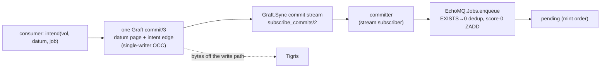

# EchoMQ v4+ durability — architecture decision notes { id="echo_mq-v4-durability-adr" }

> _Resolving the four Phase 2 forks of [`emq-durability-design.md`](../emq-durability-design.md) on the through-line the brief itself keeps surfacing: **SQL was never the plan.** These notes take the brief's method — Rationale · 5W · Steelman · Steward — and turn it from interrogation back into decision. Every decision is **Proposed**, for the Operator to ratify; the grounding discipline holds (shipped modules cited at source, the Phase 2 surfaces written in the forward tense)._

## The history that forces this

EchoMQ began with no relational store anywhere near it. Three commitments said so out loud:
**D-2** keeps the bus volatile (durability never enters the enqueue hot path); `echo_data`
declares **Ecto-freedom an enforced invariant**; the v4 roadmap lists **"becoming a SQL
queue"** as a non-goal. Then SQLite arrived anyway, through one pragmatic edge:
`EchoStore.Journal` (`journal.ex`) is a per-group `exqlite` outbox — `intend_and_enqueue/4`,
`record_many/2`, `replay/2`, `compact/1`, the `applied` version table — and it works. But
`store.design.md` does not treat it as permanent: it **demotes the journal to a rebuildable
working set** and names its future explicitly — *fold `intents` into CubDB and retire
`exqlite`* — on one condition, **that the journal stays rebuildable.**

Phase 2 (transactional-enqueue) forces the question now, because it asks the journal to hold
*business data*, and business data is often a system-of-record that cannot be rebuilt. So the
real decision under all four forks is singular: **do we deepen the SQL commitment, or honor
the founding intent and move durability onto the owned tier?** These notes choose the second,
and show that the choice makes the four forks cohere rather than compete.

## The thesis

v4+ durability lives on the **Graft** tier, not on SQLite. The single-writer commit log is
the transactional substrate **and** the outbox in one mechanism: a datum and its enqueue
intent land in one `commit/3`, and a committer drains the **commit stream** to the volatile
bus at-least-once, deduplicated by machinery the bus already runs. SQLite is not re-promoted
to a durable store; `exqlite` retires on the schedule already named; **D-2 holds** because the
durable write happens in `echo_store`, never in the bus hot path.

## The decisions

| Fork | The arm chosen | Over | One reason |
|---|---|---|---|
| A — substrate | **Commit-log-as-outbox** (the surfaced 4th arm) | A1 SQLite / A2 plain / A3 both | atomic *and* durable in one act, off SQLite |
| B — identity | **The intent is an edge** (datum→job) | B1 new `OBX` brand / B2 reuse `JOB` | a relation, not an entity; a frozen brand is the costliest reversal |
| C — committer | **Commit-stream subscriber** | C1 poller / C2 inline | determined by A; no cadence, no coupling |
| D — Postgres parity | **Out of this roadmap** | D1 parked seam / D2 delete-only | an adapters program, not "push the owned stack forward" |
| E — `exqlite` | **Retire on schedule** | keep it as a durable store | the boundary moved off SQLite, so rebuildability is restored |

### ADR-A — the transactional boundary is one Graft commit (datum + intent)

**Status:** Proposed. **Fork A.**

**Decision.** The atomic data-plus-intent write is **one `EchoStore.Graft.VolumeServer.commit/3`**
that stages both the datum page(s) and the enqueue intent against a `base_lsn`. The SQLite
`Journal` (A1) is **not** the transactional boundary, and "both substrates" (A3) is rejected
as a distributed commit the stack forbids.

- **Rationale.** The need is "the intent never diverges from the datum, *and* the datum
  survives box loss." A single Graft commit answers both in one act — it is atomic by the
  single-writer mailbox (a commit is a `handle_call`, so commits serialize with no lock
  primitive) and durable + Tigris-replicated by construction. A1 answers only the atomic half.
- **Steelman of A1, and why it falls.** A1's strongest case is that local-WAL atomicity is the
  *cheapest correct* granularity and it is already shipped and drilled (`record_many/2`). True
  — but only while the datum is **not** a system-of-record. The brief's own Steward catches the
  trap: writing transactional business data into the journal **overturns the rebuildability
  premise** that lets `store.design.md` demote it, i.e. A1 quietly **re-promotes `exqlite` to a
  durable store at the exact moment another design line is retiring it.** That is the
  irreversible mistake; we decline it.
- **Steward.** The commit-log boundary *is* the named "fold `intents` into CubDB" future — the
  migration becomes the boundary rather than a later chore. It surfaces an OCC conflict
  (`{:error, {:conflict, head}}`) to the caller; that retry contract is cheaper to keep correct
  across years than a silent serialization point that becomes a throughput ceiling (see ADR-G).
- **Consequence.** One durable story (Graft/CubDB), not two (SQLite + CubDB). Callers honor an
  OCC retry. Phase 1's durable history (already slated for Graft) and Phase 2 share a substrate.

### ADR-B — the intent is an edge, not a new brand

**Status:** Proposed. **Fork B. Highest reversal cost in the set — decided conservatively.**

**Decision.** Model the outbox intent as a **BCS edge** — a relation from a datum identity to a
job identity — carried in the commit. Do **not** mint a new frozen `OBX` namespace (B1) now, and
do not collapse the relation into a bare `JOB`-id reuse that pretends there is no relation (B2).
**Defer** an `OBX` brand until a reader (an operator or recovery tool) demonstrably needs to
address intents independently of jobs.

- **Rationale.** Under the **BCS law** — only identities and messages about identities cross a
  boundary — the intent *is* a relation, not an entity; the brief's own hard question raises the
  edge and neither A-arm considered it. An edge generalizes to Phase 3's one-trigger-many-jobs
  fan-out as datum→{jobs} **without** a speculative entity, and the bus already dedups by the
  `JOB` id (`EXISTS → 0`), so the intent needs no identity of its own to be deduplicable.
- **Steelman of B1, and why it waits.** B1 keeps fan-out open and gives a present audit surface.
  But a 14-byte branded namespace is a **permanent public contract** once minted; freezing `OBX`
  for a Phase-3-*maybe* is the single decision whose reversal would cost the most across all four
  forks. An edge is cheap to evolve; a frozen brand is forever. We pay the cheap, reversible
  cost.
- **Steward.** No namespace pressure added one phase at a time; no second gate on the
  intent-to-job edge that both consumer and committer must carry; the `VOL`/`SEG`/`CMT`/`JOB`
  taxonomy stays clean.
- **Consequence.** The committer's dedup key is the `JOB` id the edge carries; fan-out is one
  edge with many job targets; if an independent intent reader later arrives, `OBX` is minted
  *then*, against a real requirement.

### ADR-C — the committer is a commit-stream subscriber

**Status:** Proposed. **Fork C — ruled together with A, not independently.**

**Decision.** The committer is an **event-driven subscriber to the commit stream**
(`EchoStore.Graft.Sync.subscribe_commits/2`): it wakes on the commit notice Graft already
publishes, enqueues to the bus via `EchoMQ.Jobs.enqueue/4`, and marks coverage. It is **not** a
polling `GenServer` on a cadence (C1) and **not** an inline drain at `intend` time (C2).

- **Rationale.** Once ADR-A makes the substrate emit a commit event, the committer is *neither*
  a poller nor inline — it is the third shape the brief surfaced, **determined by** the
  substrate. It preserves the outbox's defining decoupling (a bus outage delays the drain, never
  blocks the committed business write) with no polling cadence to mistune and no inline coupling.
- **Steelman.** C1's case is decoupling; C2's case is "no new process." The subscriber keeps C1's
  decoupling **and** removes C2's coupling, while dropping C1's cadence knob (too slow = latency,
  too fast = load) that ages badly.
- **Steward.** One subscriber per volume, supervised; it **reuses** `replay/2` for the crash
  window (events missed while down) and `compact/1` for coverage. The shipped `Pump`/`Repeat`
  cadence becomes a *fallback* drainer for the degraded case, not the primary path.
- **Consequence.** Coverage is "drained from the stream," not "polled from a table"; the crash
  window is `replay`, exactly as today.

### ADR-D — Postgres parity leaves this roadmap

**Status:** Proposed. **Fork D — the hard-question disposition.**

**Decision.** The Postgres-`Journal`-adapter parity arm (the job row riding the app's own
`Repo.transaction/1`) is **moved out of the v4 durability roadmap entirely**, not parked as a
deferred seam (D1) and not merely deleted-in-place (D2). Its `CHOSEN-AGAINST` reasoning stays in
the design ledger; reopening it is a **separate adapters RFC**, triggered by a real
Postgres-resident consumer.

- **Rationale.** The audience (Oban shops with data in Postgres) is genuine, but serving it is a
  *different program* from "push `echo_data`/`echo_store` forward." The "own the runtime" thesis
  does not merely tolerate skipping bring-your-own-Postgres — it is **diluted** by a half-answer.
  "We sort of support Postgres, later" is a worse identity than a clean "no."
- **Steelman / Steward.** D1's case is preserved optionality at one roadmap line. But a parked
  seam is a standing "someday" to re-justify every roadmap pass, and the preserved
  `CHOSEN-AGAINST` record already gives every benefit D1 claims (the thinking is not lost). So D1
  buys nothing over relocating it; the relocation keeps Phase 2 from holding a decision that does
  not belong to it.
- **Consequence.** Phase 2's scope shrinks to the owned stack; the adapters question gets its own
  front door when a real consumer signals it.

### ADR-E — `exqlite` retires on schedule

**Status:** Proposed. **The through-line.**

**Decision.** Because ADR-A keeps the transactional boundary **off** SQLite, the Journal's
`exqlite` is retired on the named schedule: `intents` fold into CubDB, and the Journal survives
only as a **rebuildable local working set** (eventually subsumed by the commit log entirely).

- **Rationale.** The demotion in `store.design.md` was conditioned on rebuildability; A1 would
  have broken that condition. Choosing the commit-log boundary **restores** it — nothing durable
  lives in SQLite anymore — so the retirement proceeds rather than reverses. This is the literal
  answer to "there were no plans to use SQL": the one place SQL entered is now scheduled out.
- **Consequence.** One durable engine to operate and reason about; the founding no-SQL stance is
  re-established as fact, not aspiration.

### ADR-F — the guarantee is bounded, and we say so

**Status:** Proposed. **Cross-cutting — the residue and multi-volume.**

**Decision.** State the guarantee precisely rather than claim unqualified Oban parity:
transactional-enqueue is atomic with the business data **that lives in the same Graft commit**
(one volume). Consumer state **outside** `echo_store`, or a transaction **spanning two
volumes/groups**, is **not** inside the atomic boundary — the stack runs **no distributed-commit
protocol** (D-2 and the BCS law forbid 2PC). Cross-volume is at-least-once *per volume* with the
bus's dedup, not a single atomic act.

- **Rationale.** The reframe's claim of identity with Oban's DB-transaction enqueue has a
  residue: a single Postgres transaction covers *any* write the app makes; one `echo_store`
  commit covers only what is *in* it. Naming the gap is cheaper than a consumer discovering it.
- **Consequence.** Consumers must place the triggering write **in the commit**; multi-slot
  atomicity is an explicit non-guarantee, documented at the `intend` API.

### ADR-G — the `intend` API and failure semantics

**Status:** Proposed. **Cross-cutting — a fork the brief flagged as missing.**

**Decision.** The Phase 2 surface is `EchoStore.intend(volume, page_map, job_spec, opts)`
(forward tense — not yet built): it stages the datum pages and the intent edge in one
`commit/3`, **returns on durable commit** or `{:error, {:conflict, head}}` for the caller to
retry (the OCC contract from ADR-A). The job materializes on the bus at-least-once via the
committer (ADR-C). **Coverage means enqueued, not succeeded:** the intent is covered once
drained; a job's *outcome* is the bus's lifecycle (retry/cancel/stalled), never the intent's. No
compensation is implied by coverage.

- **Consequence.** The caller observes one atomicity boundary (the commit) and one failure mode
  it must handle (OCC conflict → retry). Job failure is handled where job failure already lives.

## Highest reversal cost — named

The brief asks for the single decision whose reversal would cost the most. It is **Fork B's
brand** — a frozen 14-byte namespace is a permanent public contract, and minting `OBX` for a
speculative Phase 3 is the dearest mistake available. ADR-B therefore takes the **reversible**
arm (an edge, defer the brand). The substrate (Fork A) is second-costliest, but it is an
*internal* boundary and the chosen arm is precisely the one that avoids the irreversible move
(re-promoting `exqlite`). The committer (C) and parity (D) are cheap to revisit.

| Decision | Reversal cost | Posture |
|---|---|---|
| B — frozen `OBX` brand | **Highest** (permanent public contract) | defer; model as edge |
| A — substrate boundary | High (internal, but shapes the durable story) | choose the arm that avoids the irreversible (commit-log, not SQLite) |
| E — retire `exqlite` | Medium (a migration) | proceed once A lands |
| C — committer shape | Low (process swap) | follows A |
| D — Postgres parity | Low (a ledger entry) | relocate; reopen by RFC |

## Does the composite cohere?

Yes — and more tightly than the brief's stated default (A1 + B1 + C1 + D1), which it itself
flags as internally uneasy (a *rebuildable* journal under a *permanent* brand). This set is
**A(commit-log) + B(edge) + C(stream-subscriber) + D(out) + E(retire)**, and the couplings the
brief suspected are the reason it holds: **A determines C** (the substrate emits the stream the
committer subscribes to), **A frees E** (nothing durable left in SQLite), and **B's edge rides
A's commit** (the relation is a fact in the same write). The brief's worry dissolves because we
chose **neither** A1 **nor** B1.

## What does not change

D-2 (the bus stays volatile; the durable write is in `echo_store`, never the enqueue hot path);
the BCS law (only identities and messages cross a boundary — the edge obeys it); at-least-once
with idempotent handlers (`EXISTS → 0` dedup, newer-wins); the order theorem (branded byte
order = mint order); and `EchoMQ.Jobs.enqueue/4`'s two-key atomic Lua, which the committer
calls unchanged.

## Open for the Operator

1. **Is Phase 3 fan-out certain enough** to justify even an edge over plain `JOB` reuse — or is
   the edge itself slightly ahead of the requirement? (ADR-B holds it is the cheapest model that
   does not foreclose; the Operator rules.)
2. **Does the common consumer accept the OCC-retry contract** ADR-A/G introduce, or is a
   serialization helper needed so the marginal caller never sees a conflict?
3. **Is the single-volume guarantee (ADR-F) adequate** for the named Phase 2 consumers, or does a
   real consumer need cross-volume atomicity the stack will not provide?
4. **Ratify the `exqlite` retirement timeline** (ADR-E) relative to the Phase 1 Graft-history
   work it now shares a substrate with.

## References

- The consultation under answer: [`emq-durability-design.md`](../emq-durability-design.md) (the four
  forks, the fixed constraints, the as-built floor).
- The design under review and its laws: `emq4.phase2.design.md` (the reframe, ADR-1..3,
  INV-1..7); `emq4.roadmap.md` (Phase 2; D-2; "Non-goals — becoming a SQL queue"); `emq.design.md`
  (the v2 laws the bus-touching rung carries).
- The durable tier and the journal's standing premise: `store.design.md` (journal demoted to a
  rebuildable working set; **the journal's future — folding `intents` into CubDB to retire
  `exqlite`, conditioned on rebuildability**).
- As-built anchors (cited at source): `EchoStore.Journal` (`journal.ex`),
  `EchoStore.Graft.VolumeServer` (`volume_server.ex`), `EchoStore.Graft.Sync`,
  `EchoMQ.Jobs`/`Lanes` (`jobs.ex`), `EchoData.BrandedId`, `EchoData.Graft.Id` (`VOL`/`SEG`/`CMT`).
- The method: `aaw.architect-approach.md` (Rationale · 5W · Steelman · Steward; the surfaced-fork
  discipline).
