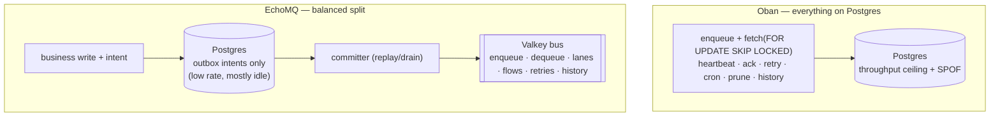

# EchoMQ 4+ — Graft hardening, pluggable durability, and the Postgres journal { id="echo_mq-v4-graft-durability" }

> _Three deliveries in the echo umbrella, on the road to EchoMQ 4+. First, an analysis of the real [`orbitinghail/graft`](https://github.com/orbitinghail/graft) and four new Graft features that harden the Elixir port to match it. Second, durability turned into a **plugin** — a journal-adapter contract with SQLite (local), Postgres (bring-your-own), Graft (v4), and Memory (tests) backends. Third, the Postgres journal itself, and why it beats Oban-fully-on-Postgres for the balanced deployment: **mitigate the single-instance database by giving it far less to do, and let a reliable Valkey carry the work.**_

## Part 1 — Graft, analyzed and hardened

### What upstream Graft is

Graft (`orbitinghail/graft`, v0.2.1, Rust, Apache/MIT) is a transactional storage engine for
**lazy, partial, strongly-consistent** replication to the edge. From its architecture docs,
the parts that matter for the owned tier:

- **Snapshots are immutable** logical views of a volume at a point in time — LSN ranges from
  one or more logs. Reads are lock-free against them; many readers run in parallel with no
  coordination.
- **Writers** stage a **segment** (the pages a transaction touched) over an immutable base
  snapshot, with read-your-write inside the transaction.
- **Commits are strictly serialized OCC**: validate the base snapshot is still latest →
  acquire a global write lock → append at a monotonic LSN → on validation failure, abort and
  retry.
- **Replication** is coordinated by a **SyncPoint** (`local_watermark` = pushed, `remote` =
  pulled). **Push** rolls up an LSN range into one **segment** (dedup to the latest version of
  each page), Zstd-compresses pages into frames (≤64/frame), uploads to `/segments/{id}`, then
  does a **conditional commit write** to `/logs/{LogId}/commits/{LSN}` to detect conflicts.
  **Pull** streams missing commits and **refuses to merge on divergence** (both sides advanced
  → manual intervention). Pages load **lazily**: a read finds the segment in the snapshot and
  fetches its frame only if not cached. Decoupled metadata/data gives **instant read replicas**.

### What `echo_store` already had — and the gaps

The Elixir port is already faithful in its core: `Graft.VolumeServer` is the
strictly-serialized OCC commit (its single-writer mailbox **is** the global write lock;
`begin/1` returns the base LSN; `commit/3` rejects a stale base with `{:error, {:conflict,
head}}`; `head_lsn` is the monotonic LSN), `Store` is the CubDB local log, `Streamer` + `Remote`
push to Tigris off the write path, `Reader` reads, and `Sync` carries `Commit` notices over the
bus. Measured against upstream, four things were implicit that EchoMQ 4+ needs explicit — the
commit-log-as-outbox (the durability ADRs) is only safe if the log's frontier, replicated unit,
and writer identity are first-class.

### The four new Graft features (shipped here)

| Module | Upstream concept | Why EchoMQ 4+ needs it |
|---|---|---|
| `EchoStore.Graft.SyncPoint` | SyncPoint (`local_watermark`/`remote`) | the committer must drain a log with an explicit pushed/pulled frontier, not one implied by "the streamer fired" |
| `EchoStore.Graft.Segment` | push rollup (dedup-to-latest, ≤64-page frames) | the replicated, checkpointable unit; makes a remote commit cheap and a read-replica instant |
| `EchoStore.Graft.Epoch` | conditional-write conflict / fencing | a restarted or partitioned `VolumeServer` must not resurrect as a second writer and re-emit a covered intent — a stale epoch is **fenced** (`{:error, {:fenced, current}}`) |
| `EchoStore.Graft.Divergence` | pull divergence detection | when local and remote both advanced, **reject — never silently merge** (matches BCS newer-wins and at-least-once-with-idempotency) |

`SyncPoint` tracks the frontier and answers `unsynced/2` (the committer/streamer backlog).
`Segment.build/3` folds a `{lsn, page, bytes}` list newest-wins into one version per page (the
rollup), chunks into frames, and keys to `segments/{SEG-id}`. `Epoch` is the fencing token a
writer claims on volume ownership; the remote records the highest seen and rejects lower.
`Divergence.check/3` returns `:ok`, `{:fast_forward, :remote, lsn}`, or
`{:error, {:diverged, …}}`. None replace shipped surface; they extend it.

## Part 2 — durability as a plugin

Durability is now a **plug**: one behaviour, swappable backends, selected in config. Nothing
in EchoMQ knows which backend is durable.

```elixir
# lib/echo_mq/journal/adapter.ex — the contract
@callback intend_and_enqueue(journal, conn, name_id, version) :: {:ok, job_id} | {:error, term}
@callback record/4; @callback mark_enqueued/2; @callback record_many/2
@callback replay/2;  @callback compact/1;       @callback last_applied/2; @callback stats/1
```

`EchoMQ.Journal` is the facade that reads `config :echo_mq, EchoMQ.Journal, adapter: …` and
dispatches. The verbs mirror the as-built `EchoStore.Journal` exactly, so adapters are
interchangeable and a deployment changes durability by **config, not rewrite**.

| Adapter | Substrate | Use |
|---|---|---|
| `EchoMQ.Journal.SQLite` | the shipped exqlite journal | **local dev & tests** — zero infra, a file per group |
| `EchoMQ.Journal.Postgres` | host's own Ecto `Repo` | **BYO-Postgres** — intent rides the business transaction |
| `EchoMQ.Journal.Graft` | CubDB-backed Graft commit log | **EchoMQ 4+** — no SQL, commit-log-as-outbox (ADR-A) |
| `EchoMQ.Journal.Memory` | ETS | tests |

The `Graft` adapter is the bridge that makes the no-SQL ADRs (A–G) a config flip from the
SQLite/Postgres world: `intend_and_enqueue` stages the datum + the intent edge in one
`VolumeServer.commit/3`, and the committer drains the commit stream.

## Part 3 — the Postgres journal, and why it beats Oban-on-Postgres

The question: *what makes a Postgres journal inside EchoMQ beneficial over Oban fully backed by
Postgres?* The answer is **where the work lands.**



**Oban puts the entire queue on Postgres** — every fetch, heartbeat, ack, retry, cron tick,
prune, and the jobs and history themselves. That makes Postgres both the **throughput ceiling**
(each state transition is a row write + index maintenance + MVCC; the bench measured durable
inserts at ~1,125/s on one core, the 6.5× durability × 3.7× substrate tax) and the **single
point of failure** (the queue is down exactly when Postgres is).

**EchoMQ's Postgres journal holds only the outbox `intents`** — one small insert per triggering
business write, bounded by the *business-write* rate, not queue churn. The bus — enqueue,
dequeue, lanes, flows, retries, history — stays on Valkey (the bench measured admission at
12–27k/s). So the balance the brief names — *mitigate the single-instance database but keep a
reliable Valkey* — falls out:

- **Throughput.** The hot path is Valkey, not Postgres. Postgres is sized for business writes,
  not for every dequeue and heartbeat.
- **Blast radius.** A Postgres outage loses only the *transactional-enqueue anchor* for the
  consumers that opted into it — and `replay/2` plus bus dedup cover the gap — **not the running
  queue.** With Oban, a Postgres outage stops the queue.
- **Cost & ops.** A single, mostly-idle Postgres instance is a cheap, low-risk durability anchor;
  the reliability-critical component is Valkey, which is itself replicable.
- **Optionality.** It is a *plugin*: a deployment with no Postgres-resident consumer runs no
  Postgres at all — SQLite locally, or the Graft commit log in v4.

And it still recovers **Oban's strongest property** — *enqueue atomically with the business
write* — because the intent rides the host's own `Repo.transaction/1`, committing in the same
Postgres transaction as the business row.

**The honest trade** (ADR-F): the atomic boundary covers only the business data written **in that
same transaction**, and you now operate **two systems** (Valkey + Postgres) rather than one. The
plugin model makes that an explicit deployment choice, not a default tax — and the v4 `Graft`
adapter collapses it back to one owned tier when you are ready to leave SQL behind.

## Part 4 — local to develop

The default adapter is `SQLite`: a file per group on disk, no service to run. `mix test` and a
laptop get the full transactional-enqueue guarantee with nothing provisioned. Move to Postgres
by setting two config keys; move to the v4 Graft commit log by setting one. The contract is the
same the whole way up.

## Delivered — feature manifest

New files, and where each lands in the umbrella:

```
apps/echo_store/lib/echo_store/graft/sync_point.ex     SyncPoint (push/pull frontier)
apps/echo_store/lib/echo_store/graft/segment.ex        Segment (rollup/dedup/frames)
apps/echo_store/lib/echo_store/graft/epoch.ex          Epoch (writer fencing)
apps/echo_store/lib/echo_store/graft/divergence.ex     Divergence (reject-don't-merge)

apps/echo_mq/lib/echo_mq/journal/adapter.ex            the plug contract (behaviour)
apps/echo_mq/lib/echo_mq/journal.ex                    the facade (config dispatch)
apps/echo_mq/lib/echo_mq/journal/sqlite.ex             local-dev adapter
apps/echo_mq/lib/echo_mq/journal/postgres.ex           BYO-Postgres outbox adapter
apps/echo_mq/lib/echo_mq/journal/postgres/intent.ex    the intents schema
apps/echo_mq/lib/echo_mq/journal/memory.ex             ETS adapter (tests)
apps/echo_mq/lib/echo_mq/journal/graft.ex              v4 commit-log-as-outbox adapter
apps/echo_mq/priv/repo/migrations/20260620000000_create_emq_intents.exs
config/journal.exs                                     adapter selection per env
```

## Caveats

1. **Authored against the unzipped umbrella; syntax-validated, not compiled here.** `echo_store`
   and the Postgres adapter pull hex deps (`exqlite`, `cubdb`, `ecto_sql`, `postgrex`) that this
   sandbox's proxy blocks, so the files were parse-checked (`Code.string_to_quoted!`, 13/13 ok)
   rather than `mix compile`d. Compile them in the umbrella where hex is reachable.
2. **The `Graft` adapter and the four Graft features are forward-tense where they extend
   unshipped surface** — they fit the as-built `VolumeServer`/`Sync`/`Store`/`Id` APIs read at
   source, but the v4 commit-log-as-outbox itself (ADR-A) is the destination, not yet the floor.
3. **The Postgres-vs-Oban numbers are the single-core bench figures** (durable ~1,125/s, Valkey
   admission 12–27k/s); they show the *shape* — work lands on Valkey, not Postgres — not a
   capacity result.
