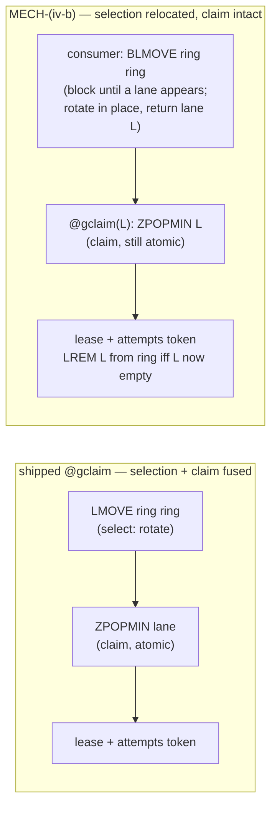

# emq.4.3 — The Metronome Mechanism: an architect's answer to FORK A-MECH { id="emq-4-3-metronome-fork-answer" }

> _The fork is well-posed once one distinction is drawn that the brief leaves implicit: **§12.2 protects the
> claim, not the selection.** Draw it, and the §12.2 collapse dissolves — MECH-(i) is Arm A relabelled because
> it changes neither selection nor claim; a genuinely new primitive is reachable in canon by relocating
> **selection** (block on the work-readiness truth) while leaving the **claim** atomic. The strongest
> realization is a refinement of MECH-(iv) the brief's sink-framing hides: **block on the ring by rotating it in
> place** (`BLMOVE ring ring`), which closes the lost-wakeup window by construction with no sink and no recovery
> path. Recommendation: **opt MECH-(iv-b) if multi-consumer-per-queue is a near target; otherwise ship MECH-(i)
> labelled honestly as Arm-A-plus-sink and defer the genuine primitive.** Reject MECH-(iii) — MECH-(iv-b)
> subsumes its soundness without the permanent §6 cost. The single highest-reversal decision is MECH-(iii)'s
> frozen §6 member; price it before ruling._

Method applied: **Rationale · 5W · Steelman · Steward**, turned on the arms themselves. Grounding taken from
§1's verified floor — the shipped `BLPOP wake` loop, the seven wake-pushers, the atomic `@gclaim` (rotate →
`ZPOPMIN` → server-clock lease → attempts token), and the frozen wire — none of which any arm replaces.

## The spine: selection is not claim

§12.2 says *"claim **IS** `ZPOPMIN` inside the claim script."* Read precisely, that protects the **claim** —
the atomic `ZPOPMIN` + lease + attempts token. It says nothing about **selection** — *which* lane the claim
runs against. The shipped `@gclaim` happens to fuse the two: `LMOVE ring ring LEFT RIGHT` (selection: rotate to
the next serviceable lane) *and* `ZPOPMIN` (claim) in one script. §12.2 forbids a client-side pop **substituting
for the claim**; it does not forbid a client-side step that performs **selection** and then hands a chosen lane
to a claim that stays atomic.

This is the whole fork. An arm founds a genuinely new primitive **iff it changes the selection structure** the
consumer blocks on, while preserving the §12.2-protected claim. By that test:

- **MECH-(i)** changes neither. It blocks on the same `wake` token (selection unchanged — a proxy that the
  rotate inside `@gclaim` still resolves) and claims via the same `@gclaim` (claim unchanged). The `BLPOP →
  BLMOVE` swap adds a recoverable *sink*, not a new selection. **It is Arm A with a recoverability bolt-on.**
- **MECH-(iv)** changes selection: the consumer blocks on the **ring** — the structure that *is* the set of
  serviceable lanes — and claims the lane it selected. Selection moves out (and becomes truthful); the claim
  stays atomic. **This is the genuine new primitive, and it is §12.2-legal.**

## Ranking the arms

Ranked by fidelity to the binding D-1 (a genuinely new primitive), compliance with §12.2 / INV7-8, present
need, and net cost.

1. **MECH-(iv-b) — block on the ring, rotate in place.** *The only arm that founds a new selection primitive,
   is §12.2-legal, closes the lost-wakeup window by construction, and subsumes MECH-(iii)'s soundness without
   touching the §6 grammar.* Cost: an `@gclaim` refactor (split selection from claim) and a 4.3↔4.4 coupling.
   **#1 — but gated on the ≥100 loop proving the split composes.**
2. **MECH-(i) — `BLMOVE` on `wake` with a sink.** *Lowest cost; closes the one present gap (crash mid-claim);
   smallest founding.* **But it is Arm A relabelled and therefore fails D-1 as written.** #2 only as the
   honest fallback if the Operator re-reads D-1 to accept Arm-A-plus-sink for the single-consumer present need.
3. **MECH-(ii) — a dedicated metronome process.** *A new operational surface, but a process-level distinction,
   not a primitive-level one* — internally it still block-then-`@gclaim`s. Justified only if **supervised
   multi-consumer fan-out / backpressure is a present need** (it is not, for codemojex one-lane-per-player).
   Largest standing cost for the least-present benefit. #3.
4. **MECH-(iii) — per-lane `wake:<group>` lists.** *Pays a permanent §6 grammar contract and pre-empts
   emq.4.4 (INV8) for a property MECH-(iv-b) delivers for free.* Crosses the INV7 soundness/fairness line,
   re-addresses 7 frozen scripts (7 byte-freeze hazards), and forecloses emq.4.4 Fork B Arm 3 — the carve's own
   home for per-lane machinery. **Dominated. #4 — reject.**

**Is MECH-(i) a genuine departure from Arm A? No.** Stated plainly so it is not smuggled: MECH-(i) is the
shipped loop with one blocking verb swapped and a recoverable sink added. It changes the *durability* of a
consumed signal, not the *selection structure* — which is what "a new blocking-claim primitive" must mean. Its
recoverability is real but narrow (it closes gap (a) only) and is itself new standing state requiring
reclamation. Under D-1 as written, MECH-(i) is non-compliant.

## Resolving the §12.2 collapse

The brief's own false-premise flag is correct *for MECH-(i)* and dissolved *for the fork*:

- **Is "found a new primitive" achievable within the canon? Yes** — by relocating selection, not claim. §12.2
  binds the claim; the ring-block founds a new selection. The collapse was an artifact of testing only the arm
  (MECH-(i)) that changes neither half.
- **Which path best honors the Operator's Arm-B intent (a structurally distinct surface)?** Not accept-(i)
  (nominal compliance only). Not re-open-§12.2 (unnecessary — §12.2 never blocked the achievable primitive).
  **Take the genuinely-distinct MECH-(iv-b)** — it is the structurally distinct surface D-1 ruled for, and it
  needs no canon revision. Re-opening §12.2 is the wrong larger rung; the smaller, legal move is the ring-block.

So the binding pair (D-1 + §12.2) does **not** force the riskiest arm by contradiction, as a first reading
suggests. It forces a precise architectural move — *new selection, unchanged claim* — whose lowest-risk
embodiment is MECH-(iv-b).

## Pricing MECH-(iv) — the question most worth the time

The brief asks: does MECH-(iv) force an `@gclaim` edit, and can block-pop + rotate compose without double-serve
or lost-lane? The answer depends on the **sink** the brief's framing assumes — and a better variant drops it.

**MECH-(iv-a) — `BLMOVE ring <sink>` (the brief's literal shape).** The pop *removes* the lane from the ring
into a per-consumer sink. This forces both an `@gclaim(lane)` edit **and** a recovery path: a crash between the
pop and the re-ring orphans a **whole lane** in the sink — every job on that lane starves until something reads
the sink. The sink is new standing state with a lane-level lost-work hazard. This is the expensive way.

**MECH-(iv-b) — `BLMOVE ring ring LEFT RIGHT` (rotate in place).** `src == dst == ring` rotates the head lane
to the tail and *returns* it, leaving it **on the ring**. The consumer wakes holding a specific serviceable
lane; the lane is never consumed, only advanced. Then `@gclaim(lane)` claims it.

**Does it force an `@gclaim` edit? Yes — but a bounded one:** split selection out. `@gclaim` drops its
`LMOVE ring ring` (the consumer's `BLMOVE` did the rotate) and takes the selected lane as an argument; the
§12.2-protected core — `ZPOPMIN` + server-clock lease + attempts token — is **unchanged and still atomic**.
"Claim is one atomic script" is preserved; only "select-and-claim is one script" is given up, which §12.2 does
not require.

**Can block-pop + rotate compose without double-serve or lost-lane? Yes, with (iv-b):**

- **No lost-lane.** The ring is rotated, not consumed. A crash between the `BLMOVE` and the `@gclaim(lane)`
  leaves the lane on the ring for the next consumer — there is **no sink, no recovery path, and nothing to
  orphan.** The lost-wakeup window closes *by construction*: you wake holding a lane that is still on the ring,
  or you do not wake.
- **No double-serve.** Two consumers that select the same hot lane both run `@gclaim(L)`; `ZPOPMIN` is atomic,
  so each takes a distinct job or one finds it empty and re-parks (the same benign `:empty` the exhaustive
  `drain` already handles). No job is served twice; none is lost.
- **Cross-lane herd eliminated.** Valkey serves blockers on `ring` FIFO; each gets a *distinct* rotated lane,
  so N parked consumers wake on N distinct lanes rather than stampeding one shared token. The "wake then serve
  nothing" case the brief flags as a possible correctness bug is gone across lanes — which makes this a **wake
  *soundness* property (4.3), not a lane-fairness property (4.4)**. INV7 is respected.

The one residual: an emptied lane must be `LREM`'d from the ring so "the ring holds exactly the serviceable
lanes" stays true. That cleanup belongs in `@gclaim(lane)` (claim → if lane now empty, `LREM`) and is the
detail the ≥100 loop must hammer.

## Decision matrix

| Arm | Blocks on | New primitive (D-1) | §12.2-legal | Lost-wakeup closed | Cross-lane herd | INV7 class | `@gclaim` edit | §6 grammar edit | New standing state | Reversal cost | Verdict |
|---|---|---|---|---|---|---|---|---|---|---|---|
| **(i)** `BLMOVE wake→sink` | proxy token | **No** (Arm A + sink) | yes | gap (a) only | persists | n/a | none | none | per-consumer sink | low | fallback only |
| **(ii)** metronome process | a process mailbox | partial (new surface, same primitive) | yes | gap (a) | persists | n/a | none | none | supervised process | medium-high | defer |
| **(iii)** per-lane `wake:<g>` | per-lane token | yes (new structure) | yes | gap (a)+(b) | eliminated | **fairness (4.4)** | none | **yes (CLOSED §6)** | per-lane lists | **highest** | **reject** |
| **(iv-a)** `BLMOVE ring→sink` | the ring (consumed) | **yes** | yes | by construction* | eliminated | soundness (4.3) | **yes** | none | per-consumer sink (lane-orphan hazard) | high | viable, costly |
| **(iv-b)** `BLMOVE ring ring` | the ring (rotated) | **yes** | yes | **by construction** | eliminated | soundness (4.3) | **yes (bounded)** | none | **none** | high (`@gclaim` re-grade) | **recommended** |

\* (iv-a) closes the window only if the sink-recovery path is correct; (iv-b) closes it with no recovery path.

## The single highest-reversal-cost decision

Priced for irreversibility, so the Operator weighs it before ruling:

1. **MECH-(iii)'s §6 member — a permanent wire-grammar contract.** A CLOSED-registry `type` cannot be removed
   without a wire **major**; it pre-empts emq.4.4 and forecloses Fork B Arm 3. **This is the highest reversal
   cost on the board** — and MECH-(iv-b) buys its entire soundness benefit without paying it.
2. **MECH-(iv)'s `@gclaim` refactor** — re-grades the most safety-critical script. Reversible only by reverting
   the claim primitive (a re-founding), but a script revert is bounded; a wire-grammar member is forever.
3. **MECH-(ii)'s supervised process** — removable, but operationally disruptive (restart semantics, the beat as
   a tunable, doubled process count to reason about).
4. **MECH-(i)'s sink** — the most reversible (a verb swap + a list).

Conclusion: **reject MECH-(iii) on reversal cost alone unless emq.4.4's lane fairness is proven *present now*** —
and it is not (4.4 owns it; INV8 forbids pre-emption).

## Did the brief surface the right arms?

Mostly — with one refinement and one honest addition, and two correct silent exclusions.

- **The refinement (most valuable):** the brief frames MECH-(iv) with a **sink** (iv-a), which hides the
  stronger **rotate-in-place** variant (iv-b). The sink is what creates the lane-orphan recovery burden and the
  apparent severity of the `@gclaim` edit. Drop the sink and (iv) becomes far cheaper on the Steward axis while
  keeping every benefit. **The brief surfaced (iv) but undersold it.**
- **A missed arm — MECH-(v): per-consumer wake lists.** A pusher fans `LPUSH` out to each *live consumer's* own
  wake list (a keyspace consumer-registry with liveness), so each consumer blocks on its own list — killing the
  cross-lane herd **without** an `@gclaim` edit and **without** a §6 grammar member. It sits honestly between
  (i) and (iv-b): herd-free and selection-cheap, but it does **not** deliver (iv-b)'s lane-soundness (a
  consumer still wakes on a generic "you have work" signal, not a specific serviceable lane) and it adds a
  consumer-registry surface the suite lacks. Rank it below (iv-b); offer it as the option "if the herd is the
  real worry but the `@gclaim` re-grade is judged too risky for a HIGH rung."
- **Correctly excluded (both fail a binding constraint):** a *server-side blocking script* (Lua/`FUNCTION`
  cannot block — foreclosed) and *keyspace-notification pub/sub* (`SUBSCRIBE` on lane events is fire-and-forget;
  a notification missed while not subscribed is **lost**, reintroducing the exact lost-wakeup gap 4.3 must
  close, and pub/sub push frames strain the frozen wire). Their omission is right.

## The proof is the rung

The brief's strongest cross-cutting point holds and survives the (iv-b) finding: even with a genuinely new
primitive, **4.3's real risk and value live in the proof.** The minimal set that actually gates the charter:

- **No lost wakeup** — a *concurrent admit-then-park* scenario: park a consumer, then admit on its lane in the
  same beat window, and assert service within the beat. For (iv-b), add the crash-between-`BLMOVE`-and-claim
  case and assert the lane is still on the ring (no recovery path exercised, because none exists).
- **Fair across consumers** — an **N-parked-consumer** scenario asserting distinct-lane wakeups and bounded
  starvation. **This requires a genuine multi-consumer harness the 55-scenario suite does not have.** Building
  it is part of 4.3's cost regardless of arm, and it is where the ≥100-iteration determinism loop earns its
  keep (the lost-wakeup race and the same-millisecond branded-`JOB` mint are cross-run hazards one green run
  cannot surface).

Whichever arm ships, register the new scenario(s) with their probe in the same change and re-pin **55 → N** in
both pinning tests; the only wire move is the `@wire_version` / `{emq}:version` / `mix.exs` climb
**`echomq:2.4.2 → 2.4.3`**. MECH-(iv-b) is an **additive minor** (no §6 edit); MECH-(iii) would also be a minor
but a heavy, pre-emptive one.

## Recommendation ("opt") and the pivot

**Opt — conditional on one fact the brief's 5W "Who" isolates:**

- **If multiple parked consumers per queue is a present or near-term target** (the only configuration in which
  herd-elimination and lane-targeting are live), **found MECH-(iv-b).** It is the genuine new primitive D-1
  ruled for, §12.2-legal by the selection/claim distinction, lost-wakeup-closed by construction, herd-free, and
  it makes MECH-(iii) unnecessary. Accept its price: a bounded `@gclaim` refactor (graded HIGH, gated on the
  ≥100 multi-consumer loop) and a deliberate 4.3↔4.4 design — because (iv-b) **relocates the rotation-fairness
  seam** from inside `@gclaim` to ring-membership discipline, which emq.4.4's weighted rotation (Fork B) must
  then build on. That coupling is real; it is also a *cleaner* seam (weighting becomes "how the ring is
  ordered/re-pushed"), so co-design 4.3 and 4.4 rather than pretend they separate.
- **If codemojex stays single-consumer-per-queue and multi-consumer is merely anticipated**, then no present
  need justifies the `@gclaim` re-grade. **Ship MECH-(i) — labelled in the record as Arm-A-plus-recoverable-
  sink, not as Arm B** (honoring the brief's "flag, don't smuggle" rule and forcing an explicit, honest re-read
  of D-1), and **schedule MECH-(iv-b) as the founding for when multi-consumer arrives.** This is the lower-risk
  path for a HIGH-risk frozen-surface rung and refuses to pay an irreversible `@gclaim` cost speculatively.

**The pivot question, for the Operator to answer first:** *does any named consumer run multiple parked
consumers per queue within the 4.3 horizon?* That single fact selects (iv-b) over (i). Everything else in this
matrix is downstream of it.

**Build topology.** Both recommended paths are **bounded touch-sets** — consumer + (`@gclaim` for iv-b) +
scenarios + the wire constant — so both fit a standard **Flat-L2** pass (Mars build → Director verify with the
≥100 loop → Mars-2 harden → Apollo MANDATORY), with no divide-and-conquer wave. Only MECH-(iii) forces the wide
formation (one agent for the 7-script re-address, one for the primitive, one for conformance + `.stories.md`),
which is itself a reason the Operator's "no overload/freeze" principle disfavours it.

## The four asks, answered

1. **Rank:** (iv-b) > (i, as fallback) > (ii) > (iii, reject). **MECH-(i) is *not* a genuine departure from Arm
   A** — it changes neither selection nor claim.
2. **§12.2 collapse:** "found a new primitive" **is** achievable in canon — by relocating *selection* (§12.2
   binds the *claim*). The Operator's Arm-B intent is best honored by **MECH-(iv-b)**, not by accepting (i) and
   not by re-opening §12.2 (which never blocked the achievable primitive).
3. **MECH-(iv) priced:** it forces an `@gclaim` edit (split selection from claim; the atomic `ZPOPMIN` core
   stays). With the **rotate-in-place (iv-b)** variant, block-pop + rotate **compose safely** — no lost-lane
   (ring rotated, not consumed; no sink, no recovery path) and no double-serve (atomic `ZPOPMIN`).
4. **Highest reversal cost:** **MECH-(iii)'s frozen §6 member** (a permanent wire-grammar contract that also
   pre-empts emq.4.4) — above (iv)'s `@gclaim` refactor, (ii)'s process surface, and (i)'s sink. Reject (iii)
   unless 4.4's fairness is proven present now.

---

_Grounded on §1's verified floor (the `BLPOP wake` loop, the seven wake-pushers, atomic `@gclaim`, the frozen
wire). Forward-tense throughout for the founding, which does not yet exist. Method: Rationale · 5W · Steelman ·
Steward. Sibling exemplar: `emq-durability-design.md`._
