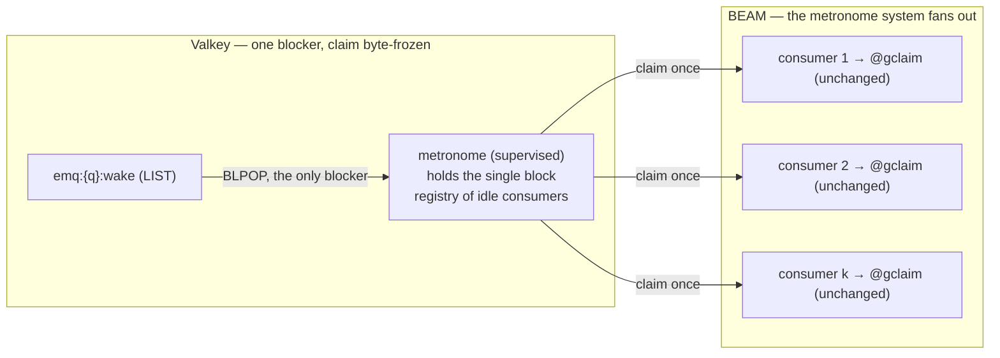

# emq.4.3 — The Metronome Mechanism: a second architect's answer to FORK A-MECH (the consumer-steward lens) { id="emq-4-3-metronome-fork-answer-2" }

> _A second architect, arguing the **same** arms (MECH i–v) from a divergent lens — **consumer-steward /
> operational-pragmatist** against the first answer's spec-steward / primitive-theory. The question is not "which
> arm founds the most genuine primitive" but "what do the named consumers (codemojex today, echo_bot's Telegram
> dispatch next) actually need, and what does each arm cost to **operate and to keep**, not only to **found**."
> Two findings diverge. **First — for a single-consumer-per-lane profile the shipped loop has no wake-*soundness*
> gap:** the exhaustive `drain` plus the periodic beat bound a lost wake token to *latency*, not lost work, so
> 4.3's honest deliverable for the present consumer is **lower wake latency**, and "found a new primitive" is
> over-charter for it. **Second — the brief argues every arm on one axis (the Valkey blocking primitive) and
> omits the BEAM-process axis;** on that axis the under-rated arm is **MECH-(ii), the metronome-as-system** — one
> Valkey blocker fanning out to N consumers over BEAM messages, each running the **byte-frozen `@gclaim` once** —
> which delivers herd-elimination and consumer-fairness **without** re-grading the safety-critical claim and
> **reversibly** (delete a supervised process; the wire is untouched). Recommendation: **re-surface D-1** — §12.2
> has dissolved the Arm-A/Arm-B distinction it was ruled on — and let the **consumer's dispatch topology**, not
> primitive purity, decide the rung; if found-new stands and a consumer pool is real, **prefer (ii) over (iv-b)**,
> because reversibility on the hot path outranks wire-elegance on a HIGH-risk frozen-surface rung._

Method applied: **Rationale · 5W · Steelman · Steward**, turned on the arms — the same instrument as the first
answer, from the opposite vantage. Grounding taken from the brief's verified floor (§1): the shipped `BLPOP wake`
park loop, the `beat_ms`-paced metronome beat (`check_control → reap → promote → drain → park`), the exhaustive
`drain`, the per-queue `emq:{q}:wake` token LIST with its seven pushers, the atomic `@gclaim`
(`LMOVE ring ring` → `ZPOPMIN` → server-clock lease → attempts token), and the frozen wire
(`Connector.command/3` carrying any blocking verb on the consumer's dedicated lane). None of these any arm
replaces. Companion: [`metronome-fork-venus-1.md`](metronome-fork-venus-1.md) (the first answer, the
selection-is-not-claim spine). The brief: [`../emq-4-3-metronome-design.md`](../emq-4-3-metronome-design.md).

## Where this answer diverges, in one paragraph

The first answer accepts D-1 (Arm B ruled) as binding, proves a genuinely-new primitive is reachable by
*relocating selection* (§12.2 binds the *claim*), and recommends **MECH-(iv-b)** — block on the ring, rotate in
place. That reading is correct on its own axis and the selection/claim distinction is the right insight. This
answer diverges on two facts the first does not weigh. (1) **The consumer.** For the present consumer profile —
codemojex one-lane-per-player, a single parked consumer per lane — there is **no lost-wakeup defect to close**:
the metronome beat is the backstop, so a lost token degrades to bounded *latency*, never lost work. The "new
primitive" charter is solving a multi-consumer problem the named consumers may not have. (2) **The axis.** Every
brief arm chooses a *Valkey* structure to block on; none chooses a *BEAM* structure to coordinate from. The
metronome is, in BCS terms, **a system** — a process that owns the beat — and once that axis is admitted, MECH-(ii)
delivers the multi-consumer benefits the first answer credits only to (iv-b), but on the BEAM side, where the
cost is supervised and **reversible**, leaving `@gclaim` and §12.2 untouched.

## The spine: the gap is latency, not soundness — until there is a pool

The brief names two real gaps in the shipped wake protocol: (a) a consumed-but-undrained signal lost to a crash
between the `BLPOP` and the claim; (b) cross-lane thundering-herd on the shared token list. The consumer lens
asks the prior question the brief defers: **are these gaps present for a named consumer, or anticipated?**

- **Gap (b) does not exist for a single consumer.** A herd requires a crowd. codemojex runs one parked consumer
  per player-lane; with one blocker on `emq:{q}:wake` there is no stampede to eliminate. Herd-elimination —
  (iv-b)'s headline benefit, and (iii)'s and (v)'s — is **dead weight** for this profile.
- **Gap (a) degrades to latency, not lost work, for a single consumer.** The consumer is a `spawn_link` loop that
  beats `check_control → reap → promote → drain → park` every `beat_ms`, and `drain` is **exhaustive** (claims
  until `@gclaim → :empty`). If the wake token is lost — consumed-then-crashed, or never pushed — the consumer
  re-enters the loop when the park's own timeout returns and **the next beat's `drain` serves everything that
  arrived**. The wake is a *latency optimization* over the beat, not the correctness path. A wholly-lost wake
  costs at most one park-timeout of delay; it never costs a job. (`reap` + the server-clock lease cover the
  symmetric case — a crash *after* a claim — independently of which arm ships.)

So for codemojex today, 4.3's deliverable is honestly **sub-beat wake latency** (serve in milliseconds when work
lands, instead of up to the park timeout), not **wake soundness** (which the beat already guarantees). That
reframes the rung: its value for the present consumer is responsiveness, and its risk is everything a
hot-path founding spends to buy responsiveness the beat already approximates. **The gaps become real the moment a
consumer runs a *pool* on a shared queue** — which is the pivot, and which is about echo_bot, below.

## The missing axis: the metronome is a system

Every arm in the brief is "block on structure X in Valkey, then `@gclaim`." That is one axis — the wire
primitive. The BCS law the stack is built to (the project's one mental model: *a system is an OTP process that
owns its data privately*) names a second axis the brief omits: **where does the beat live as a process?** Today
it is fused into `EchoMQ.Consumer`'s `spawn_link` loop — every consumer is its own metronome. The honest
BCS question is whether the beat *should* be a consumer's private concern or a **system** in its own right.

This is not a cosmetic re-framing. It is the axis on which MECH-(ii) stops being "a bigger touch-set for the same
primitive" (the first answer's #3 dismissal) and becomes the arm that buys the multi-consumer benefits **without
the wire cost**. The first answer evaluated (ii) on the wire axis ("internally it still block-then-`@gclaim`s")
and was right *on that axis*; on the process axis (ii) is a different, stronger arm.

## The arms, re-argued from the consumer-steward lens

The two arms whose verdict the lens changes — (ii) up, (iv-b) down — get the full four-part treatment; the
others get a compressed pass where the divergence is a single point or a convergence.

### MECH-(ii) — the metronome-as-system — re-argued at its strongest

**Rationale.** A dedicated supervised process owns the beat for a queue and **fans wakeups out to consumers over
BEAM messages**. Exactly one Valkey connection blocks (the metronome's, on the existing `emq:{q}:wake`); on a
wake it pokes *k* idle consumers — where *k* is the number it has registered idle — and **each pokes runs the
byte-frozen `@gclaim` once**. The herd is gone because only one connection blocks; consumer-fairness is exact
because the metronome hands out one claim per idle consumer; lane-fairness is unchanged because each `@gclaim`
still does the atomic `LMOVE ring ring` rotate. The claim primitive is **not touched**, §12.2 is **not
approached**, and the §6 grammar is **not edited**.

**5W.**
- **Why** — to make the beat a first-class, supervised surface so multi-consumer wake is coordinated on the BEAM
  (where liveness is free via links/monitors) instead of on the wire (where a herd, a sink, or a registry must be
  manufactured).
- **What** — a new supervised process per queue (a metronome system) that holds the single block, tracks idle
  consumers, and dispatches "claim once" messages; consumers lose their private park and gain a registration.
- **Who** — **echo_bot's Telegram dispatch** is the consumer that makes this live: a notification fan-out is
  naturally a *pool* of workers on a shared queue (many sends, few queues), which is precisely the
  multi-consumer-per-queue configuration in which one coordinator beats N self-parking loops. codemojex
  (one-lane-per-player) does not need it today and is not harmed by it (a one-consumer pool is the degenerate
  case).
- **When** — 4.3, *iff* the Operator rules that found-new must ship and a pool is a near target; otherwise
  scheduled for when the pool arrives (the do-no-harm path below).
- **Where** — a new module under `echo_mq` plus a supervisor child; **zero** wire edit, **zero** Lua edit, the
  `@wire_version`/`{emq}:version`/`mix.exs` climb to `echomq:2.4.3` (the brief's verified fence) the only wire-level
  move, and that only because the conformance scenario count climbs.

**Steelman.** This is the arm that delivers (iv-b)'s entire multi-consumer benefit envelope — herd-elimination,
distinct-target wakeups, consumer-fairness — **without re-grading the safety-critical claim**. The coordination
moves to the BEAM, which is the platform's core competency: a supervised process that crashes is *restarted*, its
in-flight claims are already protected by the server-clock lease and the `reap`/stalled path, and consumers that
die are detected by monitor, not by a manufactured keyspace liveness probe. It is the **most BCS-idiomatic** arm —
the metronome becomes a system that owns the beat, which is the law the whole stack is built to. And it is the
**most reversible** founding on the board: delete the process, restore the consumers' private park, and the wire
is byte-for-byte where it started — no script re-graded, no grammar member frozen.

**Steward.** The honest costs, named even though this is the favored arm. (1) **A serialization point.** One
process per queue gates wakeups; its mailbox is new standing state; a slow metronome throttles the whole queue.
This is mitigated — not erased — by supervision and by the fact that the lease makes a metronome crash lose no
work — but it is a real new failure surface to reason about, and it doubles the process count a deployment must
hold. (2) **A registration contract.** Consumers must register/deregister idle state with the metronome and the
`stop/2`/`:shutdown` drain contract must compose with it; getting that wrong re-introduces a missed wake on the
BEAM side. (3) **It is genuinely new operational surface** — restart semantics, the beat as a tunable now owned
by a separate system, the registry's bounds. The counterweight: every one of these costs is a *BEAM* cost, the
category the runtime is designed to absorb and the category that is **removable**, against (iv-b)'s *wire* cost,
which is frozen by committed records and removable only by re-founding the claim.

### MECH-(iv-b) — block on the ring, rotate in place — re-argued skeptically

**Rationale (granted).** It is the genuine new selection primitive and it is elegant on the wire: a consumer
wakes holding a specific serviceable lane, the lost-wakeup window closes by construction with no sink. The first
answer's spine — selection is not claim — is correct, and as a piece of wire design (iv-b) is the cleanest of the
brief's arms. None of that is in dispute.

**5W (the divergence starts at Who).** **Who** redeems the benefit is the same pool that (ii) serves — and for
that same consumer (ii) reaches the benefit without the `@gclaim` re-grade. **Where** is the crux: (iv-b) lives
*inside the hottest script's contract*. It splits selection out of `@gclaim` (the consumer's `BLMOVE ring ring`
now performs the rotate) and adds a conditional `LREM L from ring iff L now empty` *into* `@gclaim`. So the ring —
the structure that is the set of serviceable lanes — acquires a **new writer outside the script layer**: the
client's `BLMOVE` rotation.

**Steelman (the first answer's, honored).** The rotate is non-destructive (head to tail, returned), only
`@gclaim`'s conditional `LREM` removes; "claim is one atomic script" is preserved because only "select-and-claim
is one script" is given up, and §12.2's text binds the claim, not the selection. Two consumers selecting the same
hot lane is benign (`ZPOPMIN` is atomic). All true under §12.2's **letter**.

**Steward (where the lens objects).** Three long-game costs the first answer underprices.
- **§12.2's *spirit*, not only its letter.** The canon rejects a client-side pop because it "would bypass the
  script layer's event and bookkeeping path." Ring *rotation* is bookkeeping of selection state; (iv-b) moves it
  to the client for the first time. The first answer reads §12.2 as guarding the claim; this answer reads ring
  membership as part of "the script layer's bookkeeping path" the same § exists to protect. **Two architects read
  one section two ways — that divergence is itself the signal the Operator should see**, because an architecture
  justified by a subtle textual distinction is fragile to the next maintainer who does not draw it.
- **A speculative-generality smell the first answer applies to (iii) but not to itself.** (iv-b) **couples
  4.3↔4.4**: it relocates the rotation-fairness seam from inside `@gclaim` to ring-membership discipline, so
  emq.4.4's weighted rotation (Fork B) must then build on a seam 4.3 chose client-side. The first answer rejects
  MECH-(iii) for pre-empting 4.4 (INV8) — correctly — and then accepts a recommendation that *pre-constrains*
  4.4. Consistency demands the same skepticism: pre-shaping a later family rung from this one is the INV8 hazard
  whichever direction it points.
- **Re-grading the safety-critical claim is the least-reversible bounded cost.** The first answer rightly puts
  (iii)'s frozen §6 member as #1 reversal cost. But #2 — (iv-b)'s `@gclaim` edit — is underpriced *operationally*:
  the new `LREM`-if-empty obligation lives on the hottest path, and a bug there is a lane that is empty but still
  ringed (consumers wake, serve nothing, re-park — a busy-spin) or a lane `LREM`'d while still serviceable (a
  lost lane). The first answer waves this to "the ≥100 loop must hammer it"; the lens calls it **new permanent
  complexity in the claim primitive, paid forever, for a benefit (ii) delivers reversibly**.

### The other arms — compressed

- **MECH-(i) — `BLMOVE` wake→sink.** *Rationale/Steelman:* the move-to-sink genuinely changes the correctness
  contract (a crash mid-claim re-finds the signal) — a stronger claim to "new guarantee" than the first answer's
  "Arm A relabelled" allows; whether that *counts* as a new primitive is a definitional question for the
  Operator, not an architect's to foreclose. *Steward:* a per-consumer sink is new standing state whose recovery
  path must be written and reclaimed on consumer death, and for a single consumer it buys recoverability over a
  gap the beat already bounds. **Verdict: the smallest honest step** — ship it (labelled as recoverable-sink, not
  smuggled as Arm B) if the present profile is single-consumer and the Operator wants more than the do-nothing
  floor.
- **MECH-(v) — per-consumer wake lists.** A consumer-registry in the **keyspace** with manufactured liveness.
  This is a degenerate (ii) with the registry on the wire instead of the BEAM — and liveness is exactly what the
  BEAM gives for free (monitors) and Valkey makes you build (heartbeat keys, TTLs, a reaper). **Dominated by (ii)
  on the same benefit.** Rank below (ii).
- **MECH-(iii) — per-lane `wake:<group>` + a §6 member.** *Converge with the first answer: reject* — and add the
  consumer-grounded reason beneath the reversal-cost one: no named consumer needs per-lane wake *targeting* at
  4.3 (codemojex's lanes are players, so a per-player wake list is a large keyspace of tiny lists — operational
  bloat for a property (ii)/(iv-b) deliver without it), and it pre-empts 4.4 (INV8). A permanent wire-grammar
  contract for an anticipated, not present, need.
- **The do-nothing baseline (the brief and the first answer both under-weight it).** Keep the shipped `BLPOP
  wake` loop. For codemojex it is **already correct** — sub-beat-ish on the happy path, beat-bounded on a lost
  token, no lost work. The rung's value must be argued *against this floor*, and for a single-consumer profile
  the floor is a serious contender: the increment 4.3 buys is latency, and latency the beat already bounds.

## Decision matrix — the operational axes

The first answer's matrix is keyed to primitive theory (new-primitive? §12.2-legal? selection vs claim). This
one is keyed to what the rung costs to **operate and reverse**.

| Arm | Blocks on (where) | `@gclaim` touched | §12.2 letter / spirit | Herd (multi-consumer) | Consumer-fairness mechanism | New standing state | Reversibility class | Present-consumer benefit | Verdict |
|---|---|---|---|---|---|---|---|---|---|
| **baseline** | `wake` (each consumer) | no | clean / clean | n/a for 1; persists for pool | n/a | none | n/a | already correct (latency ≤ beat) | the floor to beat |
| **(i)** `BLMOVE wake→sink` | `wake` (each) | no | clean / clean | persists | n/a | per-consumer sink | cheap (verb + list) | bounded recoverability | smallest honest step |
| **(ii)** metronome-as-system | one blocker, **BEAM** fan-out | **no** | clean / clean | **eliminated** | metronome pokes k idle → 1 `@gclaim` each | supervised process + idle-registry (BEAM) | **BEAM-reversible** | sub-beat + herd-free pool | **recommended (found-new + pool)** |
| **(iv-b)** `BLMOVE ring ring` | the ring (client rotates) | **yes (re-grade)** | legal / **strained** | eliminated | distinct rotated lane per blocker | none | **wire-script re-founding** | sub-beat + lane-targeted | strong but costly; couples 4.4 |
| **(v)** per-consumer wake lists | own wake list | no | clean / clean | eliminated | fan-out push per live consumer | keyspace registry + manufactured liveness | wire-data, mid | herd-free, no lane-target | dominated by (ii) |
| **(iii)** per-lane `wake:<g>` + §6 | per-lane token | no | clean / clean **but §6 grammar** | eliminated | per-lane targeting | per-lane lists + **frozen §6 member** | **wire-grammar (forever)** | lane-targeted | reject (INV8, reversal) |

## Pre-empting the first answer's strongest objection

The selection-is-not-claim advocate's best rebuttal to (ii): *"the metronome still has to block on something and
dispatch, so it either polls (the thing we forbade) or it holds the ring-block and re-grades `@gclaim` anyway,
just centralized — (ii) does not escape the trade, it relocates it."*

**Answered.** The metronome blocks on the existing **`emq:{q}:wake` token** (not the ring), so it polls nothing
and edits no script. On a wake it pokes *k* idle consumers, and **each runs the unmodified `@gclaim` once** — one
atomic `ZPOPMIN` with the existing `LMOVE ring ring` rotate inside it. That distributes work **fairly across
consumers** (one claim each) and **across lanes** (the rotate the script already does), using `@gclaim`
**byte-frozen**. The herd is eliminated not by changing what is blocked on, but by reducing the blockers to one.
The genuine concession: a naive metronome that poked *one* consumer to *exhaustive-drain* would be consumer-*un*fair
(one worker hogs the beat) — so the dispatch contract is "one `@gclaim` per idle consumer per wake," and that
contract, plus the idle-registry and the serialization point, is (ii)'s real Steward cost. It is a BEAM cost, and
it is removable. (iv-b)'s cost is a wire-script re-grade, and it is not.

## The single highest-reversal-cost decision

Priced for irreversibility, converging with the first answer on the order but adding the operational reading:

1. **MECH-(iii)'s §6 member** — a permanent wire-grammar contract; removable only by a wire **major**. Highest on
   the board. Both answers reject (iii) on this alone.
2. **MECH-(iv-b)'s `@gclaim` re-grade** — re-founds the most safety-critical script and moves ring-rotation to the
   client. The first answer prices it below (iii) and calls it "bounded"; this answer prices it as the **least
   reversible *bounded* cost** and notes (ii) buys the same benefit *fully reversibly*. A script revert is
   bounded, yes — but the new `LREM`-if-empty obligation on the hot path, and the 4.3↔4.4 coupling, are the kind
   of complexity that is cheap to add and expensive to ever remove.
3. **MECH-(ii)'s supervised process** — operationally disruptive (restart semantics, a serialization point,
   doubled process count) but **deletable**; the wire and the claim are untouched, so reverting it is removing a
   child from a supervisor.
4. **MECH-(i)'s sink** / **(v)'s registry** — the most reversible wire-data additions.

The lens's conclusion: on a HIGH-risk, frozen-surface rung, **reversibility on the hot path is the decision
variable**, and it orders the arms (ii) before (iv-b) for the same multi-consumer benefit.

## Did the brief surface the right arms?

Mostly — and the first answer's two additions ((iv-b) the rotate-in-place refinement, (v) the missed
per-consumer arm) are both correct and sharpen the board. This lens adds two observations of its own:

- **The brief under-weights the do-nothing baseline.** The architect's approach requires a do-nothing baseline in
  the solution space; for a single-consumer profile the shipped loop is not a strawman floor but a live
  contender, because it has no soundness defect to fix. The rung's increment for codemojex is latency, and that
  must be argued against the beat, not assumed.
- **The brief argues the fork on one axis.** Every arm is "block on Valkey structure X." The BEAM-process axis —
  the metronome as a system that owns the beat — is the axis on which (ii) is the strongest arm rather than the
  largest touch-set. A fork that omits an axis hides its best arm on that axis; this is the most valuable thing an
  outside vantage can return.

## The proof is the rung — and it forces the pivot to be answered

Convergence with the first answer, sharpened: 4.3's real risk and value live in the proof, and **the proof cannot
be written without first deciding the consumer topology.** A "fair across consumers, no lost wakeup" charter
requires a genuine **multi-consumer harness** the 55-scenario suite does not have — and the moment that harness is
built, it must encode *how many consumers per queue*, which is the pivot below. So building the proof *forces* the
question the mechanism fork turns on; it cannot be deferred past the harness.

- **No lost wakeup** — a concurrent *admit-then-park* scenario, asserting service within the beat; for any arm
  that adds standing state (sink, registry, metronome mailbox), the crash-between-signal-and-claim case, asserting
  no orphaned work and no leaked state.
- **Fair across consumers** — the N-parked-consumer scenario, asserting distinct service and bounded starvation.
  This is where (ii)'s "one `@gclaim` per idle consumer" and (iv-b)'s "distinct rotated lane per blocker" are
  actually differentiated, and where the **≥100-iteration determinism loop** earns its keep (the lost-wakeup race
  and the same-millisecond branded-`JOB` mint are cross-run hazards one green run cannot surface — the HIGH-risk
  posture the brief fixes).

Whichever arm ships, register the new scenario(s) with their probe in the same change and re-pin **55 → N** in
both pinning tests; the only wire move is the `@wire_version` / `{emq}:version` / `mix.exs` climb to
`echomq:2.4.3` (the brief's verified fence). (ii), (i), and (v) are additive minors with **no Lua edit**;
(iv-b) is an additive minor that **re-grades `@gclaim`**; (iii) is a heavy, pre-emptive minor that edits §6.

## Recommendation ("opt") and the pivot

**Opt — one move, with the one reason that carries it:** **re-surface D-1 to the Operator before the mechanism is
ruled.** The reason: §12.2 has dissolved the premise D-1 was decided on — "Arm A (deepen) and Arm B (found-new)
are materially different" — because every achievable mechanism is now *block-on-a-signal then atomic `@gclaim`*,
which is Arm A's shape. The first answer worked *around* this by proving a letter-legal primitive exists; the
spec-steward's duty (surface, don't smuggle) is to hand the Operator the dissolved premise and let the **consumer
profile**, not primitive purity, decide. Then:

- **If found-new stands and a consumer pool is a present or near target (echo_bot's dispatch):** found
  **MECH-(ii), the metronome-as-system** — it is the genuine multi-consumer founding, BCS-idiomatic (the beat
  becomes a system), herd-free and consumer-fair, and it reaches the benefit **without** re-grading `@gclaim` and
  **reversibly**. Prefer it over (iv-b): on a HIGH-risk frozen-surface rung, BEAM-reversibility outranks
  wire-elegance, and (ii) refuses the 4.3↔4.4 coupling (iv-b) accepts.
- **If the present and near consumers are single-consumer-per-lane (codemojex):** no soundness gap justifies a
  hot-path founding now. **Ship the smallest latency step** — MECH-(i) for bounded recoverability over the beat,
  or hold at the do-nothing baseline and re-rule D-1 honestly as "Arm A's deepening fits this consumer" — and
  **schedule MECH-(ii) for when the pool arrives.** Do no harm; thin but robust; refuse to pay an irreversible
  hot-path cost speculatively.

**The pivot question, for the Operator to answer first** (and sharper than "multiple parked consumers per
queue"): *will echo_bot's Telegram-notification dispatch run as a **pool of parked consumers on a shared queue**,
or as a **consumer-per-lane** (per-chat / per-tenant)?* The pool answer makes the herd real and selects a
multi-consumer founding ((ii), then (iv-b)); the consumer-per-lane answer leaves codemojex's profile intact and
selects (i) or the baseline. **This single fact about a consumer that is not yet built is the gate** — and it is
exactly the kind of fact NO-INVENT forbids an architect to assume, so it is surfaced, not resolved.

**Build topology.** (ii), (i), (v), and the baseline are bounded touch-sets — a standard **Flat-L2** pass (Mars
build → Director verify with the ≥100 loop → Mars-2 harden → **Apollo MANDATORY**, the brief's HIGH-risk
posture). (ii) adds a supervised process and its registration contract — still one bounded build, with the
proof's multi-consumer harness the load-bearing work. Only (iii) forces the wide divide-and-conquer formation
(the 7-script re-address as its own stream), which is itself a reason to disfavor it.

## The four asks, answered (from this lens)

1. **Rank.** For a **single-consumer-per-lane** profile: baseline ≈ (i) > (ii) > (iv-b) > (v) > (iii). For a
   **pool** profile: **(ii) > (iv-b)** > (v) > (i) > (iii). The headline divergence from the first answer: **(ii)
   above (iv-b)** in the multi-consumer case — same benefit, reversible, claim untouched. On "is MECH-(i) a
   genuine departure from Arm A": it changes the correctness *contract* (recoverable signal); whether that is a
   "new primitive" is the Operator's definition to set, not an architect's to foreclose.
2. **§12.2 collapse.** "Found a new primitive" *is* achievable in canon (the first answer is right that selection
   can be relocated). The divergence is on whether it *should* be the goal: for the present consumer there is no
   soundness gap, so the honest move is to **re-surface D-1** and let the consumer profile decide, not to
   manufacture a primitive the consumer does not redeem. If the Arm-B intent (a structurally distinct surface)
   stands, it is best honored by **MECH-(ii) on the BEAM axis**, not (iv-b) on the wire axis.
3. **MECH-(iv) priced.** Granted: (iv-b) composes safely on the wire (ring rotated not consumed; atomic
   `ZPOPMIN`). The lens's addition: it forces an `@gclaim` re-grade that introduces a **new ring writer outside
   the script layer** (the client's rotate) and a new `LREM`-if-empty obligation on the hot path, and it
   **couples 4.3↔4.4** — costs that **(ii) avoids entirely**, which is why (ii) is preferred for the same benefit.
4. **Highest reversal cost.** Agree: **MECH-(iii)'s frozen §6 member** is #1. Add: **MECH-(iv-b)'s `@gclaim`
   re-grade is #2 and operationally underpriced** — the least-reversible *bounded* cost — whereas **MECH-(ii)'s
   process surface is fully reversible** (a supervisor child, the wire untouched). On a HIGH-risk frozen-surface
   rung, that ordering is the recommendation.

---

_Grounded on the brief's verified floor (the `BLPOP wake` park loop, the `beat_ms` metronome beat, the exhaustive
`drain`, the seven wake-pushers, the atomic `@gclaim`, the frozen wire). Forward-tense throughout for the
founding, which does not yet exist. Consumers cited as the real ones — codemojex (single-consumer-per-lane today),
echo_bot (Telegram-notification dispatch, the pool that makes the pivot live) — never an invented one. Method:
Rationale · 5W · Steelman · Steward, from the consumer-steward lens. Companion (the spec-steward lens):
[`metronome-fork-venus-1.md`](metronome-fork-venus-1.md). The Director synthesizes the two; the Operator rules._
