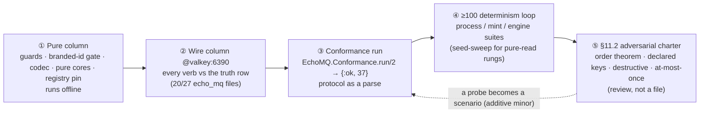
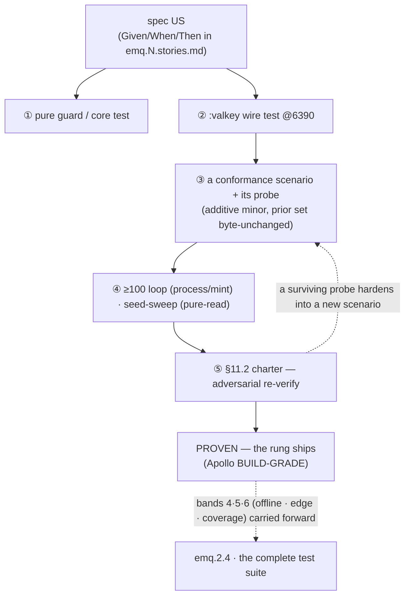

# EchoMQ — Testing Progress Dashboard

> **The single consolidated proof-status view of the EchoMQ engineering program** — how each shipped rung
> of the 2.x bus (`emq.0`–`emq.2.3`) is *proven*, measured against the bar the strategy *defines*. This
> file **reports**; the binding artifacts **define** — the testing strategy
> [`../emq.testing.md`](../emq.testing.md) (the proof stack + the given-when-then matrix + the coverage
> axes), the per-rung task ledgers beside this file ([`emq.1.testing.md`](./emq.1.testing.md) …
> [`emq.2.3.testing.md`](./emq.2.3.testing.md)), and the as-built test trees under `echo/apps/*/test/`.
> It is the testing mirror of [`../emq.progress.md`](../emq.progress.md) (the build-status dashboard).
>
> **Generated 2026-06-14** from the as-built tree at `master` (`3c6461ff`) + the committed spec ledgers
> (`specs/emq-N.progress.md`). **Re-true at each rung close** — re-probe the tree; module names, line
> numbers, and counts drift, and the working tree and `origin/master` drift in both directions (this view
> was authored after a `git pull` corrected a local tree that lagged the team's emq.2.3 push).

**One-line state.** Four rungs are **shipped & gate-green** — `emq.1` (`e0fa9b03`), `emq.2.1` (`7d98ef86`),
`emq.2.2` (`76fc947c`), `emq.2.3` (`3c6461ff`). **33 / 33 shipped user stories** are bound to a proof;
**conformance is 37 / 37**; the determinism loop is green where it applies (emq.2.3 100/0, Apollo
BUILD-GRADE). The open band across the whole program is **line/branch coverage — UNMEASURED on the v2 apps**
(`excoveralls` is wired only on the frozen v1; the wire suites are Valkey-gated) — it is the **#1 backlog
item and the `emq.2.4` enabler**. The bus is proven as a **parse** (conformance), densely on the happy path;
the **depth + offline-coverage** is what `emq.2.4`'s "complete test suite" closes.

---

## Legend

| Symbol | Proof state | Meaning |
|---|---|---|
| ✅ | **PROVEN** | shipped, gate-green: acceptance + conformance green on this machine at ship |
| ◐ | **PARTIAL** | the band exists but is thin — some cases covered, the edges open |
| ✗ | **OPEN** | the band has no proof yet (a hot place → a per-rung task) |
| ⛔ | **UNMEASURED** | cannot be established here (Valkey 6390 down · no v2 coverage baseline) |
| 📐 | **SPECCED** | the test plan is authored, no test artifact yet (emq.2.4) |

**The proof lanes** (which layer carries a story): `pure` (no engine, runs offline) · `wire` (Valkey 6390) ·
`proc` (process/timer, under the ≥100 loop) · `ledger` (a design-gate story, proven by the ADR + the
declared-keys analysis, not a runtime test).

**The 6-band maturity rubric** (the bar below = how many bands are green for the rung; a shipped rung is
gate-green by definition, so the bar measures **hardening depth beyond the ship gate**):

1. **Acceptance** — every US bound to a proving test · 2. **Conformance** — scenario + probe registered,
prior set byte-unchanged · 3. **Determinism** — the ≥100 loop (or the pure-read seed sweep) run & recorded ·
4. **Offline-pure** — a pure column proves something without Valkey · 5. **Edge/honesty** — the refusal /
at-most-once / no-phantom / `[RECONCILE]`-limit / property edges tested · 6. **Coverage-measured** — a
captured `--cover` baseline.

ANSI bars: `█` proven-band · `░` open-band. Band glyphs read `1·2·3·4·5·6`.

---

## Testing Progress

> Reconciled 2026-06-14 against git + the as-built trees, **per rung**. Ground truth: all four Movement-I
> rungs are shipped and gate-green; the bars show the **proof depth** the strategy bar asks for, not ship
> status (they all shipped). The two bands consistently open program-wide are **4 (offline-pure)** and **6
> (coverage-measured)** — exactly `emq.2.4`'s remit.

```text
EchoMQ — testing maturity · per rung · convergence target echo/apps/echo_mq
bands:  1 acceptance · 2 conformance · 3 determinism · 4 offline-pure · 5 edge/honesty · 6 coverage-measured

Movement 0 · founding proof
  emq.0     ✅ proven    ████████████████░░░░  14 founding scenarios · the §5 test/coverage pass        a2d599c8

Movement I · the parity floor   (all SHIPPED & gate-green — the bar = hardening depth beyond the ship gate)
  emq.1     ✅ proven    ████████████████░░░░  ✅✅✅◐◐✅  7 US · conf→18 · det 120/120+100/100 · cov 91.50%   e0fa9b03
  emq.2.1   ✅ proven    ███████████░░░░░░░░░  ✅✅✅✗◐⛔  8 US · conf→24 · pure-read seed-sweep posture        7d98ef86
  emq.2.2   ✅ proven    ███████████░░░░░░░░░  ✅✅✅✗◐⛔  10 US · conf→32 · ≥100 loop caught an iter-59 race   76fc947c
  emq.2.3   ✅ proven    █████████████░░░░░░░  ✅✅✅◐◐⛔  8 US · conf→37 · ≥100 100/0 · Apollo BUILD-GRADE     3c6461ff
  emq.2.4   📐 specced   ████░░░░░░░░░░░░░░░░  the complete test suite — closes bands 4·5·6 program-wide   e8a61eb7 (spec)

── roll-up · the four shipped rungs ──────────────────────────────
  acceptance     33 / 33 user stories bound to a proof   (25 executable · 4 conformance-gate · 4 ledger)
  conformance    37 / 37 scenarios   ·   run/2 → {:ok, 37}   ·   pinned twice (registry + live count)
  population      echo_mq 201 (20/27 files :valkey) · echo_wire 18 (pure) · echo_store 68   =  287 tests
  determinism    emq.1 120+100 · emq.2.2 100/100 (race caught) · emq.2.3 100/0   ·   emq.2.1 seed-sweep
  coverage(line)  UNMEASURED on v2  ⛔  (excoveralls v1-only; 20/27 echo_mq files Valkey-gated)
  the depth gap   v1 echomq ≈531 tests / 41 files   →   v2 echo_mq 201 / 27   ·   residual = emq.2.4
  ──────────────────────────────────────────────────────────
  4 / 4 Movement-I rungs PROVEN at the ship gate  ·  bands 4 & 6 open program-wide → emq.2.4
```

**The proof convergence:** every shipped capability answers to **one** standing gate — `EchoMQ.Conformance`
(`echo/apps/echo_mq/lib/echo_mq/conformance.ex`, 37 scenarios), re-run live (`conformance_run_test.exs` →
`{:ok, 37}`) and pinned pure (`conformance_scenarios_test.exs`, the 37-name run order). A capability is not
"shipped" until its scenario sits in that registry with the prior set byte-unchanged.

---

## The proof stack — the five layers

The dependency between proof layers (each catches what the one below hides; a claim ships only when its
layer is green):



**Layer reading.**
- **① Pure** is the only layer that runs in an offline CI today (`ExUnit.start(exclude: [:valkey])`); it is
  also the thinnest beyond guards/cores — **band 4** of the rubric.
- **② Wire** is where most behavioral proof lives and is exactly what an offline run **skips** — the
  program's standing blind spot until a Valkey-backed CI exists.
- **③ Conformance** is its own gate beyond the unit suites — it has caught two harness bugs the standalone
  suites missed (the emq.1 learning, below).
- **④ Determinism** is mandatory for process/mint/engine suites (`pump`, `locks_stalled`, `jobs_extend`);
  a **pure-read** rung (emq.2.1) runs a seed sweep instead and states that posture honestly.
- **⑤ The charter** is applied by review; when a probe hardens into a permanent check it is **registered as
  a conformance scenario** (the additive-minor feedback edge).

---

## Coverage milestones — the proof each axis must carry

The four coverage axes of [`../emq.testing.md`](../emq.testing.md) §4, as milestones:

| Axis | What "done" is | Current | State |
|---|---|---|---|
| **User-story acceptance** | every shipped US binds to ≥1 proof (test or design ledger) | **33 / 33** | ✅ proven |
| **Conformance (protocol-as-parse)** | every capability is a registered scenario, prior set byte-unchanged | **37 / 37** | ✅ proven |
| **Determinism** | process/mint suites green across ≥100 (pure-read: seed sweep) | green where run | ✅ at ship · ◐ not auto-captured |
| **Test population** | a wire test + a conformance probe + a guard per public verb | **287** cases | ✅ on the happy path |
| **Code line/branch** | a captured `--cover` baseline, Valkey up, excoveralls on v2 | **none** | ⛔ unmeasured → `emq.2.4` |

### What `emq.2.4` (the parity closer) must ship — the testing milestone

| Required proof | Closes band | Lead ledger |
|---|---|---|
| stand up a **Valkey-6390 CI job** (the 20 wire files + the conformance run execute in CI) | 2/4 | [`emq.2.3.testing.md`](./emq.2.3.testing.md) |
| wire **excoveralls** into the three v2 `mix.exs` + **capture the first line/branch baseline** | 6 | cross-rung |
| an **offline pure column** per read/operator verb (guards run without Valkey) | 4 | [`emq.2.1.testing.md`](./emq.2.1.testing.md), [`emq.2.2.testing.md`](./emq.2.2.testing.md) |
| the **edge/honesty** tests (at-most-once · no-phantom-emit · `de:*` orphan · meter zero-cost · order-theorem property) | 5 | all four ledgers |
| the **G1 rate-gate fork** pinned so emq.2.4's Arm-2 wiring is a deliberate diff | 5 | [`emq.2.1.testing.md`](./emq.2.1.testing.md) |

---

## The rung testing ladder — current state

| Rung | Ships proven | Test files (`echo/apps/echo_mq/test/`) | Lanes | Conf. | Bands | State |
|---|---|---|---|---|---|---|
| **emq.0** | the founding 14 scenarios · the §5 test/coverage pass · the `echo/rungs/` gate ladder | the founding suites + `conformance_*` | wire+pure | →14 | foundation | ✅ proven `a2d599c8` |
| **emq.1** | scheduler/retry/pump/resubscribe — 7 US, the poison drill, two determinism loops, a `--cover` figure | `scheduled_enqueue` · `repeat` · `pump`(+`_core`) · `resubscribe` · `backoff` · `consumer`(+`_spec`) | wire+pure | →18 | `✅✅✅◐◐✅` | ✅ proven `e0fa9b03` |
| **emq.2.1** | read plane — 8 US over `EchoMQ.Metrics`; all six reads wire-proven; pure-read seed-sweep posture | `metrics_test.exs` (20, 6 describes) | wire | →24 | `✅✅✅✗◐⛔` | ✅ proven `7d98ef86` |
| **emq.2.2** | operator plane — 10 US; the destructive paths gated; the ≥100 loop caught an iter-59 race | `admin_test.exs` (10) · `jobs_ops_test.exs` (17) | wire | →32 | `✅✅✅✗◐⛔` | ✅ proven `76fc947c` |
| **emq.2.3** | watch plane — 8 US; events/extend wire, meter/cancel pure; determinism 100/0; Apollo BUILD-GRADE | `events_integration` · `jobs_extend` · `locks_stalled` · `meter` · `cancel` | wire+proc+pure | →37 | `✅✅✅◐◐⛔` | ✅ proven `3c6461ff` |
| **emq.2.4** | the parity closer — the **complete test suite** + the feature residue; HIGH-RISK (Apollo MANDATORY + ≥100) | the depth-gap fill (bands 4·5·6) | — | plans 37→… | `📐` | 📐 specced |

> The bands `4` (offline-pure) and `6` (coverage-measured) are **open on every emq.2.x rung** — they are not
> per-rung debt but a **program-wide closure** assigned forward to `emq.2.4`, exactly as the depth gap is
> attributed in [`../emq.progress.md`](../emq.progress.md) (worker→emq.6 · OTel→emq.8 · flow→emq.3 ·
> scheduler→emq.1 · stress→the ≥100 loop).

---

## The test grounding map — US → test → conformance → code

The join that ties the four document sets to one truth: every shipped **user story** binds to an as-built
**test file**, a **conformance scenario** that re-proves it as a parse, and the **module** it exercises.

| User story | As-built test | Conformance scenario | As-built module | Rung |
|---|---|---|---|---|
| scheduled enqueue (1·US1) | `scheduled_enqueue_test.exs` | `schedule` | `EchoMQ.Jobs.enqueue_at/in` | emq.1 ✅ |
| repeatables (1·US2) | `repeat_test.exs` | `repeat` | `EchoMQ.Repeat` | emq.1 ✅ |
| retry + poison (1·US3) | `backoff_test.exs` · `consumer_test.exs` | `backoff` | `EchoMQ.Backoff` · `Jobs.retry/7` | emq.1 ✅ |
| promote pump (1·US4) | `pump_test.exs` · `pump_core_test.exs` | (via run) | `EchoMQ.Pump`(+`.Core`) | emq.1 ✅ |
| resubscribe (1·US5) | `resubscribe_test.exs` | `resubscribe` | `Connector` (`echo_wire`) | emq.1 ✅ |
| counts / state / metrics / dedup / rate / lane (2.1·US1–6) | `metrics_test.exs` | `counts`·`state`·`metrics`·`dedup`·`rate`·`lane_depth` | `EchoMQ.Metrics` | emq.2.1 ✅ |
| pause / drain / obliterate (2.2·US1–3) | `admin_test.exs` | `queue_pause`·`drain`·`obliterate` | `EchoMQ.Admin` | emq.2.2 ✅ |
| update_data/progress · logs · remove · reprocess (2.2·US4–8) | `jobs_ops_test.exs` | `update_data`·`update_progress`·`job_logs`·`remove_job`·`reprocess_job` | `EchoMQ.Jobs` | emq.2.2 ✅ |
| events (2.3·US1) | `events_integration_test.exs` | `events` | `EchoMQ.Events` | emq.2.3 ✅ |
| meter (2.3·US2) | `meter_test.exs` | `telemetry` | **`EchoMQ.Meter`** (`telemetry.ex`) | emq.2.3 ✅ |
| extend_lock (2.3·US3) | `jobs_extend_test.exs` | `lock_extend` | `Jobs.extend_lock/5`·`extend_locks/4` | emq.2.3 ✅ |
| Locks plane (2.3·US4) | `locks_stalled_test.exs` | (via lock_extend) | **`EchoMQ.Locks`** (`lock_manager.ex`) | emq.2.3 ✅ |
| Stalled sweep (2.3·US5) | `locks_stalled_test.exs` | `stalled` | **`EchoMQ.Stalled`** (`stalled_checker.ex`) | emq.2.3 ✅ |
| cancel (2.3·US6) | `cancel_test.exs` | `cancel` | **`EchoMQ.Cancel`** (`cancellation_token.ex`) | emq.2.3 ✅ |
| every GATE story (1·US7 · 2.1·US8 · 2.2·US10 · 2.3·US8) | `conformance_run_test.exs` · `conformance_scenarios_test.exs` | all 37 | `EchoMQ.Conformance` | all ✅ |
| every design-gate story (1·US6 · 2.1·US7 · 2.2·US9 · 2.3·US7) | the rung's `emq.N.md` D1 + declared-keys analysis | — | (ledger, no runtime test) | all ✅ |

> The **module names differ from the spec prose** — `telemetry.ex` = `EchoMQ.Meter`, `lock_manager.ex` =
> `EchoMQ.Locks`, `stalled_checker.ex` = `EchoMQ.Stalled`, `cancellation_token.ex` = `EchoMQ.Cancel`. The map
> cites the real `defmodule`; the PIN is kept in [`emq.2.3.testing.md`](./emq.2.3.testing.md).

---

## The proof flow



---

## Frontier & next testing actions

The hot-place backlog (strategy §5), prioritized — **this is the `emq.2.4` testing backlog**:

| # | What | Where | Blocked on |
|---|---|---|---|
| 1 | **Stand up a Valkey-6390 CI job + capture the first v2 `--cover` baseline** (wire excoveralls into the three v2 `mix.exs`) — closes bands 2-in-CI & 6 program-wide | [`emq.2.3.testing.md`](./emq.2.3.testing.md) (lead) | **NEXT** — the emq.2.4 enabler; needs a CI Valkey service |
| 2 | **Capture the ≥100 determinism loop as an artifact** (today run by hand) — the `pump`/`locks_stalled`/`jobs_extend` flake surface | `emq.1` + `emq.2.3` ledgers | the CI job (#1) |
| 3 | **The edge/honesty tests** — at-most-once across disconnect · no-phantom-emit · `de:*` orphan · meter zero-cost · the order-theorem property | all four ledgers (band 5) | none (authorable now) |
| 4 | **The cross-rung lock integration** — a real `EchoMQ.Locks` lease drives `emq.2.2` `remove_job`'s `EMQLOCK` (replace the hand-set lock) | `emq.2.2` + `emq.2.3` | none |
| 5 | **Pin the G1 rate-gate fork** so emq.2.4's Arm-2 claim-wiring is a deliberate, diffable change | `emq.2.1` ledger | the emq.2.4 ruling (Arm 2) |

> **Closed since this view opened:** `emq.2.3` (the watch plane) **shipped & proven** (`3c6461ff`) —
> determinism **100/0**, both flakes fixed at root, Apollo **BUILD-GRADE**; conformance **37/37**.

---

## Evidence (`emq.2.3`, the latest shipped rung — testing figures)

Verbatim from the rung's ledger + the as-built tree — the testing figures this rung may claim:

- **Suites:** five new files — `events_integration_test` (8, wire) · `jobs_extend_test` (9, wire) ·
  `locks_stalled_test` (13, wire+proc) · `meter_test` (11, pure) · `cancel_test` (19, pure) — **+60 cases**.
- **Conformance:** **32 → 37** (the prior 32 byte-unchanged; +5 watch scenarios `lock_extend`/`stalled`/
  `events`/`telemetry`/`cancel`); both pins carry 37 in the same change (`conformance_run_test.exs` →
  `{:ok, 37}`, `conformance_scenarios_test.exs` the 37-name run order).
- **Determinism:** the ≥100 loop **GREEN 100/0**, owning the machine; **both determinism flakes fixed at
  root** (not by retry); Apollo **BUILD-GRADE**.
- **Boundary:** the diff stayed inside `echo/apps/echo_mq` (+ `jobs.ex` extend verbs); per-app testing only.

**`emq.1` coverage (the last captured `--cover`, the v2 baseline of record):** Backoff 100% · Pump.Core
100% · Conformance 94.86% · Jobs 89.58% · Pump 88.89% · Repeat 85.71% · **Total 91.50%** — a single rung's
figure, **not** a standing program baseline (no v2 `excoveralls`; band 6 open — frontier #1).

---

## Findings & learnings — consolidated per rung (the testing lens)

Each rung's durable **testing** carry-forward, grounded in its ledger (`specs/emq-N.progress.md`). These are
why the proof stack is shaped the way it is.

### emq.1 — *the conformance scenarios are a higher-signal gate than the unit suites* (L-1)
The wire-level conformance bodies **caught two self-inflicted bugs the standalone per-module suites did
not** (an inverted mint-order guard; a too-early promote). Carry-forward: the **additive-minor law** (a new
scenario + its probe in the same change, the prior set byte-unchanged) is enforced on every capability rung
*because* conformance out-signals units. Determinism: **120/120 + 100/100** across distinct seeds (no
same-ms mint collision). This is the rung that earned coverage band 6 a real figure (91.50%).

### emq.2.1 — *a gate-invisible declared-keys breach* (the F-1 class)
`@counts` first derived its metric keys from an `ARGV` base; when **only metric-states** were requested,
`KEYS` was empty → **no declared key pinned the `{q}` slot** — a breach **invisible on single-node Valkey**
(it only fails on a real cluster). The lesson is a **testing** one: a green wire suite on a single node is
not proof of declared-keys discipline; the **§11.2 charter's declared-keys probe** is now a standing
Stage-2 check, and "an `ARGV` base is not a declared root" carries into every later sweep verb. Also: the
read plane is a **pure-read rung** — its determinism posture is the **seed sweep**, not the ≥100 loop
(running the loop would forge load the rung does not introduce).

### emq.2.2 — *the ≥100 loop earned its keep* (L-3)
The determinism loop caught an **iter-59 subscriber-stop race** (a TOCTOU in the new emit test's cleanup,
sharing the resubscribe suite that kills connections) — **a single run AND a 5× run both missed it**.
Cause-fixed via `stop_quietly/1`; a Director-**independent** 100/100 corroborated. Carry-forward: **the loop
is the gate, not the implementer's single run**. Also two **realization-over-literal** `[RECONCILE]` limits
were pinned, not coded around (drain protects the repeat *registry*; obliterate's `de:*` cleanup is
bounded-complete) — these need **regression guards** so a future "fix" that breaks declared-keys is caught
(strategy §5.5).

### emq.2.3 — *two determinism flakes fixed at root, not retried*
The process suites (`locks_stalled`, `jobs_extend`) are the program's flake surface (timers + leases); both
flakes were **fixed at root** and the loop landed **100/0** owning the machine. Carry-forward: the **server-
clock law** (`extend_lock` re-scores from `TIME` in-script) is the invariant a flake would silently break,
and the **at-most-once honesty** across a disconnect is asserted in prose but **not yet tested** (the top
band-5 gap). The spec-name vs file-name drift (`Meter`/`Locks`/`Stalled`/`Cancel`) is pinned in the ledger.

---

## Master testing invariant (held at every rung)

> Every shipped capability is proven as a **parse** — a registered `EchoMQ.Conformance` scenario with its
> probe, the prior set **byte-unchanged** — not as prose. The protocol grows by **additive minor** only.
> Process / mint / engine suites pass under the **≥100 determinism loop owning the machine** (a pure-read
> rung states a seed-sweep posture instead). Testing is **per-app** (umbrella-wide `mix test` banned);
> engine claims are **honest-row** (a host without Valkey reports as *that* row, never the truth row); and
> **a check counts only if it RUNS** — a doctest is inert until a file invokes `doctest`, a wire test is
> inert until Valkey is up in CI. The open closure across the program is **bands 4 (offline-pure) and 6
> (coverage-measured)** — assigned forward to `emq.2.4`, the complete test suite.

---

## Sources

- **Testing strategy (binding):** [`../emq.testing.md`](../emq.testing.md) (the proof stack · the GWT matrix · the coverage axes · the hot-place index)
- **Per-rung task ledgers:** [`emq.1.testing.md`](./emq.1.testing.md) · [`emq.2.1.testing.md`](./emq.2.1.testing.md) · [`emq.2.2.testing.md`](./emq.2.2.testing.md) · [`emq.2.3.testing.md`](./emq.2.3.testing.md)
- **Build-status mirror:** [`../emq.progress.md`](../emq.progress.md) · **design canon:** [`../emq.design.md`](../emq.design.md) · **roadmap:** [`../emq.roadmap.md`](../emq.roadmap.md)
- **Spec triads + ledgers:** [`../specs/emq.1.stories.md`](../epics/emq.epic.1/emq.1.stories.md) · [`../specs/emq.2.1.stories.md`](../specs/emq.2/emq.2.rungs/emq.2.1.stories.md) · [`../specs/emq.2.2.stories.md`](../specs/emq.2/emq.2.rungs/emq.2.2.stories.md) · [`../specs/emq.2.3.stories.md`](../specs/emq.2/emq.2.rungs/emq.2.3.stories.md) · the `specs/emq-N.progress.md` ledgers
- **As-built test trees:** `echo/apps/echo_mq/test/` (201 / 27) · `echo/apps/echo_wire/test/` (18 / 4) · `echo/apps/echo_store/test/` (68 / 12) · the v1 reference `echo/apps/echomq/test/` (≈531 / 41)
- **The standing gate:** `echo/apps/echo_mq/lib/echo_mq/conformance.ex` (37 scenarios) ↔ `conformance_run_test.exs` (`{:ok, 37}`) + `conformance_scenarios_test.exs` (the registry pin)
- **Commits:** `a2d599c8` (emq.0 · 14) · `e0fa9b03` (emq.1 · →18) · `7d98ef86` (emq.2.1 · →24) · `76fc947c` (emq.2.2 · →32) · `3c6461ff` (emq.2.3 · →37)
