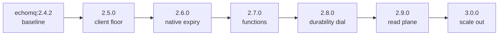

# EchoMQ improvement roadmap — climbing the rungs { id="echo_mq-roadmap-rungs" }

> _Every opportunity the bench work surfaced, sequenced as **rungs** on EchoMQ's own wire-version ladder. A rung is not a sprint label — it is the mechanism the connector already enforces: `@wire_version` is claimed or verified on every connect, a mismatch is fatal, and "the fence climbs per rung (Fork-2, D-3)." Each rung below bumps that version, ships a coherent slice, and is admitted by new `Conformance` scenarios. The connector stays version-agnostic; the ladder does the moving._

## How a rung ships (the fence is the release mechanism)

`EchoMQ.Connector` (in `echo_wire`) carries one constant, `@wire_version "echomq:2.4.2"`,
and runs `fence/2` before the first command on every connection: it `SET version_key …
NX`-claims the rung on an empty keyspace, or `GET`-verifies it, and on any mismatch returns
`{:error, {:version_fence, got}}` — which is **fatal**, alongside `:auth_refused` and
`:boot_refused`. The connector asserts only the *shape* `^echomq:\d+\.\d+\.\d+$`
(`connector_test`), never a literal, which is exactly why "the fence CLIMBS per rung" without
a per-rung connector edit.

That gives the roadmap its shape and its safety: **a rung is an atomic cutover.** Bumping
`@wire_version` plus the `Conformance` scenarios that define the rung means every client on
the bus must agree on the rung before it issues a command — mixed-rung traffic is rejected,
not silently tolerated. Shipping a rung is therefore three things and no more:

1. the implementation (the modules below),
2. the `@wire_version` bump (the cutover), and
3. the `Conformance` scenarios that *are* the rung's definition (the gate).

## The current rung — `echomq:2.4.2`

Already on the bus and not relitigated here: `Jobs` (atomic enqueue, `enqueue_many`,
scheduled), `Connector` (RESP3, pipelining-as-primitive, EVALSHA-first), `Lanes`
(rotating-ring fairness), `Flows`, `Locks`, `Stalled`, `Pool`, `Metrics`/`Meter`,
`Backoff`, `Cancel`, `Admin`, `Consumer`, and the `Conformance` standing gate. Two facts
about it set the agenda: id minting is `codec=pure` (the Rust NIF unloaded), and the bus is
volatile by **decision D-2**.

## The ladder at a glance

| Rung | Wire version | Theme | Layer it attacks | Evidence (measured this cycle) | Risk |
|---|---|---|---|---|---|
| 1 | `2.5.0` | Client floor | **CLIENT** (~2.2×) | NIF encode **14.3×** cheaper; `enqueue_many` **4.4×** serial | low |
| 2 | `2.6.0` | Native expiry | Correctness / ops | `HEXPIRE` present on Valkey | low–med |
| 3 | `2.7.0` | Functions | Cold-conn latency / deploy | `FUNCTION` present; retires NOSCRIPT dance | med |
| 4 | `2.8.0` | Durability dial | **DURABILITY** (6.5×) | `WAITAOF` present; durable=fsync on demand | med |
| 5 | `2.9.0` | Read plane | Read cost / L1 | `CLIENT TRACKING` present; connector already carries push state | low–med |
| 6 | `3.0.0` | Scale out | **SUBSTRATE** ceiling | `io-threads` lever — multi-core only (1-core showed no gain) | med |

Ordering is payoff-over-risk and single-core-first: rung 1 needs no extra cores and attacks
the largest *recoverable* layer; the substrate ceiling (rung 6) is deferred because it
cannot pay until there is a second core.

---

## Rung 1 — `echomq:2.5.0` · the client floor

**Ships.** The decomposition put ~2.2× of the gap in EchoMQ's own client layer, and it is
the most recoverable. Two moves close most of it, both single-core-friendly:
- **The branded-id NIF** (`codec=pure` → native). The encode is byte-identical to
  `EchoData.BrandedId.encode!/2`, the snowflake stays the shared `Snowflake` atomic, and the
  measured win is **14.3× cheaper** per id (676 → 47 ns/op) — which returns CPU to the engine
  on the shared core and removes per-id allocation. A pure-Elixir fallback keeps a node
  without the compiled `.so` correct.
- **`Pool`-fronted, pipelined enqueue as the default.** `enqueue_many` already runs **4.4×**
  the serial path (53.7k vs 12.2k jobs/s) because it amortises the round-trip; making `Pool`
  the front door for `Jobs.enqueue` removes the single-`GenServer` serialization that caps
  the serial client.

**Touches.** `echo_data` `BrandedId`/`Base62` (route through the NIF, ship the `.so` in
`priv/`), `echo_mq` `jobs.ex` (enqueue through `Pool`), `pool.ex`. No wire-protocol change —
the rung changes the *client contract*, not the keyspace.

**Gate (new `Conformance` scenarios).** NIF↔Elixir byte-identity over the snowflake range;
`Pool`-fronted enqueue preserves idempotency and score-0 mint order.

**Risk & mitigation.** Low. The NIF is an additive seam with a fallback; the `Pool` path is
already exercised. Mitigation: the byte-identity scenario gates the cutover, so a divergent
encoder can never reach the bus.

**Cutover.** Bump to `echomq:2.5.0`; the fence rejects any 2.4.2 client mid-rollout.

## Rung 2 — `echomq:2.6.0` · native expiry

**Ships.** Move lease and lock expiry into Valkey hash-field TTL (`HEXPIRE`, probed present),
folding the lease into the job hash so an expired claim or released lock self-clears — and
the periodic sweeper retires. This is the first rung that pins a **Valkey feature floor**
(Redis 7.0 has no `HEXPIRE`), which is the right place to make Valkey the substrate of record,
consistent with the A/B finding that on one core you choose Valkey for *features*, not speed.

**Touches.** `locks.ex` (+ `locks/`), `stalled.ex` (lease expiry), `keyspace.ex` (the
hash-field carrying the TTL), and the enqueue/claim scripts that set it.

**Gate.** A held lease auto-expires without a sweep; a stalled claim self-clears at its TTL;
the lock field's TTL is observable.

**Risk & mitigation.** Low–medium — it is a semantic move of where expiry lives. Mitigation:
keep the sweeper as a belt-and-braces fallback for one rung, gated off by a conformance
scenario proving native expiry fires, then remove it in 2.7.

**Cutover.** `echomq:2.6.0`; the fence guarantees all clients use the `HEXPIRE` lease at once.

## Rung 3 — `echomq:2.7.0` · functions

**Ships.** Register the script set as a Valkey **`FUNCTION`** library and call named
functions, retiring the connector's "EVALSHA-first with one load-on-NOSCRIPT per script per
connection" dance (its moduledoc) — no per-connection `SCRIPT LOAD`, no `NOSCRIPT` branch, no
sha-mismatch race. Cold connections stop paying the reload.

**Touches.** `echo_wire` `connector.ex` (the `eval` path and the `{:bump, 5}` script-load
counter become function calls), the `Script`/`Keyspace` script set, and a one-time
function-library deploy in the rung's migration — the v1→v3 enqueue migration is the
de-risking template (semantic ledger, idempotent admission, machine-checkable returns).

**Gate.** A freshly opened connection runs enqueue with zero `SCRIPT LOAD`; the function
library's presence is a boot precondition.

**Risk & mitigation.** Medium — it adds a deploy artifact (the library) ahead of the cutover.
Mitigation: deploy the library *before* bumping the fence, and gate the rung on a
"library-present" conformance check so a node without it fails closed.

**Cutover.** `echomq:2.7.0`.

## Rung 4 — `echomq:2.8.0` · the durability dial

**Ships.** An **opt-in** per-enqueue durability tier: `enqueue(…, durability: :fsync)` blocks
on **`WAITAOF`** (local AOF + N replicas) and returns only once persisted, while the default
enqueue stays memory-fast and volatile — **D-2 is untouched.** This bridges the 6.5×
durability layer *on demand*, on the same bus, without the `echo_store` Journal/Graft round
trip, for the specific jobs that need Oban-grade durability.

**Touches.** `jobs.ex` (the `durability` opt), `echo_wire` `connector.ex` (the `WAITAOF`
after the write); `echo_store`'s Journal + Graft remain the path for always-durable
obligations — this is the lighter, caller-chosen tier beside them.

**Gate.** A `:fsync` enqueue returns only after persistence; a default enqueue is observably
volatile and pays no fsync; the tier is per-call, not global.

**Risk & mitigation.** Medium, but the blast radius is small because the default path does not
change. Mitigation: the "default stays volatile" scenario is part of the gate, so the rung
cannot accidentally make every enqueue durable.

**Cutover.** `echomq:2.8.0`.

## Rung 5 — `echomq:2.9.0` · the read plane

**Ships.** Cache hot reads — queue depths via `Metrics`, job rows — with server-driven
invalidation over **`CLIENT TRACKING`** (RESP3), and give the EchoStore L1 coherence for
free. The plumbing is already partly present: the connector state carries `push_to`,
`pushes`, and `subscriptions` for RESP3 pushes, so this rung wires invalidation into an
existing seam rather than building one.

**Touches.** `metrics.ex`, `meter.ex`, `echo_wire` `connector.ex` (push handling), and the
EchoStore L1.

**Gate.** A tracked key's mutation pushes an invalidation that drops the stale cache entry
before the next read; the read plane returns coherent values under concurrent writes.

**Risk & mitigation.** Low–medium and read-side only — no mutation-path change. Mitigation:
cap the server tracking table and treat tracking as a cache, never a source of truth.

**Cutover.** `echomq:2.9.0`.

## Rung 6 — `echomq:3.0.0` · scale out

**Ships.** The major bump and the one the single-core box could not demonstrate: lift the
**substrate ceiling** with Valkey `io-threads` on multi-core, and validate `Lanes` fairness
and `Flows` DAGs under the concurrency that threading unlocks. This is where the Redis-vs-
Valkey story resolves — Valkey's threading is a multi-core win, so this rung also makes the
deployment contract multi-core Valkey. On one core `io-threads` showed no gain (the honest
finding); here it is the lever.

**Touches.** Deployment (`valkey-server --io-threads N`) rather than a single module, plus the
`Conformance` suite gains its first concurrency scenarios: `Lanes` holds a cold tenant's fair
share under a hot one; `Flows` DAG completion under load.

**Gate.** Fairness under a hot tenant (no starvation); fan-in completion under concurrent
producers; the substrate ceiling rises with cores.

**Risk & mitigation.** Medium — it changes the deployment contract. Mitigation: the matrix
harness (`docker/run-matrix.sh`) measures each allocation before rollout, so the multi-core
gain is proven on the target shape, not assumed.

**Cutover.** `echomq:3.0.0` — the major bump signals the multi-core substrate.

---

## Why this order

- **Single-core first.** Rung 1 is the only one that lifts throughput with no extra cores; it
  attacks the largest recoverable layer (the client) and is the lowest risk. The substrate
  ceiling (rung 6) is last because it cannot pay until there is a second core.
- **Features before the durability dial.** `HEXPIRE` (2.6) and `FUNCTION` (2.7) make Valkey
  the substrate of record and simplify the engine before 2.8 adds a durability surface to it.
- **Additive before structural.** Rungs 1, 4, and 5 are additive (fallbacks, opt-in tiers,
  read-side caches); 2 and 3 move where logic lives and so come with belt-and-braces
  mitigations and a library deploy ahead of the fence.

## What does not change

- **D-2 stays.** The default enqueue is volatile on every rung; rung 4 adds a *choice*, not a
  new default.
- **The connector stays version-agnostic.** No rung edits the fence's shape check; each rung
  is a `@wire_version` value plus its `Conformance` set.
- **Correct-when-degraded.** The NIF (rung 1) keeps a pure-Elixir fallback; the sweeper (rung
  2) survives one rung as a fallback before removal.

## Caveats

1. The evidence is single-core measured: NIF **14.3×** (encode) / **+6.7%** (serial enqueue),
   `enqueue_many` **4.4×**, durability **6.5×**, substrate **3.7×**, client **2.2×**. Absolute
   throughput is not a production figure; the *shape* and the layering are what carry.
2. On one core Redis ≈ Valkey within noise (and the bench compared a Redis release to Valkey
   `unstable`); rungs 2–3 and 6 are where Valkey's value — features and threading — actually
   lands. Pin a Valkey release tag for the fair multi-core read.
3. Rungs 2, 3, 5 require Valkey ≥ the feature's floor (`HEXPIRE` 7.4+, `FUNCTION`, RESP3
   tracking); they are the rungs that make the substrate choice explicit.
