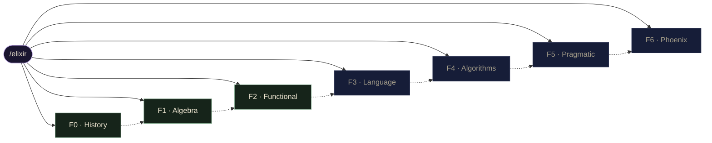

# Functional Programming in Elixir

A course that teaches functional programming twice: first as mathematics, then as Elixir. It runs from the λ-calculus and the BEAM's history, through the algebra of functions, into idiomatic Elixir, data structures, engineering practice, and the Phoenix web framework. Six chapters of nine modules each — fifty-four modules — plus an optional two-part history chapter. Every lesson carries an interactive, build-it-yourself component, and every module of mathematics is paired with its Elixir counterpart — the recurring *bridge* from an idea to its code.

> This document is the syllabus and navigation map. Each chapter below lists its modules with a short abstract and its route; the Mermaid graphs show how the pages link and the order they are read in.

## At a glance

| | |
|---|---|
| **Chapters** | 7 — an optional History prologue (F0) and six core chapters (F1–F6) |
| **Modules** | 54 numbered modules (F1–F6), plus 2 History essays |
| **Deep-dive subpages** | 16, across the five F2 hub modules |
| **Live now** | F0, F1, and F2 |
| **Built** | all of F1 (9), F2.01–F2.08 (8), the 16 F2 subpages, and both History essays |
| **Design** | the *jonnify* dark-editorial system; each page has interactive SVG + vanilla-JS components |
| **Quality bar** | every page ships at Apollo **A+** across nine gates |

**Legend** &mdash; ● built &middot; ○ planned &middot; ⬡ hub (an overview page with deep-dive subpages) &middot; ▣ lab (an interactive capstone) &middot; ↳ a subpage of the module above it.

## Course map

The spine of the course. Solid edges branch from the root to each chapter; the dashed edge is the intended reading order.

Each chapter lives at a route under `/elixir`, every module at `‹chapter›/‹module›`, and every deep-dive subpage at `‹chapter›/‹module›/‹subpage›`. Within a chapter the modules read in order, F.01 through F.09, the last being an interactive lab.

## F0 &middot; History &mdash; `/elixir/course`

An optional prologue in two essays. Where functional languages came from, and where the BEAM and OTP came from — the history that explains why Elixir looks and behaves the way it does.

| Module | Abstract | Route | Status |
|---|---|---|---|
| **F0.1 · The evolution of functional languages & runtimes** | Traces the lineage from the λ-calculus through LISP, ML, and Haskell to the immutable turn that shaped today's functional languages — the intellectual backdrop for everything that follows. | `/elixir/course/fp-evolution` | ● |
| **F0.2 · The evolution of Erlang, the BEAM & OTP** | Follows Erlang from its telecom origins to the BEAM's soft-real-time scheduling and OTP's supervision model — the runtime Elixir is built on. | `/elixir/course/beam-evolution` | ● |

## F1 &middot; Algebra &mdash; `/elixir/algebra`

The mathematical foundation. Nine modules treat functions, composition, recursion, higher-order operators, and pattern matching as pure mathematics, ending in a plotting lab. Every idea introduced here is later carried across to Elixir in F2 — the recurring *bridge* between an idea and its code.

| Module | Abstract | Route | Status |
|---|---|---|---|
| **F1.01 · What a function really is** | A function as a mapping with a domain and a range that returns exactly one output for each input, leading to treating functions as first-class values. | `/elixir/algebra/functions` | ● |
| **F1.02 · The substitution model** | Evaluation as replacing equals for equals; the model that gives referential transparency and a precise meaning to purity. | `/elixir/algebra/substitution` | ● |
| **F1.03 · Composition, f∘g** | Chaining mappings so the output of one feeds the next, and the associativity that lets a chain regroup freely — the algebra under the pipe. | `/elixir/algebra/composition` | ● |
| **F1.04 · Immutability & binding** | A symbol names a fixed value rather than a mutable cell; the foundation of immutable data and equational reasoning. | `/elixir/algebra/immutability` | ● |
| **F1.05 · Sets, sequences & mappings** | Applying one function across every element of a collection — the mathematical seed of lists, maps, and Enum.map. | `/elixir/algebra/collections` | ● |
| **F1.06 · Recursion & induction** | A base case and a step, paired with the induction that proves it terminates; recursion takes the place of loops. | `/elixir/algebra/recursion` | ● |
| **F1.07 · Higher-order operators (Σ, Π)** | Operators such as Σ and Π that take a function as input, generalising into map, filter, and reduce. | `/elixir/algebra/higher-order` | ● |
| **F1.08 · Equations & pattern matching** | Identities and solving by structure — the mathematical root of pattern matching. | `/elixir/algebra/pattern-matching` | ● |
| **F1.09 · Functions on the plane — a plotting lab** | An interactive lab to plot single functions and their compositions, watching f∘g take shape as a curve. | `/elixir/algebra/plotting-lab` | ● ▣ lab |

### F1 navigation

A single linear sequence ending in the plotting lab. The pager links each module to the next and back.

## F2 &middot; Functional Programming &mdash; `/elixir/functional`

The same foundations as working Elixir. Each module pairs a concept with its Elixir form — purity, persistent data, higher-order functions, recursion, folds, closures, algebraic data types, and composition — and the later modules expand into hubs, each with several deep-dive subpages. The chapter closes with the data-pipeline lab.

| Module | Abstract | Route | Status |
|---|---|---|---|
| **F2.01 · Pure functions & side effects** | What purity buys — testability, reasoning, and safe concurrency — and how to keep side effects at the edges of a program. | `/elixir/functional/pure` | ● |
| **F2.02 · Immutability & persistent data** | Persistent data structures and structural sharing, which make an immutable update cheap rather than a full copy. | `/elixir/functional/persistence` | ● |
| **F2.03 · Higher-order functions** | Treating functions as ordinary values: passing them as arguments and returning them from other functions. | `/elixir/functional/higher-order` | ● |
| **F2.04 · Recursion patterns & tail calls** | Recursion as the functional loop. A hub with three dives: the shape of a recursive definition, rewriting with an accumulator for tail-call optimisation, and the common patterns that turn out to be folds. | `/elixir/functional/recursion` | ● ⬡ hub |
| ↳ F2.04 &middot; The shape of recursion | Base case, recursive case, and the growing call stack. | `/elixir/functional/recursion/shape` | ● |
| ↳ F2.04 &middot; Tail calls & accumulators | Rewrite with an accumulator to run in constant stack space. | `/elixir/functional/recursion/tail-calls` | ● |
| ↳ F2.04 &middot; Recursion patterns | sum, length, reverse, map, filter — and why they are folds. | `/elixir/functional/recursion/patterns` | ● |
| **F2.05 · map / filter / reduce (folds)** | reduce as the universal fold from which map and filter follow. A hub with four dives: map, filter, reduce, and advanced folds such as scan and group_by. | `/elixir/functional/folds` | ● ⬡ hub |
| ↳ F2.05 &middot; map | Transform every element; the structure is preserved. | `/elixir/functional/folds/map` | ● |
| ↳ F2.05 &middot; filter | Keep the elements that pass a predicate. | `/elixir/functional/folds/filter` | ● |
| ↳ F2.05 &middot; reduce | The general fold; an accumulator of any shape. | `/elixir/functional/folds/reduce` | ● |
| ↳ F2.05 &middot; Advanced folds | scan, map_reduce, flat_map, group_by — folds with extra structure. | `/elixir/functional/folds/advanced` | ● |
| **F2.06 · Closures & partial application** | Functions that capture their surrounding environment. A hub with three dives: what a closure captures and when, the & capture operator, and partial application and currying by hand. | `/elixir/functional/closures` | ● ⬡ hub |
| ↳ F2.06 &middot; Capturing the environment | What a closure captures, and when — the value at definition time. | `/elixir/functional/closures/environment` | ● |
| ↳ F2.06 &middot; The capture operator | The & shorthand: positional placeholders and function capture. | `/elixir/functional/closures/capture` | ● |
| ↳ F2.06 &middot; Partial application & currying | Fixing arguments to specialize a function; currying by hand. | `/elixir/functional/closures/currying` | ● |
| **F2.07 · Algebraic data types** | Building data from products (this and that) and sums (this or that). A hub with three dives: product types, sum types, and pattern matching on data. | `/elixir/functional/adt` | ● ⬡ hub |
| ↳ F2.07 &middot; Product types | Tuples and structs — fields held together; inhabitants multiply. | `/elixir/functional/adt/product` | ● |
| ↳ F2.07 &middot; Sum types | Tagged tuples and variants — one shape or another; inhabitants add. | `/elixir/functional/adt/sum` | ● |
| ↳ F2.07 &middot; Pattern matching on data | Destructuring products and dispatching on sum variants. | `/elixir/functional/adt/matching` | ● |
| **F2.08 · Composition & pipelines** | Joining functions into larger ones. A hub with three dives: function composition, the pipe operator, and building pipelines of map, filter, and reduce. | `/elixir/functional/composition` | ● ⬡ hub |
| ↳ F2.08 &middot; Function composition | Combining functions so one's output feeds the next — f after g. | `/elixir/functional/composition/compose` | ● |
| ↳ F2.08 &middot; The pipe operator | \|> threads a value left to right, as the first argument. | `/elixir/functional/composition/pipe` | ● |
| ↳ F2.08 &middot; Building pipelines | map, filter, and reduce stages over a dataset, end to end. | `/elixir/functional/composition/pipeline` | ● |
| **F2.09 · The data-pipeline lab** | The F2 capstone: compose a full pipeline over a real dataset and watch the value transform at each stage. | `/elixir/functional/pipeline-lab` | ● ▣ lab |

### F2 navigation

The reading path threads through the subpages: a hub links forward to its first dive, the dives chain in order, and the last dive links on to the next module. Each hub also links directly to all of its dives via on-page cards. The pager is bidirectional, so a hub's back-link reaches the previous module's last dive.

```mermaid
graph TD
  B1["F2.01 · pure"] --> B2["F2.02 · persistence"] --> B3["F2.03 · higher-order"] --> H4

  H4["F2.04 · recursion ⬡"]
  H4 --> C1["F2.04.1 · shape"] --> C2["F2.04.2 · tail-calls"] --> C3["F2.04.3 · patterns"] --> H5

  H5["F2.05 · folds ⬡"]
  H5 --> D1["F2.05.1 · map"] --> D2["F2.05.2 · filter"] --> D3["F2.05.3 · reduce"] --> D4["F2.05.4 · advanced"] --> H6

  H6["F2.06 · closures ⬡"]
  H6 --> E1["F2.06.1 · environment"] --> E2["F2.06.2 · capture"] --> E3["F2.06.3 · currying"] --> H7

  H7["F2.07 · adt ⬡"]
  H7 --> F1n["F2.07.1 · product"] --> F2n["F2.07.2 · sum"] --> F3n["F2.07.3 · matching"] --> H8

  H8["F2.08 · composition ⬡"]
  H8 --> G1["F2.08.1 · compose"] --> G2["F2.08.2 · pipe"] --> G3["F2.08.3 · pipeline"] --> B9

  B9["F2.09 · pipeline-lab ▣"]

  classDef live fill:#1a1530,stroke:#b39ddb,color:#ece4d0;
  classDef hub fill:#16241a,stroke:#7ba387,color:#ece4d0;
  classDef dive fill:#161d38,stroke:#3a4366,color:#d7cfb9;
  classDef plan fill:#161d38,stroke:#2a3252,color:#a39c89;
  class B1,B2,B3 live;
  class H4,H5,H6,H7,H8 hub;
  class C1,C2,C3,D1,D2,D3,D4,E1,E2,E3,F1n,F2n,F3n,G1,G2,G3 dive;
  class B9 plan;
```

## The road ahead &mdash; F3 to F6

F3 and F4 are built. F5 is open — its overview is live and its nine modules are in production — and unlike the earlier chapters it is organised around shipping one thing: the **Portal engine**, a framework-free core built pragmatically, technique by technique, until it is ready to integrate with Phoenix LiveView. F6 then mounts that engine in a Phoenix application. Each chapter keeps the same shape: nine modules read in order, the ninth an interactive lab, with the hub-and-subpages treatment where a topic earns the depth.

### F3 &middot; The Elixir Language &mdash; `/elixir/language`

The Elixir language proper: values and IEx, the match operator, modules and the pipe, enumerables and streams, structs and protocols, processes and the actor model, and OTP — ending in a live process playground.

| Module | Abstract | Route | Status |
|---|---|---|---|
| **F3.01 · Values, types & IEx** | The values Elixir programs are built from, and the IEx shell as the primary tool for exploring them. | `/elixir/language/values` | ● |
| **F3.02 · Pattern matching & the match operator** | The match operator: = binds by matching structure rather than assigning, the idea that runs through the whole language. | `/elixir/language/match` | ● ⬡ hub |
| ↳ F3.02 &middot; The match operator | = asserts a shape and binds the rest — not assignment; the pin ^ matches a known value. | `/elixir/language/match/operator` | ● |
| ↳ F3.02 &middot; Destructuring portal data | Pull fields out of the maps, structs, and tuples the portal passes around. | `/elixir/language/match/destructuring` | ● |
| ↳ F3.02 &middot; Branching with case, with & guards | Dispatch on shape: function heads, case, the with pipeline, and guards. | `/elixir/language/match/branching` | ● |
| **F3.03 · Functions, modules & the pipe** | Defining functions inside modules and composing them with the pipe. | `/elixir/language/modules` | ● ⬡ hub |
| ↳ F3.03 &middot; Defining functions | def and defp, multiple clauses, arity, anonymous functions, and the capture operator. | `/elixir/language/modules/functions` | ● |
| ↳ F3.03 &middot; Organising with modules | defmodule, attributes, alias and import, and documentation — the Portal namespace. | `/elixir/language/modules/organising` | ● |
| ↳ F3.03 &middot; The pipe operator | \|> threads a value as the first argument, composing module functions into a pipeline. | `/elixir/language/modules/pipe` | ● |
| **F3.04 · Enumerables & streams** | Traversing collections eagerly with Enum and lazily with Stream, and when each is appropriate. | `/elixir/language/enum-streams` | ● ⬡ hub |
| ↳ F3.04 &middot; Enum, the eager workhorse | The Enumerable protocol and the Enum functions that walk any collection — map, filter, reduce, group_by. | `/elixir/language/enum-streams/enum` | ● |
| ↳ F3.04 &middot; Comprehensions | for over generators, with filters and :into — set-builder notation as Elixir syntax. | `/elixir/language/enum-streams/comprehensions` | ● |
| ↳ F3.04 &middot; Lazy streams | Stream builds a recipe that runs only when pulled — eager versus lazy, and why laziness wins. | `/elixir/language/enum-streams/streams` | ● |
| **F3.05 · Structs, maps & keyword lists** | Shaping data with structs, maps, and keyword lists, and choosing between them. | `/elixir/language/structs` | ● ⬡ hub |
| ↳ F3.05 &middot; Defining a struct | defstruct over a Portal entity, the %User{} literal, and the __struct__ key that makes a struct a tagged map. | `/elixir/language/structs/define` | ● |
| ↳ F3.05 &middot; Enforcing keys & defaults | @enforce_keys for required fields and default values in defstruct — what fills in, and what fails at build time. | `/elixir/language/structs/defaults` | ● |
| ↳ F3.05 &middot; Matching on a struct's type | The %User{} pattern, dispatch by struct tag across function clauses, clause order, and the is_struct/2 guard. | `/elixir/language/structs/matching` | ● |
| **F3.06 · Protocols & behaviours** | Polymorphism through protocols and contracts through behaviours. | `/elixir/language/protocols` | ● ⬡ hub |
| ↳ F3.06 &middot; Defining a protocol | defprotocol declares the contract; a call resolves to an implementation by the value's type, or raises Protocol.UndefinedError. | `/elixir/language/protocols/define` | ● |
| ↳ F3.06 &middot; Implementing for a struct | One defimpl per type builds a dispatch table; new types are added without touching the protocol or the other implementations. | `/elixir/language/protocols/defimpl` | ● |
| ↳ F3.06 &middot; Behaviours & callbacks | @callback declares the contract, @behaviour and @impl fulfil it — the compile-time counterpart that OTP is built on. | `/elixir/language/protocols/behaviours` | ● |
| **F3.07 · Processes & the actor model** | Lightweight isolated processes communicating by messages — spawn, send, and receive — the actor model on the BEAM. | `/elixir/language/processes` | ● ⬡ hub |
| ↳ F3.07 &middot; Spawning a process | spawn/1 starts a function as a new process and returns its PID at once; the child runs concurrently, with its own heap and crash boundary. | `/elixir/language/processes/spawn` | ● |
| ↳ F3.07 &middot; Sending & receiving messages | send/2 drops a term in a mailbox; receive matches it out. A message can carry a PID, so the receiver can reply. | `/elixir/language/processes/messages` | ● |
| ↳ F3.07 &middot; Holding state in a loop | State is the argument to a recursive receive loop; the process tail-calls itself with updated state — the pattern GenServer abstracts. | `/elixir/language/processes/state` | ● |
| **F3.08 · OTP: GenServer & supervisors** | OTP's GenServer for stateful servers and supervisors for fault tolerance. | `/elixir/language/otp` | ● ⬡ hub |
| ↳ F3.08 &middot; The GenServer behaviour | use GenServer hides the loop; you fill in init/1, handle_call/3, and handle_cast/2, and the state threads between them. | `/elixir/language/otp/genserver` | ● |
| ↳ F3.08 &middot; Synchronous call, asynchronous cast | call blocks until the server replies; cast returns :ok at once. One routes to handle_call, the other to handle_cast. | `/elixir/language/otp/call-cast` | ● |
| ↳ F3.08 &middot; Supervisors & restart strategies | A supervisor restarts crashed children by strategy — one_for_one, one_for_all, rest_for_one. This is let it crash. | `/elixir/language/otp/supervisors` | ● |
| **F3.09 · The process playground** | An interactive playground: spawn processes, send messages, and watch the mailbox and process tree live. | `/elixir/language/playground` | ● ▣ lab |

### F4 &middot; Algorithms & Data Structures &mdash; `/elixir/algorithms`

Functional algorithmics. From lists, trees, sorting, and hashing up through the persistent-map family — HAMT and CHAMP — then the identifiers that key them (a Snowflake bigint and a branded base62 id), their persistence across SQLite, PostgreSQL, and Redis, and a branded CHAMP map behind a GenServer; closing with practical recipes, dynamic programming, and an interactive lab.

| Module | Abstract | Route | Status |
|---|---|---|---|
| **F4.01 · Lists, recursion & complexity** | Cons-cell lists, recursion over them, and big-O complexity as it actually behaves on the BEAM. | `/elixir/algorithms/lists` | ● ⬡ hub |
| ↳ F4.01 &middot; Cons cells & the shape of a list | A list is [head \| tail]; prepend is O(1) and shares the old list, hd/1 and tl/1 read a cell, and append must copy. | `/elixir/algorithms/lists/cons` | ● |
| ↳ F4.01 &middot; Recursion over lists | Match [h \| t], act on the head, recurse on the tail, stop at []; an accumulator makes it tail-recursive, a loop in constant space. | `/elixir/algorithms/lists/recursion` | ● |
| ↳ F4.01 &middot; Complexity & big-O on the BEAM | Cost is how many cons cells an operation touches: O(1) at the head, O(n) for length, ++, and last. | `/elixir/algorithms/lists/big-o` | ● |
| **F4.02 · Trees & traversals** | Binary and n-ary trees with depth-first and breadth-first traversals written functionally. | `/elixir/algorithms/trees` | ● ⬡ hub |
| ↳ F4.02 &middot; Binary trees & recursive shape | A node is {value, left, right} or nil; size, height, and sum fold the two subtrees, and insert shares all but the path it rebuilds. | `/elixir/algorithms/trees/shape` | ● |
| ↳ F4.02 &middot; Depth-first: pre, in, post-order | The three orders differ only in when the node is visited relative to its subtrees; in-order on a BST comes out sorted. | `/elixir/algorithms/trees/dfs` | ● |
| ↳ F4.02 &middot; Breadth-first & balance | Level order with a FIFO queue, why a balanced tree keeps the descent at log n, and how sorted insertion degenerates into a list. | `/elixir/algorithms/trees/bfs` | ● |
| **F4.03 · Sorting & searching** | Merge sort, quicksort, and binary search expressed over immutable data. | `/elixir/algorithms/sorting` | ● ⬡ hub |
| ↳ F4.03 &middot; Merge & quicksort | Two divide-and-conquer sorts: merge splits then merges, quicksort pivots then partitions; both average O(n log n). | `/elixir/algorithms/sorting/sorts` | ● |
| ↳ F4.03 &middot; Linear & binary search | Linear is O(n) over anything; binary is O(log n) over a sorted, randomly-accessible sequence, which a linked list is not. | `/elixir/algorithms/sorting/search` | ● |
| ↳ F4.03 &middot; Stability & sort cost | Average, worst, space, and stability per sort, and the decision-tree argument for the Omega(n log n) comparison floor. | `/elixir/algorithms/sorting/cost` | ● |
| **F4.04 · Maps, sets & hashing** | Hash maps, collisions, and the cost model behind maps and sets. | `/elixir/algorithms/maps` | ● ⬡ hub |
| ↳ F4.04 &middot; Maps & key lookup | Map.get/fetch/put over the course's page registry; O(1)-average lookup by route, and the LiveView assigns map. | `/elixir/algorithms/maps/lookup` | ● |
| ↳ F4.04 &middot; MapSet & membership | MapSet membership and set algebra over the course's route sets; the links gate is a MapSet.member? check. | `/elixir/algorithms/maps/sets` | ● |
| ↳ F4.04 &middot; Hashing & collisions | How maps and sets reach O(1): phash2 hashes a key to a slot, collisions resolve, and Elixir stores entries in a 32-way HAMT. | `/elixir/algorithms/maps/hashing` | ● |
| **F4.05 · Hash Array Mapped Tries (HAMT)** | Hash Array Mapped Tries: persistent maps built on prefix trees. | `/elixir/algorithms/hamt` | ● ⬡ hub |
| ↳ F4.05 &middot; Bitmapped nodes | A HAMT node keeps one bitmap marking its occupied slots and one packed array holding them; a slot's position is the popcount of the lower bits. | `/elixir/algorithms/hamt/bitmap` | ● |
| ↳ F4.05 &middot; Hash-prefix indexing | A HAMT reads the key's hash five bits at a time, each chunk choosing one of 32 slots, so a key's path is its hash and depth is about log32 n. | `/elixir/algorithms/hamt/indexing` | ● |
| ↳ F4.05 &middot; Structural sharing | An insert rebuilds only the path from root to the changed leaf and shares every other sub-tree, so the old map survives and a snapshot is nearly free. | `/elixir/algorithms/hamt/sharing` | ● |
| **F4.06 · CHAMP maps** | CHAMP — Compressed Hash-Array Mapped Prefix-trees — their node layout and iteration. | `/elixir/algorithms/champ` | ● ⬡ hub |
| ↳ F4.06 &middot; Compressed node layout | A CHAMP node splits its slots into two bitmaps and two packed arrays — entries and sub-nodes — with no empty cells. | `/elixir/algorithms/champ/layout` | ● |
| ↳ F4.06 &middot; Cache-friendly iteration | Because entries sit contiguously, a CHAMP walks them linearly in a canonical order, with far better cache locality than a HAMT. | `/elixir/algorithms/champ/iteration` | ● |
| ↳ F4.06 &middot; Canonical equality | CHAMP keeps one canonical shape per map, so structural equality and cheap snapshot diffs fall out of shared sub-trees. | `/elixir/algorithms/champ/equality` | ● |
| **F4.07 · Identifiers, Snowflake & branded ids** | Choosing an identifier: from naive and incrementing ids to a 64-bit Snowflake bigint and a namespaced, base62 branded id for distributed systems, e.g. TSK0KHTOWnGLuC. | `/elixir/algorithms/identifiers` | ● ⬡ hub |
| ↳ F4.07 &middot; Choosing an identifier | From an auto-increment counter to a random UUID to a Snowflake: each scheme keeps order or coordination, and a Snowflake keeps both. | `/elixir/algorithms/identifiers/choosing` | ● |
| ↳ F4.07 &middot; The Snowflake bigint | A 64-bit integer packed as timestamp(42) \| worker(10) \| sequence(12), each field read with one shift and one mask. | `/elixir/algorithms/identifiers/snowflake` | ● |
| ↳ F4.07 &middot; Branded ids | Base62 over 0-9A-Za-z, padded to eleven, with a three-letter namespace prefix; lossless and order-preserving. | `/elixir/algorithms/identifiers/branded` | ● |
| **F4.08 · Branded ids & persistence** | Using branded ids as keys: storing and querying them in SQLite, PostgreSQL, and Redis. | `/elixir/algorithms/persistence` | ● ⬡ hub |
| ↳ F4.08 &middot; Branded ids as keys | Store the 64-bit integer as a bigint primary key and brand it only at the edge: eight bytes that sort by time and validate themselves. | `/elixir/algorithms/persistence/keys` | ● |
| ↳ F4.08 &middot; SQLite & PostgreSQL | Because time sits in the high bits, a date window is a contiguous id range: id >= min AND id < max, served by the primary-key index with no created_at column. | `/elixir/algorithms/persistence/sql` | ● |
| ↳ F4.08 &middot; Redis keys | Namespaced string keys, and an edge validator that sheds malformed, out-of-range, wrong-namespace, and future ids with a 404 before the cache or database is touched. | `/elixir/algorithms/persistence/redis` | ● |
| **F4.09 · Branded CHAMP maps & GenServer** | A CHAMP keyed by branded ids and partitioned by namespace prefix, owned by a BEAM GenServer. | `/elixir/algorithms/branded-champ` | ● ⬡ hub |
| ↳ F4.09 &middot; Partition by namespace | The store is a tiny map from a three-letter namespace to a CHAMP per kind; the prefix routes a lookup to its partition, keeping each sub-trie shallow and key spaces apart (the Portal's entity registry). | `/elixir/algorithms/branded-champ/partition` | ● |
| ↳ F4.09 &middot; Structural sharing | Inside a partition, marking a lesson complete copies one root-to-leaf path and shares the rest, so Portal.Progress keeps every prior snapshot for free and a diff is cheap. | `/elixir/algorithms/branded-champ/trie` | ● |
| ↳ F4.09 &middot; Own it with a GenServer | A GenServer serializes writes and publishes each new snapshot; because the CHAMP is immutable, Portal.Auth.current_user/1 reads the published root lock-free on every request (the session store). | `/elixir/algorithms/branded-champ/genserver` | ● |
| **F4.10 · Practical recipes in Elixir** | Turning algorithmic problems into idiomatic Elixir: patterns, pipelines, and profiling. | `/elixir/algorithms/recipes` | ● ⬡ hub |
| ↳ F4.10 &middot; Idiomatic patterns | A with chain threads validate -> authenticate -> load -> authorize for a request, short-circuiting to the right status on the first {:error, _} and skipping the rest, with no nested cases. | `/elixir/algorithms/recipes/patterns` | ● |
| ↳ F4.10 &middot; Streams & pipelines | A lazy Stream fuses filter and map into one pass and stops when Enum.take is satisfied, building the activity feed by examining only what it takes instead of materialising the whole collection. | `/elixir/algorithms/recipes/pipelines` | ● |
| ↳ F4.10 &middot; Profiling & complexity | Reading cost from the code: a list scan is O(n) and grows with the user base, a CHAMP lookup is O(log32 n) and stays a few hops, which is why the Portal's session store is a map and not a list. | `/elixir/algorithms/recipes/profiling` | ● |
| **F4.11 · Dynamic programming & advanced problems** | Dynamic programming and memoisation, with harder algorithmic challenges. | `/elixir/algorithms/dynamic-programming` | ● ⬡ hub |
| ↳ F4.11 &middot; Memoization & overlapping subproblems | Top-down: compute the longest prerequisite chain to a lesson recursively and cache each lesson's depth, so a shared prerequisite is evaluated once instead of along every path that reaches it. | `/elixir/algorithms/dynamic-programming/memoization` | ● |
| ↳ F4.11 &middot; Tabulation & bottom-up | Bottom-up: fill a table of the fewest modules to reach each credit total from zero upward, so the target's answer reads off a row built from smaller answers, where greedy choice fails and the table is optimal. | `/elixir/algorithms/dynamic-programming/tabulation` | ● |
| ↳ F4.11 &middot; Classic DP problems | Edit distance, the textbook two-dimensional DP: how many single-character edits turn a misspelled query into a catalog title, filled cell by cell to power a typo-tolerant 'did you mean' suggestion. | `/elixir/algorithms/dynamic-programming/problems` | ● |
| **F4.12 · Lab: build a branded CHAMP store** | An interactive lab: insert branded keys and watch a partitioned CHAMP restructure as it grows. | `/elixir/algorithms/lab` | ● ⬡ hub ▣ lab |
| ↳ F4.12 &middot; Watch a branded CHAMP grow | Insert branded keys one by one and watch the store take shape: each key routes to its partition by its three-letter namespace, each partition's CHAMP fills, and a new partition appears the first time its namespace is used. | `/elixir/algorithms/lab/grow` | ● |
| ↳ F4.12 &middot; A Snowflake registry | Resolve any branded id in one call: route it to its partition, look it up in O(log32 n) hops, and read its creation time straight from the embedded Snowflake, or reject it before any search when its namespace has no partition. | `/elixir/algorithms/lab/registry` | ● |
| ↳ F4.12 &middot; Query by time range | Because Snowflake ids are time-ordered, a time window becomes an id range: compute the bounds from the clock, scan one namespace partition, and return the entries created inside the window with no stored timestamp column. | `/elixir/algorithms/lab/range` | ● |

### F5 &middot; Pragmatic Programming &mdash; `/elixir/pragmatic`

A pragmatic, end-to-end build of one product: the Portal engine. Nine modules carry the same framework-free core from DRY, orthogonal foundations through domain modeling, a tracer-bullet walking skeleton, design by contract, commands/queries/events, where state lives, testing, and integration seams — ending in a lab where the engine facade is mounted behind a LiveView sketch, ready to integrate with Phoenix LiveView in F6.

| Module | Abstract | Route | Status |
|---|---|---|---|
| **F5.01 · Start thin: a running Portal from day one** | Start thin: stand the Portal up behind a minimal Elixir web server from day one, place that move on the course roadmap — templating, simple server, Portal logic, Phoenix, Fly — and keep the web replaceable so F6 swaps in Phoenix untouched. | `/elixir/pragmatic/foundations` | ● ⬡ hub |
| ↳ F5.01 &middot; The development roadmap | The path the whole course walks — HTML templating, a simple web server, Portal logic, Phoenix, then production — and why you start thin and grow rather than build big up front. | `/elixir/pragmatic/foundations/roadmap` | ● |
| ↳ F5.01 &middot; A thin web server in Elixir | A minimal Plug-and-Bandit server that answers a request by calling the Portal engine and nothing more — a real HTTP front end, running from the first day. | `/elixir/pragmatic/foundations/thin-server` | ● |
| ↳ F5.01 &middot; A web layer built for replacement | Keep the web as a thin adapter over the engine facade, so Phoenix can replace it in F6 by calling the same functions, with the Portal untouched. | `/elixir/pragmatic/foundations/replaceable` | ● |
| **F5.02 · Modeling the Portal domain** | Modeling the Portal domain in plain structs, typespecs, and bounded contexts — Accounts, Catalog, Learning — each with a small public API. | `/elixir/pragmatic/domain` | ● ⬡ hub |
| ↳ F5.02 &middot; Structs & typespecs | Model each entity as a plain struct with enforced keys, branded-id fields, defaults, and a @type — data with a shape the compiler and Dialyzer can check. | `/elixir/pragmatic/domain/structs` | ● |
| ↳ F5.02 &middot; Bounded contexts | Group entities into context modules — Accounts, Catalog, Learning — that own their data and reference one another only by id, so each can change alone. | `/elixir/pragmatic/domain/contexts` | ● |
| ↳ F5.02 &middot; A context's public API | Give each context a small public API of functions that validate input, return tagged tuples, and keep everything else private — the only way in. | `/elixir/pragmatic/domain/api` | ● |
| **F5.03 · Tracer bullets: a walking skeleton** | Tracer bullets: build one use case end to end first — enroll a learner, then deliver the first lesson — as a walking skeleton, then iterate the slice. | `/elixir/pragmatic/tracer-bullets` | ● ⬡ hub |
| ↳ F5.03 &middot; Tracer bullets vs prototypes | A tracer bullet is thin but real code you keep and build on; a prototype is throwaway code to answer a question — same speed, opposite fate. | `/elixir/pragmatic/tracer-bullets/prototypes` | ● |
| ↳ F5.03 &middot; The walking skeleton | Enroll a learner end to end through every layer at once — route, context API, struct, store — each minimal, all wired, the whole thing running. | `/elixir/pragmatic/tracer-bullets/skeleton` | ● |
| ↳ F5.03 &middot; Iterating the slice | Once the skeleton walks, grow it in thin vertical slices — deliver a lesson, record progress — each touching every layer and leaving the system running. | `/elixir/pragmatic/tracer-bullets/iterating` | ● |
| **F5.04 · Design by contract** | Design by contract: preconditions, postconditions, and invariants on the engine’s commands, asserted in Elixir, failing fast at the boundary. | `/elixir/pragmatic/contracts` | ● ⬡ hub |
| ↳ F5.04 &middot; Preconditions, postconditions & invariants | The three parts of a command's contract — a precondition the caller must meet, a postcondition the function guarantees, and an invariant always true of the state. | `/elixir/pragmatic/contracts/conditions` | ● |
| ↳ F5.04 &middot; Assertions in Elixir | Express contracts in idiomatic Elixir — guards and pattern matching for preconditions, a with chain to compose them, tagged tuples for expected failures, and raise for broken invariants. | `/elixir/pragmatic/contracts/assertions` | ● |
| ↳ F5.04 &middot; Failing fast | Check at the boundary and stop on the first violation, before any state changes — expected failures return a tagged error, impossible states crash, neither corrupts. | `/elixir/pragmatic/contracts/fail-fast` | ● |
| **F5.05 · Commands, queries & events** | Commands, queries, and events: separate writes from reads and model every change to the engine as a domain event, with the engine as a reducer. | `/elixir/pragmatic/cqrs` | ● ⬡ hub |
| ↳ F5.05 &middot; Command/query separation | Command/query separation — a command changes state and returns only success or failure, a query returns data and changes nothing, and no function does both. | `/elixir/pragmatic/cqrs/cqs` | ● |
| ↳ F5.05 &middot; Domain events | Model every change as a past-tense domain event — LearnerEnrolled, LessonDelivered, ProgressRecorded — an immutable fact carrying the data of what happened. | `/elixir/pragmatic/cqrs/events` | ● |
| ↳ F5.05 &middot; The engine as a reducer | Derive state by folding events: a command emits events, each event evolves the state, and one reduce over the log replays the engine to now. | `/elixir/pragmatic/cqrs/reducer` | ● |
| **F5.06 · Where engine state lives** | Where engine state lives — GenServer, Agent, or ETS — and the process boundary and supervision around it. | `/elixir/pragmatic/state` | ● ⬡ hub |
| ↳ F5.06 &middot; Choosing where state lives | Three holders for live state on the BEAM — a GenServer holds state and runs logic, an Agent holds a value, ETS is a shared table — and the engine needs the one that holds state and folds events. | `/elixir/pragmatic/state/choosing` | ● |
| ↳ F5.06 &middot; The engine GenServer | Three callbacks carry the engine: init folds the log into state, a command call runs decide then evolve and keeps the new state, a query call reads and replies unchanged. | `/elixir/pragmatic/state/genserver` | ● |
| ↳ F5.06 &middot; Supervision | Let it crash: a supervisor restarts the engine on failure, and init replays the event log so the state rebuilds itself — recovery is replay, not repair. | `/elixir/pragmatic/state/supervision` | ● |
| **F5.07 · Pragmatic testing** | Pragmatic testing: testing the pure core, property-based tests with StreamData, and contracts run as tests. | `/elixir/pragmatic/testing` | ● ⬡ hub |
| ↳ F5.07 &middot; Testing the pure core | decide, evolve, and replay are pure, so a test is arrange a value, call, assert the output — no process, no mocks; the bulk of the suite lives here. | `/elixir/pragmatic/testing/pure-core` | ● |
| ↳ F5.07 &middot; Property-based testing | State a rule true for all valid inputs — replay is deterministic, progress stays in 0..100, decide is total — and let StreamData generate the cases and shrink failures. | `/elixir/pragmatic/testing/property` | ● |
| ↳ F5.07 &middot; Contract tests | The F5.04 precondition, postcondition, and invariant become assertions, and doctest runs the @doc examples so documentation cannot drift from the code. | `/elixir/pragmatic/testing/contract-tests` | ● |
| **F5.08 · Boundaries & integration seams** | Boundaries and integration seams: ports, adapters, and the engine facade the UI will call, with error shapes the UI can render. | `/elixir/pragmatic/boundaries` | ● ⬡ hub |
| ↳ F5.08 &middot; Ports & adapters | A port is a behaviour the core depends on; adapters implement it; config swaps them. One EventStore contract with an in-memory adapter and a Postgres adapter, and dependencies that point inward. | `/elixir/pragmatic/boundaries/ports` | ● |
| ↳ F5.08 &middot; The engine facade | The driving port: a small context — enroll/2, deliver_lesson/2, progress_of/1 — that hides the GenServer, the event log, and the reducer behind one stable, intention-revealing door. | `/elixir/pragmatic/boundaries/facade` | ● |
| ↳ F5.08 &middot; Error contracts for the UI | A closed set of %Portal.Error{} codes, mapped from internal reasons at the boundary, so the UI renders a finite list of outcomes; impossible states stay crashes for the supervisor. | `/elixir/pragmatic/boundaries/errors` | ● |
| **F5.09 · Lab: the Portal engine, LiveView-ready** | An interactive lab: assemble the engine facade and mount it behind a LiveView sketch — ready to integrate with Phoenix LiveView in F6. | `/elixir/pragmatic/engine-lab` | ○ ▣ lab |

### F6 &middot; Phoenix Framework &mdash; `/elixir/phoenix`

Building for the web with Phoenix: the request lifecycle, routing and plugs, Ecto, contexts, HEEx, LiveView, PubSub, and deployment — ending in a real-time live dashboard.

| Module | Abstract | Route | Status |
|---|---|---|---|
| **F6.01 · Architecture & the request lifecycle** | Phoenix architecture and the request lifecycle: endpoint, router, controller, view. | `/elixir/phoenix/lifecycle` | ○ |
| **F6.02 · Routing, controllers & plugs** | Routing, controllers, and the plug pipeline. | `/elixir/phoenix/routing` | ○ |
| **F6.03 · Ecto: schemas, changesets & queries** | Ecto schemas, changesets, and queries — data, validation, and the repo. | `/elixir/phoenix/ecto` | ○ |
| **F6.04 · Contexts & domain design** | Contexts and domain design: boundaries that scale. | `/elixir/phoenix/contexts` | ○ |
| **F6.05 · Templates, components & HEEx** | Server-rendered markup with templates, components, and HEEx. | `/elixir/phoenix/heex` | ○ |
| **F6.06 · Phoenix LiveView fundamentals** | Phoenix LiveView fundamentals — interactive UIs without hand-written JavaScript. | `/elixir/phoenix/liveview` | ○ |
| **F6.07 · PubSub, channels & real-time** | PubSub, channels, and real-time updates over WebSockets. | `/elixir/phoenix/pubsub` | ○ |
| **F6.08 · Auth, deployment & going live** | Sessions and authentication, releases, and going to production. | `/elixir/phoenix/deployment` | ○ |
| **F6.09 · The live dashboard** | An interactive lab: real-time LiveView state over a socket, with multiple clients via PubSub. | `/elixir/phoenix/live-dashboard` | ○ ▣ lab |

## The branded Snowflake build stamp

Every page carries a build stamp in its footer: a fourteen-character branded id that decodes, on the page itself, to a millisecond timestamp. It is a three-character namespace followed by a base62 encoding of a 64-bit Snowflake, and the same id convention is used as a cross-system pivot key throughout the course — and is the subject of module F4.07.

| Field | Value |
|---|---|
| Branded id | `TSK0KHTOWnGLuC` |
| Namespace | `TSK` |
| Snowflake | `274557032793636864` |
| Timestamp | `2026-01-27 15:11:37 UTC` |

The 64-bit layout is `timestamp(41) << 22 | node(10) << 12 | sequence(12)`, measured from a custom epoch of `2024-01-01 00:00:00 UTC` (1704067200000 ms). The base62 alphabet is `0-9 A-Z a-z`, left-padded to eleven characters, so namespace plus encoding is always fourteen.

## How each page is built

Every lesson is a static page in the *jonnify* dark-editorial design system — Cormorant Garamond and PT Serif for prose, Manrope for labels, JetBrains Mono for code, over an ink-and-cream palette with gold, blue, sage, burgundy, and an elixir-purple accent. Beyond the writing, each page is held to a fixed set of rules:

- **Interactive components.** Every lesson carries at least one hand-built SVG-and-vanilla-JS component that computes the real result, shows a live readout and a one-sentence takeaway, works without JavaScript, and respects reduced-motion. No external libraries, no browser storage.
- **The bridge.** Each mathematical idea is paired with its Elixir counterpart, so the algebra of F1 and the code of F2 read as two views of one thing.
- **Apollo A+ gates.** A page ships only when it passes all nine checks: required containers, well-formed SVG, no future-dated claims, an editorial voice gate, no browser storage, reduced-motion support, graceful degradation without JavaScript, valid internal links, and a working pager.
- **Hubs and subpages.** Deeper modules are an overview hub plus several deep-dive subpages, linked by the pager and by on-page cards, as the F2 graph above shows.

---

*Generated from the course manifest. Routes, titles, and statuses are authoritative; abstracts summarise each module's scope.*
