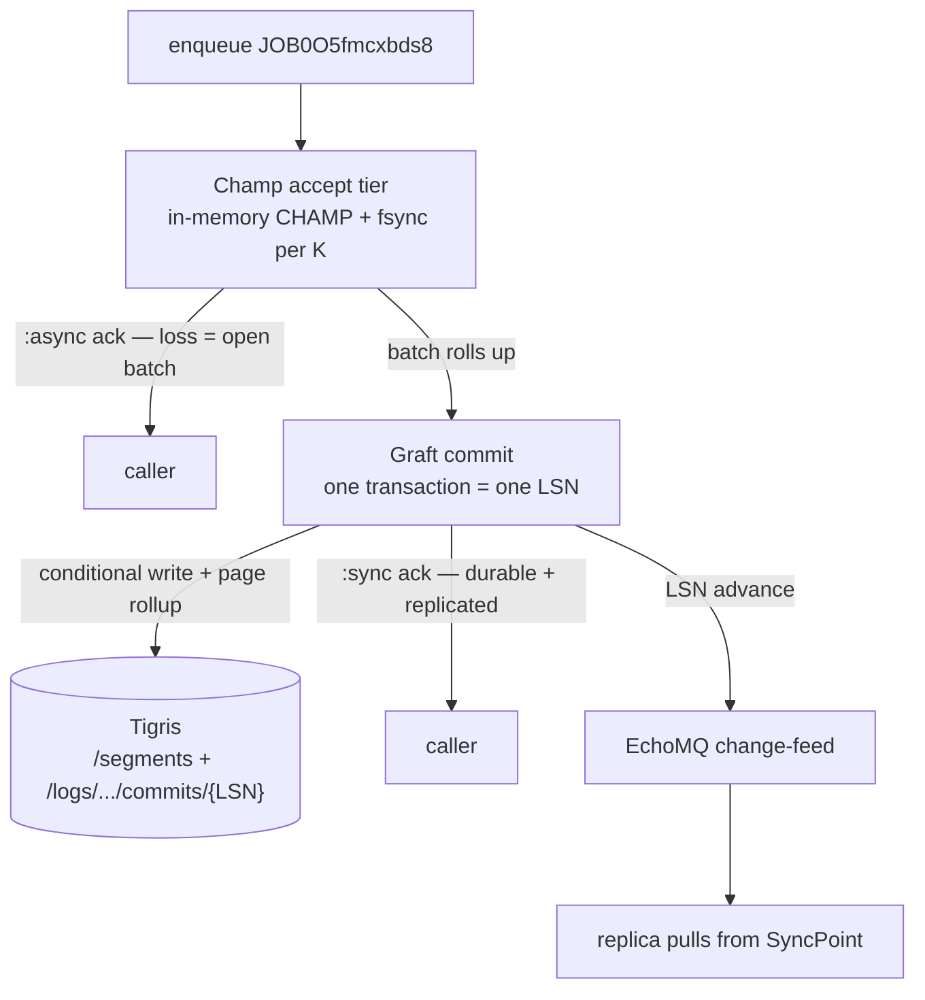

# Guaranteeing EchoMQ Durability with Champ and Graft { id="echomq-durability-champ-graft" }

> _The final two-tier design: Champ accepts jobs at in-heap speed with a fsync per K records, Graft commits each batch as one transactional LSN replicated to Tigris, and the commit LSN rides EchoMQ as the change-feed — measured, and placed on the durability spectrum._

## The Setup

EchoMQ enqueues jobs on Valkey over RESP3, bridging the BEAM and Go runtimes. That gives it Redis-class enqueue durability: at AOF `appendfsync everysec`, a job is on disk within a one-second window, on a single box. For most jobs that is enough. For the jobs that must not be lost — payments, the work product recorded as a job completes — a one-second window on one machine is not a guarantee, and nothing has left the machine.

A four-way measurement settled what the choices cost. Recording 20,000 jobs on a single shared vCPU, durable-enqueue throughput ranged from an in-memory map holding nothing to disk down to a commit-per-job that fsyncs every write, and the spread had one explanation: throughput tracks how many durable records ride each fsync. The fsync is fixed cost; everything else is how many jobs you amortize it across. So the question for EchoMQ is not whether to fsync, but how to reach a per-commit, replicated guarantee without collapsing to the per-commit floor.

The answer pairs two engines. Champ — an in-memory `BrandedChamp` with a periodic disk snapshot — is the accept tier, fast because its checkpoint amortizes the fsync over K records. `echo_graft` — the platform's owned engine (transactional and page-replicated over object storage, seeded from Graft) — is the commit tier, where each batch becomes one LSN replicated to Tigris. This piece shows how they join, with the numbers measured against a real S3-compatible store.

## What You'll Build

- The measured durability spectrum across Memory, Champ, Oban, and BullMQ, and the single mechanism that explains the spread.
- Champ as the low-latency accept tier — in-memory state plus one fsync per K records — with its recovery and snapshot numbers against real object storage.
- Graft as the transactional commit tier — per-commit LSN, page-level replication to Tigris, the conditional-write fence, and instant-replica recovery.
- The seam that joins them: a local-fsync batch rolling up into one Graft commit to Tigris, the commit LSN published over EchoMQ, and a durability mode chosen per call.

## The spectrum, and the one knob

Each engine accepts a job and decides how much of it survives a crash and how fast it says yes. Those are the same knob. Measured at N of 20,000 on one vCPU, with PostgreSQL durable (`synchronous_commit=on`) and Redis durable (AOF `everysec`):

| Engine | Runtime | Store | Durability | single jobs/s | batch jobs/s |
|---|---|---|---|---|---|
| Memory | BEAM | in-memory map | none | 336,961 | — |
| Champ (K=10000) | BEAM | local fsync snapshot | bounded: <= 10000 records | 103,970 | — |
| Champ (K=1000) | BEAM | local fsync snapshot | bounded: <= 1000 records | 33,989 | — |
| BullMQ | Node | Redis (AOF everysec) | bounded: 1s | 6,388 | 16,180 |
| Oban | BEAM | PostgreSQL (sync commit) | strict: per-commit fsync | 718 | 13,235 |

A factor of 469 separates strict per-commit durability from no durability. Oban's single-insert path commits once per job and lands at 718 jobs/s; its `insert_all` path writes 1,000 jobs per transaction and reaches 13,235, a factor of 18 from spreading one fsync across the batch. The reading is mechanical: Memory rides infinitely many durable records per fsync, Champ rides K, Oban-batch rides a transaction, Oban-single rides one. EchoMQ's job is to choose where on that line each queue sits, and to make the strict-and-replicated end affordable.

## Tier one — Champ accepts

Champ keeps the outbox in an `EchoData.BrandedChamp` and writes a snapshot to disk every `checkpoint_every` records, so one fsync covers a whole interval. K is the dial, and it is exactly the loss window in records. Measured against MinIO standing in for Tigris, recording 20,000 records:

| checkpoint_every (K) | rec/s (local) |
|---|---|
| 100 | 5,225 |
| 1,000 | 36,889 |
| 10,000 | 102,529 |

The recovery numbers matter as much as the throughput. A green machine seeds its outbox from a snapshot and restores it; seed plus restore ran in 3.63 ms for a 1,000-entry outbox, 8.53 ms for 10,000, and 33.59 ms for 50,000. A `SIGTERM` flush — write the final snapshot and upload it — took 7.72 ms at 10,000 entries and 16.80 ms at 50,000, inside the deploy kill window. Replay re-enqueued 20,000 pending intents at 1,044,659 intents/s.

Champ at K of 10,000 reaches 103,970 jobs/s from a one-record-at-a-time durable API — that is Oban-`insert_all`-class throughput without the caller ever holding a batch, because the checkpoint amortizes the fsync continuously. What Champ does not give is a per-commit guarantee or replication on commit: its snapshot ships asynchronously and at snapshot granularity, so a crash loses the records since the last checkpoint, and a follower sees whole snapshots. Champ alone is the bounded-loss tier. The guarantee comes from the second tier.

## Tier two — Graft commits, Tigris replicates

Graft is a transactional storage engine that replicates at page granularity to object storage. Its model supplies exactly what Champ's snapshot lacks: reads run lock-free against immutable LSN snapshots; a writer stages a segment and commits through optimistic concurrency control, appending a monotonic LSN; and the commit is written to the log with a conditional write that detects conflicts. Two writers racing a commit resolve by the loser's conditional write failing — the fence comes from the commit protocol, not a separate lease.

Replication rolls up rather than streams. A push snapshots an LSN range, collects the referenced pages, deduplicates to the latest version of each, compresses them into Zstd frames of up to 64 pages, uploads the segment, and commits the metadata with the conditional write. Many local commits collapse into one remote commit, and pages load lazily — a reader faults a page in by finding its segment in the snapshot and fetching that frame. Because metadata and data are decoupled, a replica becomes ready by reading the log head and faulting pages in on demand, rather than downloading the whole Volume.

The Tigris seam is a configuration, not a rewrite: `echo_graft`'s remote backend rides Apache **OpenDAL**, so Tigris is an OpenDAL `S3Compatible` store — one of the three `RemoteConfig` arms (beside Memory and Fs), pointed at Tigris through `AWS_ENDPOINT_URL` — and its create-if-not-exists conditional put (surfaced as `opendal::ErrorKind::ConditionNotMatch`) is the commit fence. Segments land under `/segments/{SegmentId}` and commits under `/logs/{LogId}/commits/{LSN}`. This is what carries EchoMQ's durability from bounded-loss-snapshot to per-commit transactional and replicated off the box, with recovery measured in a log-head read plus lazy page faults rather than a full snapshot download.

## The seam

The two tiers join at the batch. Champ's accept tier amortizes a local fsync over a batch; that same batch rolls up into one Graft transaction — one LSN — replicated to Tigris. The caller chooses the guarantee per call: `:async` returns once the batch is fsync'd locally, with the loss window bounded by the open batch, while `:sync` returns only after the Tigris-replicated commit acknowledges.

```elixir
# the durability mode is a per-call choice on the accept tier
defp enqueue(job, mode) do
  :ok = Champ.record(Accept, job.id, job.queue, job.payload) # in-heap, fsync per K
  case mode do
    :async -> {:ok, :accepted}                  # loss bound = the open batch
    :sync  -> Graft.commit_batch(job.volume)     # one LSN, replicated to Tigris, then ack
  end
end
```

The commit LSN is the synchronization cursor. Every advance is published by the EchoMQ-participant backend (`echo_graft_backend`) on its change-feed lane, so replicas and the dashboard observe new versions without polling and a follower pulls from its SyncPoint forward.



## End to end, as one unit

EchoMQ's consumer side already claims jobs in batches under one lease. Sizing the commit batch to the claim batch makes the two axes meet: a handler records the whole claimed batch's results in one Graft transaction, so one fsync and one LSN cover enqueue, process, and record as a single durable, replicated unit. Branded Snowflakes key the Volumes — a `{ns}{base62}` id maps to a Graft Volume — so the identity that crosses the runtimes is the identity that addresses the durable state.

The result is a durability dial per queue. A telemetry queue sits at Memory and accepts 336,961 jobs/s holding nothing. An ordinary queue sits at Champ-K and accepts tens of thousands per second at a bounded window. A money queue sits at Champ-plus-Graft, per-commit transactional and Tigris-replicated, and the fsync-amortizing batch is what keeps that tier off the per-commit floor.

## What We Shipped

A two-tier durability design for EchoMQ: Champ as the in-memory accept tier with a fsync per K records, and Graft as the transactional commit tier replicating each batch to Tigris as one LSN. The accept tier was measured against real object storage — 102,529 rec/s at K of 10,000, recovery from 3.63 ms to 33.59 ms across 1,000 to 50,000-entry outboxes — and the commit tier supplies the per-commit guarantee, the conditional-write fence, page-rollup replication, and log-head recovery that the snapshot tier cannot. The commit LSN published over EchoMQ binds replicas to the same cursor, and aligning the commit batch to the consumer's claim batch makes enqueue-through-record one durable, replicated unit. Every figure here is reproducible from the shootout and blue-green harnesses.

## References

- orbitinghail / graft — transactional, page-level replication over object storage; the LSN commit and conditional-write model used as the commit tier. https://github.com/orbitinghail/graft
- minio / minio — the S3-compatible store used to measure replication and recovery locally. https://github.com/minio/minio
- taskforcesh / bullmq — the Redis-backed queue measured in the spectrum. https://github.com/taskforcesh/bullmq
- apache / opendal — the remote-storage abstraction `echo_graft`'s Tigris backend rides (the `S3Compatible` operator + the conditional-put commit fence). https://github.com/apache/opendal
- Carl Sverre, on Graft's design and lazy partial replication. https://graft.rs/docs/internals
- Saša Jurić, _"To spawn, or not to spawn?"_ — on placing work off the calling process, behind the async replication path. https://www.theerlangelist.com/article/spawn_or_not
- _Designing Data-Intensive Applications_, Martin Kleppmann, O'Reilly, 2017 — write-ahead logs, group commit, and replication (Chapters 3 and 5).
- _Property-Based Testing with PropEr, Erlang, and Elixir_, Fred Hebert, Pragmatic Bookshelf, 2019 — modeling stateful recovery and idempotent replay.
- Amazon S3 conditional writes (`If-None-Match`) — the create-if-not-exists primitive behind the commit fence. https://docs.aws.amazon.com/AmazonS3/latest/userguide/conditional-writes.html