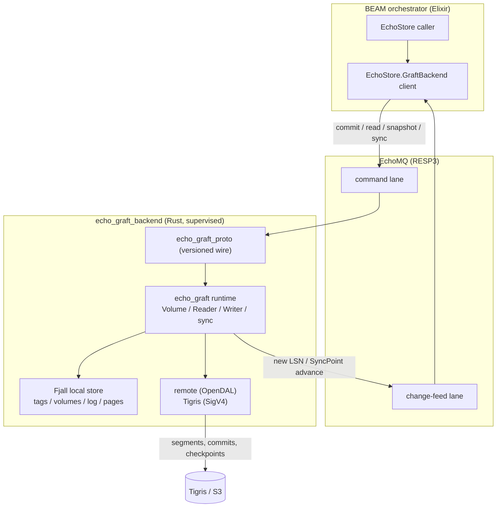
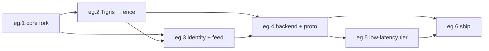

# echo_graft — a Graft fork for EchoMQ { id="echo-graft-roadmap" }

> _Fork Graft's transactional, object-storage-replicated Volume engine, strip the SQLite layer, and re-seam the core to EchoMQ — branded-Snowflake identity, a Tigris remote backend, an EchoMQ change-feed, and a BEAM-driven Rust sidecar — shipping a durability tier that is transactional **and** replicated, beside Champ and Oban._

## 1. Vision

Champ today is bounded-loss: in-memory `BrandedChamp` plus a periodic snapshot, so durability is a window of K records and replication is snapshot-grained and async. Oban is strict but single-node unless Postgres streaming replication is bolted on. Graft already solves the missing quadrant — transactional commits with an LSN log, segment/snapshot data, conditional-write commit, and instant read replicas over object storage — but it ships as a Rust crate plus a SQLite extension, with no binding for any other language.

`echo_graft` is a **from-scratch system seeded from** Graft's core (permitted outright by its MIT/Apache-2.0 license), with the SQLite extension removed and three seams rewritten for this platform: a Tigris remote backend, branded-Snowflake identity in place of opaque Graft identifiers at the external edge, and an EchoMQ change-feed driven off the commit LSN. The engine runs as a supervised Rust sidecar that the BEAM orchestrates over EchoMQ (RESP3); a versioned protocol crate keeps the two sides in lockstep. The outcome is a durability tier with per-commit transactional guarantees, page-level replication, and instant replica recovery — integrated through the bus the platform already trusts.

> {style="warning"}
> **Development direction (binding).** `echo_graft` keeps **no backward compatibility** with upstream Graft — not API, not wire, not cherry-pick. Upstream is a read-only *idea source* (`github.local/graft` @ `b07d9312`), never a sync target; every divergence is **owned**, never re-merged. Agents have explicit allowance to modify any file and break any upstream contract for EchoMQ's efficiency, correctness, or developer experience. The standing brief is `echo/apps/echo_graft/README.md` (which supersedes the former `FORK.md`).

## 2. Program 5W + H { id="program-5wh" }

| | |
|---|---|
| **Who** | Platform/architecture (Fireheadz). Consumers: EchoStore durability callers on the BEAM; operators reading the durability dashboard. |
| **What** | A forked, EchoMQ-native build of Graft's Volume runtime — transactional commits, LSN log, segment/snapshot data, conditional-write commit, lazy page loading — fronted by a Rust sidecar and an Elixir client. |
| **When** | Sequenced `eg.1` → `eg.6`; each rung independently shippable and benchmarked. The spine (`eg.1`–`eg.4`) precedes the perf tier (`eg.5`) and the ship rung (`eg.6`). |
| **Where** | A Cargo workspace (`crates/echo_graft*`) in the cclin-server monorepo; the sidecar binary deploys beside Go workers on the EchoMQ bus; remote state lives in Tigris (S3-compatible). Build targets: Mac orchestrator + Windows RTX compute node. |
| **Why** | To own the transactional+replicated durability quadrant without reimplementing a storage engine from scratch, and without the SQLite/C-binding path that was explicitly rejected. Reusing Graft's core saves a multi-month build and inherits its consistency model. |
| **How** | Fork the core under its permissive license; cut `libgraft_ext`; rewrite the remote-storage, identity, and change-feed seams; bridge to the BEAM via a sidecar over EchoMQ (RESP3), keeping an async-NIF as a later hot-read optimization. |

## 3. Architecture { id="architecture" }

The BEAM never links the engine in-process during the spine: the sidecar owns Volumes, commits, and sync, and the bus is the contract. The commit LSN is the synchronization cursor — every advance is published on the change-feed lane so BEAM consumers and the dashboard observe new versions without polling.

## 4. Rungs { id="rungs" }

| Rung | Ships | Stands on | Size | Risk | Build topology |
|---|---|---|---|---|---|
| **eg.1** | core fork + workspace — `echo_graft` runtime carved from upstream, `libgraft_ext` removed, Fjall local store retained, upstream Volume tests green | upstream `orbitinghail/graft` (MIT/Apache-2.0) | **M** | **NORMAL** (subtractive fork; no logic rewrite) | Flat-L2 |
| **eg.2** | Tigris remote backend + commit/fence — the OpenDAL remote module (`RemoteConfig::S3Compatible`) against Tigris (SigV4); segments/commits/checkpoints; conditional-write commit verified as the multi-writer fence | eg.1 · the blue-green SigV4 path | **M** | **NORMAL** (a new backend behind a stable trait) | Flat-L2 |
| **eg.3** | branded-ID identity + EchoMQ change-feed — `{ns}{base62}` ↔ Volume/Log mapping; LSN/SyncPoint advances published over EchoMQ | eg.1 · eg.2 · EchoMQ | **M** | **NORMAL+** (a new external identity surface + a new lane) | Flat-L2 + Apollo RECOMMENDED |
| **eg.4** | BEAM↔Rust backend + protocol — `echo_graft_backend` as an EchoMQ participant; `echo_graft_proto` versioned wire; `EchoStore.GraftBackend` Elixir client (a coexisting peer beside native `EchoStore.Graft.*`); commit/read/snapshot/sync over the bus | eg.2 · eg.3 | **L** | **HIGH** (the cross-runtime contract; a wire + version surface) | Flat-L2 + Apollo REQUIRED |
| **eg.5** | low-latency write tier + the live Rust↔Valkey binding — local-fsync group-commit buffer in front of the object-storage commit, sync/async durability per call, AND `echo_graft_backend` stood up on a real Valkey socket so the eg.4 contract (proven compositionally) runs end-to-end as one live EchoMQ participant; UF-1 wire cap wired at the live call site + UF-2 `VolumeNotFound→not_found` closed | eg.4 | **L** | **HIGH** (the first live cross-runtime binding + a durable buffer) | Flat-L2 + Apollo REQUIRED |
| **eg.6** | ship — cross-compile (Mac + Windows), CI, the durability shootout battery run against `echo_graft` beside Champ and Oban | eg.1–eg.5 | **M** | **NORMAL** (packaging + measurement) | Flat-L2 |

## 5. Sequencing { id="sequencing" }

## 6. Cross-cutting acceptance gates { id="gates" }

Every rung is done only when all of these hold, in addition to its own acceptance criteria:

1. **Upstream parity** — the carved runtime passes Graft's own Volume/transaction tests unchanged (eg.1 establishes the baseline; later rungs must not regress it).
2. **Declared keys** — every remote object key and every EchoMQ field a rung adds is enumerated in that rung's spec; nothing undeclared appears on the wire or in the bucket.
3. **Byte-frozen wire** — once `echo_graft_proto` defines a message, its on-wire encoding is frozen; changes go through a protocol-version bump, never a silent edit.
4. **Determinism loop** — any new mint/lease/commit surface runs a ≥100-iteration interleaving loop without a conflict-detection miss or a lost commit.
5. **Shootout battery** — the rung's durable-enqueue path is measured with the shootout harness and the number is recorded beside Champ/Oban.
6. **No scheduler block** — if any in-VM (NIF) path is introduced, it runs on a dirty scheduler or returns via message-back; it never parks a normal scheduler.
7. **License retained** — upstream MIT/Apache-2.0 headers are preserved on every carried file.

> {style="note"}
> The async-NIF hot-read path is explicitly **not** part of the spine. It is a post-`eg.6` optimization and carries its own spec when scheduled.

## 7. Non-goals { id="non-goals" }

- The SQLite extension (`libgraft_ext`) — removed, not maintained.
- WebAssembly / browser targets (a Graft future-work item, out of scope here).
- Variable-sized pages (Graft is fixed-page today; revisit only if a workload demands it).
- Multi-region or cross-bucket replication (single Tigris bucket for now).
- An in-VM NIF as the primary integration (sidecar is the spine; NIF is a later optimization).

## 8. Glossary { id="glossary" }

- **Volume** — the unit of transactional state; the external handle is a branded Snowflake.
- **Snapshot** — an immutable logical view of a Volume at a point in time, expressed as LSN ranges; reads run lock-free against it.
- **LSN** — a monotonically increasing commit sequence number in a log; the synchronization cursor.
- **Segment** — a compressed unit of page data in remote storage, addressed by id; frames bundle pages for transfer.
- **Checkpoint** — a rolled-up base against which later deltas are read; the GC boundary.
- **Commit** — an atomic log entry at an LSN; written remotely with a conditional write for conflict detection.
- **SyncPoint** — per-Volume replication frontier; tracks what has been pushed (`local_watermark`) and pulled (`remote`).
- **VolumeReader / VolumeWriter** — lock-free reader over a snapshot; writer staging a segment with read-your-write semantics.
- **Sidecar** — the supervised Rust process running the engine, addressed over EchoMQ.
- **Change-feed** — the EchoMQ lane carrying commit-LSN advances to BEAM consumers.

## 9. References { id="references" }

**Design docs (this directory):**

- `graft.design.md` — _Guaranteeing EchoMQ Durability with Champ and Graft_: the two-tier durability narrative (the native Champ accept tier + the `echo_graft` commit tier), the measured durability spectrum, and the Champ→Graft→Tigris seam.
- `graft.engine-split.design.md` — the Elixir/Rust engine-split decision (Operator D-1=A, COEXIST): why the native-BEAM `EchoStore.Graft.*` and the Rust `echo_graft_backend` coexist rather than one replacing the other.

**Upstream Graft (read-only idea source):**

- Graft architecture — https://graft.rs/docs/internals
- Graft future work — https://graft.rs/docs/internals/future
- Graft Volumes — https://graft.rs/docs/concepts/volumes
- Graft consistency — https://graft.rs/docs/concepts/consistency
- Source + license — https://github.com/orbitinghail/graft (MIT OR Apache-2.0)
