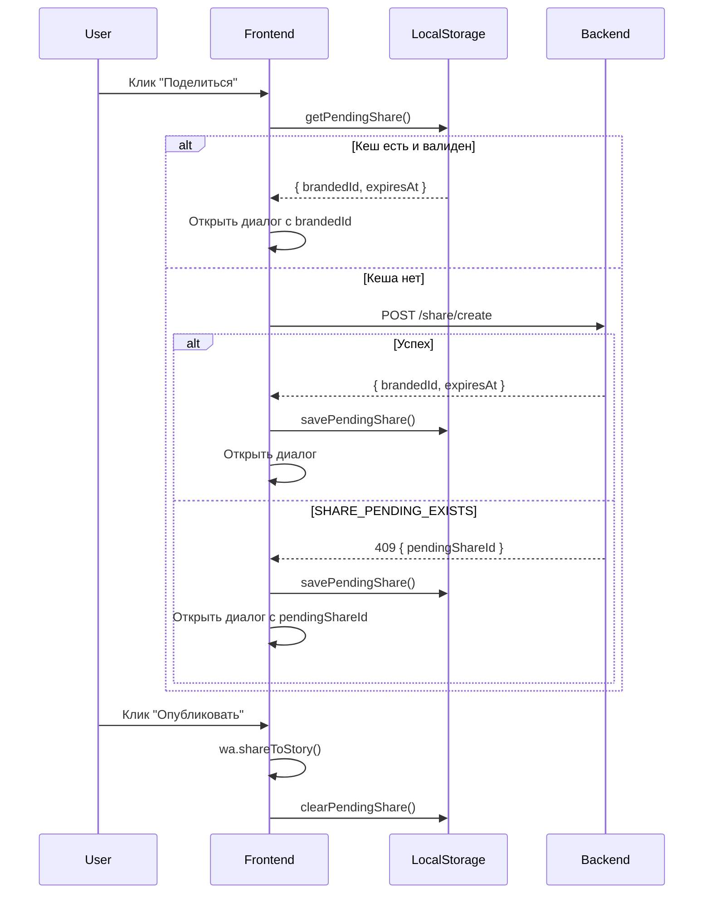

# Share Transaction — Backend Details

## TTL транзакции

- **Время жизни:** 15 минут
- **Константа:** `TOKEN_EXPIRY_MINUTES = 15`
- **Файл:** `backend/src/services/share.service.ts:50`

## Ошибки

### SHARE_PENDING_EXISTS (HTTP 409)

Возвращается если pending share уже существует и `expiresAt > now`.

```json
{
  "error": "SHARE_PENDING_EXISTS",
  "message": "You have a pending share. Complete or wait for it to expire: {pendingShareId}",
  "details": {
    "pendingShareId": "{brandedId}"
  }
}
```

`pendingShareId` в details — это `brandedId` записи (генерируется из `id` через `encode_base62` с префиксом `SHR`).

### SHARE_DAILY_LIMIT_REACHED (HTTP 429)

Возвращается если пользователь уже шарил сегодня (статус `verified` или `rewarded`).

### SHARE_ALREADY_REWARDED (HTTP 409)

Шар уже был награждён.

### SHARE_CLAIM_EXPIRED (HTTP 410)

Время действия шара истекло.

## Логика создания (share/create)

1. Проверяется `canShareToday(playerId)`:
   - Ищет запись за сегодня (`shareDate = today`)
   - Если запись `pending` и не истекла → `SHARE_PENDING_EXISTS`
   - Если запись `pending` и истекла → можно создать новую
   - Если запись `verified`/`rewarded` → `SHARE_DAILY_LIMIT_REACHED`
   - Если записи нет → можно создать новую
2. Генерируется snowflake ID, создаётся запись со статусом `pending`
3. `brandedId` генерируется БД: `'SHR' || encode_base62(id)`

## Награда

- Задаётся константой `REWARD_AMOUNT` в `share.service.ts`
- Начисляется как `bonusKeys` (скрепки)

## Фронтенд-кеширование

На фронте `brandedId` кешируется в `localStorage` (ключ `codemoji_pending_share`) с TTL по `expiresAt` из ответа бекенда. При повторном нажатии кеш проверяется первым, чтобы избежать ошибки `SHARE_PENDING_EXISTS`. Как фоллбек, если кеш пуст но бекенд вернул `SHARE_PENDING_EXISTS`, `pendingShareId` извлекается из `details` и используется вместо нового запроса.

## Диаграмма потока


