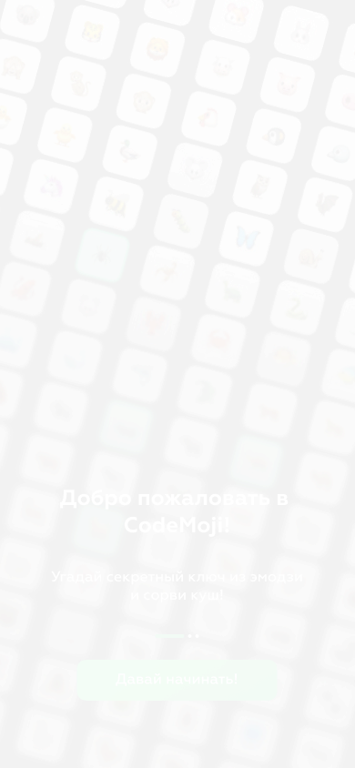
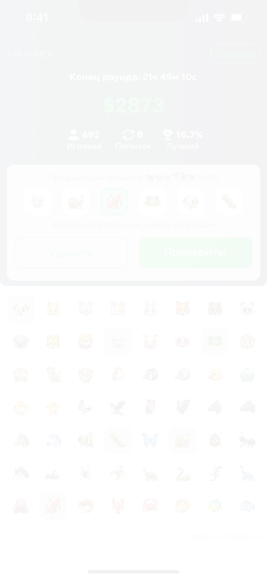
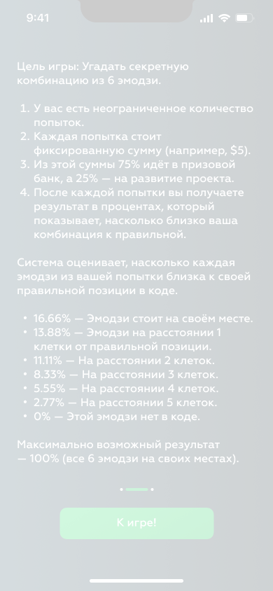

# 01 — Onboarding

The first surfaces a player sees: identity is established from verified Telegram `initData`, the main hub shows the wallet, and the in-app explainer teaches the linear-scoring engine. No `GAM` exists yet on these screens; a player has a `PLR` brand and a wallet, and they are picking a `ROM` to enter.

Vocabulary referenced here is defined in [`README.md`](README.md). When the descriptions cite a path with line numbers (e.g. `codemojex.design.md:182`), see the [pointers section](README.md#pointers) for the absolute repo locations.

---

## Welcome screen

| field | value |
|---|---|
| figma id | `21:958` |
| figma label | `welcome screen` |
| figma type | FRAME |
| figma page | UI |
| asset | [`assets/welcome-21-958.png`](assets/welcome-21-958.png) |
| role | first-touch landing — identity is established from verified Telegram `initData` |
| game state | n/a |
| mode | n/a |
| entities | `PLR` |
| events | none (HTTP only) |

The welcome screen is what a player sees when they open the Mini App for the first time, before any `GAM` exists for them. Production identity comes from verified Telegram `initData`, whose signature the server checks with an HMAC-SHA-256 over the bot token keyed by the constant `WebAppData`; until that check is wired the surface trusts the supplied id (`codemojex.design.md:182`). The screen looks up or creates the `PLR` row in Postgres and binds the player's `tg_chat_id` from the launch data — the column that addresses every later notification (`notifications.md:64`). No `game:<id>` channel is joined here.

The button on this screen advances to **Main**; the wallet starts at zero balances and the player accrues `keys`/`clips`/`diamonds` from purchases, grants, and prizes only — there is no signup grant in the canon.

---

## Main hub

| field | value |
|---|---|
| figma id | `21:780` |
| figma label | `Main` |
| figma type | FRAME |
| figma page | UI |
| asset | [`assets/main-21-780.png`](assets/main-21-780.png) |
| role | main hub — wallet status + entry to the rooms lobby |
| game state | n/a |
| mode | n/a |
| entities | `PLR` · `ROM` |
| events | none (lobby-level; `game:<id>` is joined only after entering a game) |

Main is the hub a logged-in player returns to between games. It surfaces the player's wallet — the three separate currencies and the conversion rate — and routes to the rooms lobby (`Rooms`, see [03-rooms.md](03-rooms.md)). The three currency lanes are kept visually distinct because they are kept *literally* distinct in the data model: `keys` pay paid-room guesses, `clips` pay free-room guesses only, `diamonds` are the prize currency and convert to keys at a fixed 10:1; `clips` are excluded from the available balance and carry no economic value (`01-currency-model.md`). The hub also exposes the player's `tg_chat_id` link (set from the verified launch data) and entry to **Withdraw** ([04-sections.md#withdraw](04-sections.md#withdraw)) and the explainer below.

There is no per-room process, so a large field of idle rooms costs nothing on the server side (`codemojex.design.md:178`); the lobby is just an HTTP read against the `rooms` table.

---

## How to play

| field | value |
|---|---|
| figma id | `21:948` |
| figma label | `Как играть?` |
| figma type | FRAME |
| figma page | UI |
| asset | [`assets/how-to-play-21-948.png`](assets/how-to-play-21-948.png) |
| role | in-app explainer — teaches the linear-scoring engine |
| game state | n/a |
| mode | n/a |
| entities | `EMS` (sample-only, no real game state) |
| events | none |

The how-to-play screen is the in-app version of [`codemojex.game_rules.md`](../../../echo/apps/codemojex/docs/codemojex.game_rules.md): it shows that a secret is six **unique** codes drawn from the room's snapshotted keyboard (not Unicode characters — `EMS` cells, addressed `XXYY` over the sprite grid; see [`02-rooms-and-emoji-sets.md`](../../../echo/apps/codemojex/docs/02-rooms-and-emoji-sets.md)), that a guess scores `100 - 20·d` per position with `d` the position distance, and that the per-guess total is `0..600` (a perfect crack of 600 closes a `classic` game immediately).

A nearby on-canvas text node on this page (`426:11064`) already carries the Russian copy: *100 = Эмоджи на своём месте · 80 = 1 клетка от правильной позиции · 60 = 2 клетки от правильной позиции · 40 = 3 клетки от правильной позиции · 20 = 4 клетки от правильной позиции · 0 = 5 клеток от правильной позиции* — that is the canonical D0–D5 table players read.

**One thing the explainer must NOT show** is a tier ladder: the shipped engine is linear-only — no 30-tier ladder, no first-mover bonus, no `ptier`/`bonus`/`tierfirst` columns (`codemojex.design.md:84` + `codemojex.design.md:139`). The "30-tier system" in `game_rules.md` is documented there as a forward-looking extension; this screen should anchor the player on the raw best total they will be ranked by.

