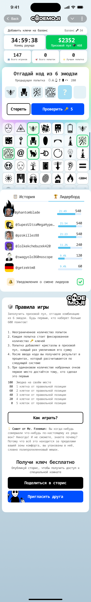
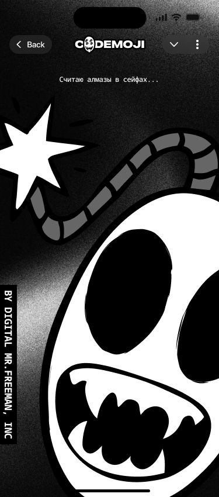
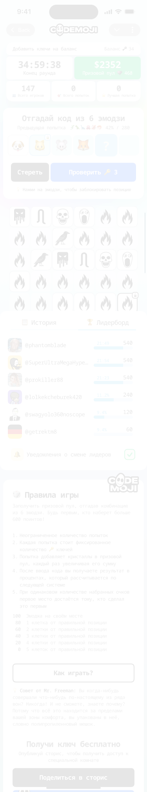
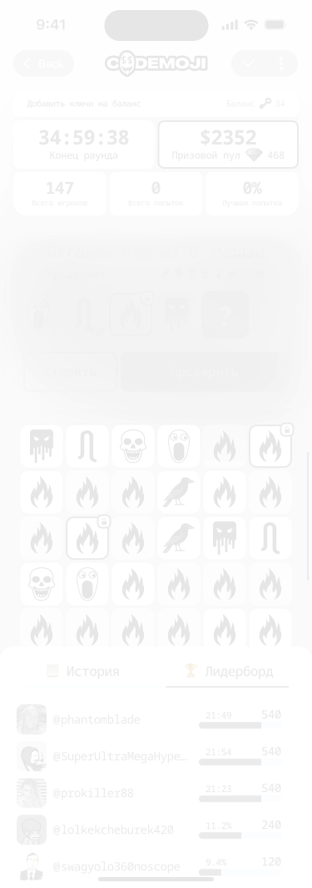
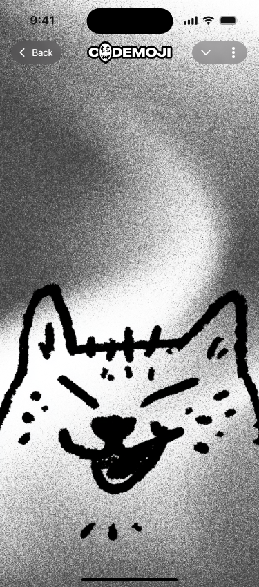
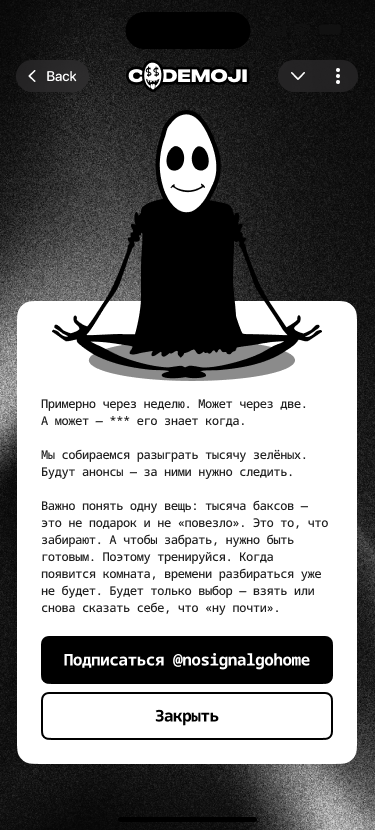

# 02 — Gameplay board (`CODEMOJIES`)

The CODEMOJIES surface is the gameplay board: where a player composes a six-emoji guess and submits it. **One** master component is the canonical board, with several iterations and exploration frames living beside it on the canvas — all titled `CODEMOJIES`, distinguishable only by their Figma id.

The board is the busy half of the player experience: every screen here joins the Phoenix channel `game:<id>` (`codemojex.design.md:180`), submits guesses through `POST /games/:id/guess` (`codemojex.design.md:166`), and shows live feedback that depends on the game's `type` policy:

- **`classic`** — per-guess `scored` events fan out over the channel (player name, percentage, effective score — never the secret, never the guess content). A perfect 600 closes the game there and then.
- **`golden`** — the channel carries `state`/`timer` only; no per-guess score crosses the wire until `revealed_ms` is set. At close, one fat `revealed` event carries the secret, the final board, and the payouts.

A guess validates against the game's snapshotted keyboard (`cell_codes` — the random `cell_count`-cell subset of the room's `EMS`, or the full set when `cell_count` is null), overlays the player's locked positions (`lock:<player>` hash in Valkey), is charged through `Codemojex.Wallet`, and enqueues on the player's own per-`PLR` lane on the `cm` queue (`codemojex.design.md:102`, `codemojex.design.md:166`). The host never scores; it accepts and enqueues, and the channel is what the surface reads back from.

Vocabulary referenced here is defined in [`README.md`](README.md).

---

## Gameplay board — canonical

| field | value |
|---|---|
| figma id | `94:2974` |
| figma label | `CODEMOJIES` |
| figma type | COMPONENT |
| figma page | UI |
| asset | [`assets/codemojies-board-canonical-94-2974.png`](assets/codemojies-board-canonical-94-2974.png) |
| role | gameplay board — composes + submits a 6-emoji guess (canonical master component) |
| game state | `active` |
| mode | both (`classic` shows per-guess feedback; `golden` withholds until reveal) |
| entities | `GAM` · `PLR` · `GES` · `EMS` |
| events | `scored` (classic) · `state`/`timer` (golden in-flight) · `revealed` (golden settle) on `game:<id>` |

This is the headline screen: six guess slots arranged 0..5, the emoji keyboard ([Emoji section](04-sections.md#emoji-section-canonical)) below, a per-attempt score readout, the game timer, and the per-game leaderboard ([06-meta.md#leaderboard](06-meta.md#leaderboard)).

The data it shows comes from `Codemojex.View` — the player-facing read that *never selects the secret*, *never includes another player's guesses*, and (for a `golden` game) gates score/points/leaderboard fields until `revealed_ms` is set (`codemojex.design.md:92` + `codemojex.design.md:184-186`). The keyboard is the snapshot — never the live room's set, so editing the room mid-game cannot change the terms (`02-rooms-and-emoji-sets.md`).

A position the player has confirmed can be **locked**: `Codemojex.Locks` persists the lock so it carries across the player's subsequent guesses (`codemojex.design.md:82`). The lock is per-player and overlays at submit time — it never crosses to another `PLR`.

This canonical component is what the codemoji-app frontend should treat as the source of truth; the variants below are design iterations on the same surface.

---

## Board variant — `331:5191`

| field | value |
|---|---|
| figma id | `331:5191` |
| figma label | `CODEMOJIES` |
| figma type | COMPONENT |
| figma page | UI |
| asset | [`assets/codemojies-board-variant-331-5191.png`](assets/codemojies-board-variant-331-5191.png) |
| role | gameplay-board design variant (second master component) |
| game state | `active` |
| mode | both |
| entities | `GAM` · `PLR` · `GES` · `EMS` |
| events | same as canonical |

A second master component for the gameplay board — same surface contract as `94:2974`, different visual treatment / layout pass. Worth diffing visually against the canonical to settle which version the frontend implements.

---

## Board variant — `707:19464`

| field | value |
|---|---|
| figma id | `707:19464` |
| figma label | `CODEMOJIES` |
| figma type | FRAME |
| figma page | UI |
| asset | [`assets/codemojies-board-variant-707-19464.png`](assets/codemojies-board-variant-707-19464.png) |
| role | gameplay-board design exploration (frame, not a component) |
| game state | `active` |
| mode | both |
| entities | `GAM` · `PLR` · `GES` · `EMS` |
| events | same as canonical |

A frame (not a master component) carrying a board iteration. Likely a layout exploration or a mode-specific visualization; render the PNG and compare against the canonical to read the intent.

---

## Board variant — `702:17102`

| field | value |
|---|---|
| figma id | `702:17102` |
| figma label | `CODEMOJIES` |
| figma type | FRAME |
| figma page | UI |
| asset | [`assets/codemojies-board-variant-702-17102.png`](assets/codemojies-board-variant-702-17102.png) |
| role | gameplay-board design exploration |
| game state | `active` |
| mode | both |
| entities | `GAM` · `PLR` · `GES` · `EMS` |
| events | same as canonical |

Another frame-level iteration.

---

## Board variant — `1147:66482`

| field | value |
|---|---|
| figma id | `1147:66482` |
| figma label | `CODEMOJIES` |
| figma type | FRAME |
| figma page | UI |
| asset | [`assets/codemojies-board-variant-1147-66482.png`](assets/codemojies-board-variant-1147-66482.png) |
| role | gameplay-board design exploration (most recent by snowflake id) |
| game state | `active` |
| mode | both |
| entities | `GAM` · `PLR` · `GES` · `EMS` |
| events | same as canonical |

The latest exploration by id ordering (the `1147:` prefix sorts after the other variants); worth checking first when looking for the most recent design intent on the board surface.

---

## Board variant — `880:17162`

| field | value |
|---|---|
| figma id | `880:17162` |
| figma label | `CODEMOJIES` |
| figma type | FRAME |
| figma page | UI |
| asset | [`assets/codemojies-board-variant-880-17162.png`](assets/codemojies-board-variant-880-17162.png) |
| role | gameplay-board design exploration |
| game state | `active` |
| mode | both |
| entities | `GAM` · `PLR` · `GES` · `EMS` |
| events | same as canonical |

A board frame variant.

---

## Board variant — `897:16801`

| field | value |
|---|---|
| figma id | `897:16801` |
| figma label | `CODEMOJIES` |
| figma type | FRAME |
| figma page | UI |
| asset | [`assets/codemojies-board-variant-897-16801.png`](assets/codemojies-board-variant-897-16801.png) |
| role | gameplay-board design exploration |
| game state | `active` |
| mode | both |
| entities | `GAM` · `PLR` · `GES` · `EMS` |
| events | same as canonical |

A board frame variant.

