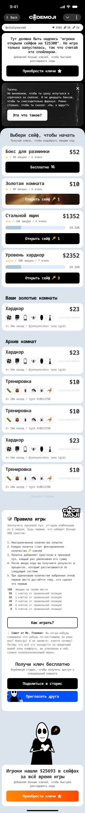
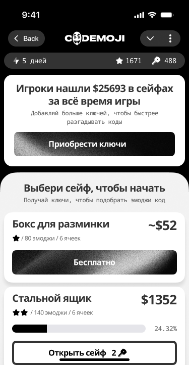
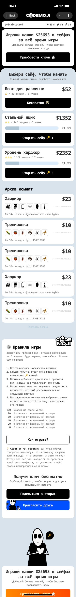
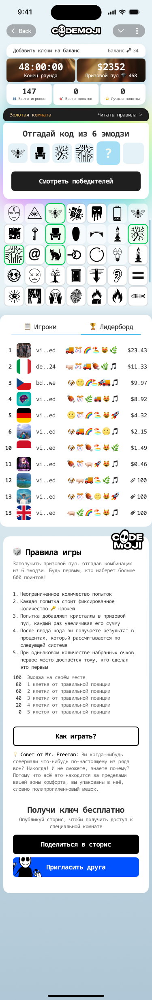
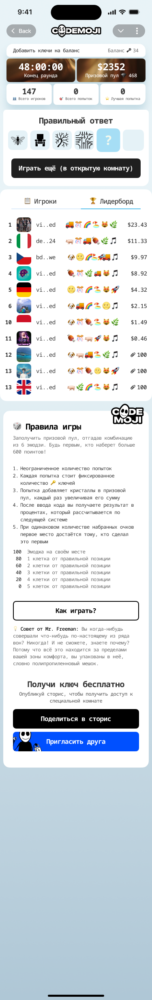

# 03 — Rooms (lobby + Golden Room states)

A **room** (`ROM`) is a template: it holds the props a `GAM` inherits at start — emoji set (`EMS`), duration, seeded prize pool, guess fee, free-or-paid, the game `type` (`classic` | `golden`), the sealed `payout_split`, the reduced-set `cell_count`, and the boost props (`golden` bool + `gold_multiplier`). At any moment a room either has **no** active game (waiting for the first player to join) or **exactly one** game in flight; the first player to join a waiting room starts the game, the room snapshots its props onto the `GAM`, and from that moment the round's terms are fixed (`02-rooms-and-emoji-sets.md` + `codemojex.design.md:130`).

The screens in this folder cover three room surfaces:

- the **rooms lobby** — a list of rooms by their props (3 variants)
- a **Golden Room in progress** — the boost class while a `classic` game is running
- a **Golden Room finished** — the boost class post-settlement

**Disambiguation reminder** ([README.md](README.md#golden-room-vs-golden-game-type--disambiguation)): a *Golden Room* is a boost class on a `classic`-type game (`golden: true` + `gold_multiplier: N` on `rooms` + `games`, applied at settlement as `effective_pool = pool * multiplier`, winner-take-all). A `golden` *type* game is the blind/sealed commit-reveal mode — different mechanism, no per-guess feedback, top-K payout. The screens here document the boost class on the classic base.

---

## Rooms lobby — canonical

| field | value |
|---|---|
| figma id | `121:2056` |
| figma label | `Rooms` |
| figma type | COMPONENT |
| figma page | UI |
| asset | [`assets/rooms-lobby-121-2056.png`](assets/rooms-lobby-121-2056.png) |
| role | rooms lobby — the room list (canonical master component) |
| game state | n/a (lobby is rooms-level, not game-level) |
| mode | n/a |
| entities | `ROM` |
| events | none — the lobby is an HTTP read against `rooms` (no per-room process exists, so a large idle field costs nothing) |

The lobby is the room-picker: a list rendered from the `rooms` table with the props a player needs to choose — emoji set, duration, seed prize pool, guess fee, paid/free, and (where set) the Golden Room boost. There is **no** per-room server process (`codemojex.design.md:178`); the lobby is a JSON read and joining a room is what mints a `GAM`. A player choosing a `paid` room commits `keys`; choosing a `free` room commits `clips` — the two paths never cross (`01-currency-model.md`).

The canonical component is `121:2056`; design variants `561:12013` and `846:15620` below explore the same surface.

---

## Rooms lobby — variant `561:12013`

| field | value |
|---|---|
| figma id | `561:12013` |
| figma label | `Rooms` |
| figma type | COMPONENT |
| figma page | UI |
| asset | [`assets/rooms-lobby-variant-561-12013.png`](assets/rooms-lobby-variant-561-12013.png) |
| role | rooms-lobby design variant (second master component) |
| game state | n/a |
| mode | n/a |
| entities | `ROM` |
| events | none |

A second master component for the lobby — same surface contract as `121:2056`, different treatment.

---

## Rooms lobby — variant `846:15620`

| field | value |
|---|---|
| figma id | `846:15620` |
| figma label | `Rooms` |
| figma type | FRAME |
| figma page | UI |
| asset | [`assets/rooms-lobby-variant-846-15620.png`](assets/rooms-lobby-variant-846-15620.png) |
| role | rooms-lobby design exploration |
| game state | n/a |
| mode | n/a |
| entities | `ROM` |
| events | none |

A frame-level iteration of the lobby surface.

---

## Golden Room — in progress

| field | value |
|---|---|
| figma id | `1089:19410` |
| figma label | `Golden Room in progress` |
| figma type | COMPONENT |
| figma page | UI |
| asset | [`assets/golden-room-in-progress-1089-19410.png`](assets/golden-room-in-progress-1089-19410.png) |
| role | Golden Room with an active boosted game — shows `gold_multiplier` + effective pool |
| game state | `open` |
| mode | `classic` (the boost class rides on the classic base) |
| entities | `ROM` · `GAM` · `PLR` |
| events | `scored` events from `game:<id>` (classic mode — live per-guess) |

A Golden Room is one where the platform is funding a multiplied diamond payout: the boost is `gold_multiplier` (default `3×` unless a multiplier is given), captured onto the round at start so editing the room — or ending the gold promotion — never changes the terms of a round already in flight (`golden-rooms.md:6` + `golden-rooms.md:9-16`).

This screen is what a player sees while the boosted game is open: the boosted pool (computed via `Codemojex.Economy.effective_pool(pool, true, mult)` = `pool * mult`, `golden-rooms.md:39`), the multiplier, the timer, the player count, and entry to the gameplay board. Because the game is `classic`-typed, per-guess `scored` events from `game:<id>` still fan out and the leaderboard updates live.

The room itself is a normal `ROM` row; the gold props (`golden: true` + `gold_multiplier`) are defaulted columns so existing rooms are unaffected by their presence (`golden-rooms.md:9-16`).

---

## Golden Room — finished

| field | value |
|---|---|
| figma id | `1108:27589` |
| figma label | `Golden Room finished` |
| figma type | COMPONENT |
| figma page | UI |
| asset | [`assets/golden-room-finished-1108-27589.png`](assets/golden-room-finished-1108-27589.png) |
| role | Golden Room post-settlement — winner-take-all of the boosted pool, golden_win moment |
| game state | `settled` |
| mode | `classic` |
| entities | `ROM` · `GAM` · `PLR` · `TXN` · `NOT` |
| events | PubSub `{:golden_win, …}` broadcast on the game's topic + `golden_win/4` Telegram notification |

The post-settlement Golden Room screen is the louder moment a Golden Room has been designed for. Settlement runs inside the one-shot `SET cm:<game>:closed NX` lock so a perfect-crack close and a timer close never both pay; the closer computes the effective pool, applies the ordinary winner-take-all split (the whole boosted pool to the top scorer, divided evenly on a tie), deposits each prize through the wallet path as a `TXN`, bumps `cm:total_won`, and marks the game `settled` (`golden-rooms.md:37-48`). A re-run pays identically — `effective_pool/3` is a pure function and the close lock prevents a double pay (`golden-rooms.md:48`).

The win is announced on two channels: a `{:golden_win, …}` message on the game's Phoenix PubSub topic (so anyone watching the room sees the moment fan out, the same way a `scored` event does) and a `golden_win/4` text notification through the `Codemojex.Notifier` (resolved via `Codemojex.Store.chat_of/1` to the winner's `tg_chat_id` and delivered by `echo_bot`). A player with no chat on file is paid all the same; the diamonds are the record, the notice is the flourish (`golden-rooms.md:50-52`).

After this screen the room transitions back to waiting (the `classic` traversal `open → settled`, then the room is reusable for the next game).

