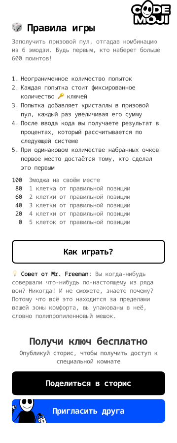
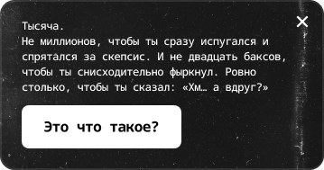
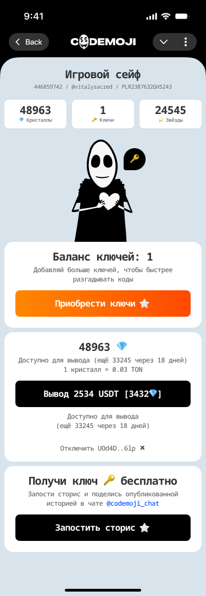
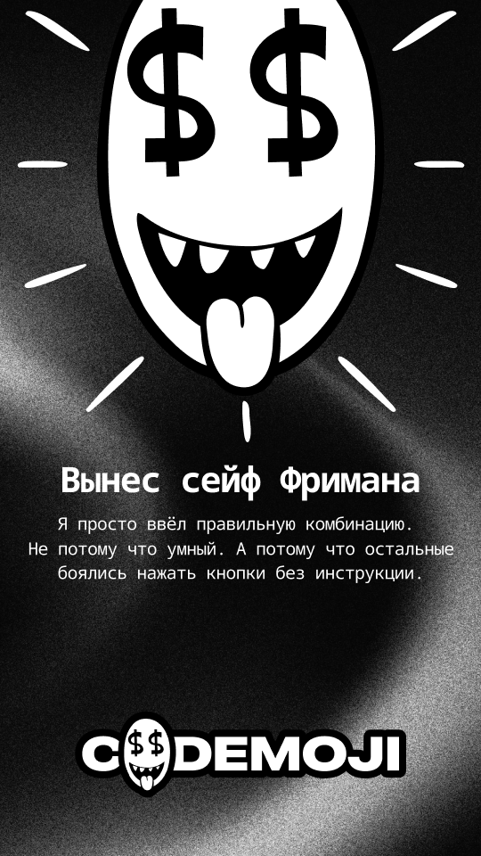
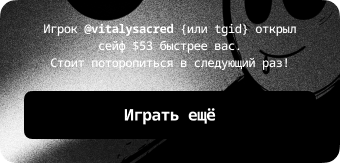

# 04 — Sections (embedded subsurfaces + end-of-game actions)

These are the screens that compose into the larger surfaces above: the emoji keyboard that lives inside the gameplay board, the wallet's withdraw flow, the winner card a closer fires at settlement, and the outbound sharing surface. Each has its own master component on the UI page and is meant to be embedded as an instance.

Vocabulary referenced here is defined in [`README.md`](README.md).

---

## Emoji section — canonical

| field | value |
|---|---|
| figma id | `338:19434` |
| figma label | `Emoji section` |
| figma type | COMPONENT |
| figma page | UI |
| asset | [`assets/emoji-section-338-19434.png`](assets/emoji-section-338-19434.png) |
| role | emoji keyboard — renders the game's snapshotted `cell_codes` from the `EMS` sprite via CSS background-position |
| game state | `active` |
| mode | both |
| entities | `EMS` · `GAM` |
| events | none server-side — client-side composition only, until the player submits a guess from the parent board |

The emoji section is the keyboard the player composes a guess on. It is one of the two `:cm_emojisets` (L1 ETS over L2 Valkey) cache reads the scoring hot path depends on, and its content for a given `GAM` is the **snapshotted** subset of the room's `EMS`. Codes are not Unicode characters — they are `XXYY` coordinates over the sprite grid (column then row), and the cell is rendered via CSS `background-image` + `background-position` arithmetic:

```text
x = parseInt(code.slice(0, 2), 10)      // column
y = parseInt(code.slice(2, 4), 10)      // row
bgPositionX = -x * cellSize             // e.g. -3 * 144 = -432
bgPositionY = -y * cellSize             // e.g. -5 * 144 =  -720
// CSS: background-position: -432px -720px;
```

(`02-rooms-and-emoji-sets.md:26-39`)

The keyboard the player sees is the game's snapshot, not the live room set — editing the room mid-game cannot reshape an in-flight keyboard, which matters because the `cell_codes` are how the secret was drawn (`codemojex.design.md:86`). A `golden`-type game may have a **reduced** keyboard (`cell_count` < the room's full set) — the same snapshot mechanism handles both.



---

## Emoji section — variant

| field | value |
|---|---|
| figma id | `880:16663` |
| figma label | `Emoji section` |
| figma type | COMPONENT |
| figma page | UI |
| asset | [`assets/emoji-section-variant-880-16663.png`](assets/emoji-section-variant-880-16663.png) |
| role | emoji-keyboard design variant |
| game state | `active` |
| mode | both |
| entities | `EMS` · `GAM` |
| events | none |

A second master component for the keyboard panel — same rendering contract (`EMS` cells over the CSS sprite grid).



---

## Withdraw

| field | value |
|---|---|
| figma id | `480:11657` |
| figma label | `Withdraw` |
| figma type | COMPONENT |
| figma page | UI |
| asset | [`assets/withdraw-480-11657.png`](assets/withdraw-480-11657.png) |
| role | wallet flow — today scoped to diamonds → keys at 10:1; cash-out remains open |
| game state | n/a |
| mode | n/a |
| entities | `PLR` · `TXN` |
| events | none server-fanout (HTTP only) |

The withdraw surface is the player's exit from the prize currency. The shipped operation here is the **diamonds → keys conversion** at a fixed 10:1 rate, executed atomically: the request validates `diamonds ≥ amount`, debits diamonds, credits `floor(diamonds / 10)` keys, and writes the paired `TXN` rows (one debit + one credit, the reason fields cross-referencing each other) inside a single Postgres transaction guarded by a CHECK constraint on the player row (`01-currency-model.md:71-90` + `codemojex.design.md:88`). The non-negative invariant is the backstop the wallet leans on.

Cash-out (`diamonds → fiat`) is **not** shipped today and is an Open Question for legal review: `codemojex.design.md:255` — *"Diamonds convert to keys but are not withdrawable today; if cash-out is ever added, what verification and anti-fraud controls apply?"*. If this screen surfaces a "withdraw to wallet" action, it should be gated as future / disabled until that question is ruled.

While a conversion is pending the diamonds are held in `locked_diamonds` and released on completion (`01-currency-model.md:74-77`); the surface should reflect locked vs. available.



---

## Winner

| field | value |
|---|---|
| figma id | `771:15371` |
| figma label | `Winner` |
| figma type | COMPONENT |
| figma page | UI |
| asset | [`assets/winner-771-15371.png`](assets/winner-771-15371.png) |
| role | winner card — fires at game close on the winning player's surface |
| game state | `settled` |
| mode | `classic` |
| entities | `GAM` · `PLR` · `TXN` · `NOT` |
| events | the final `:scored` on `game:<id>` + the winner-take-all settle inside the close lock |

The winner card is what the closer fans out at the moment a `classic` game settles. The trigger is the exactly-once close — a perfect 600 inside `ScoreWorker` or the timer winning the `SET cm:<game>:closed NX` lock — at which point the closer reads the top of the board, computes the winner-take-all split over the diamond pool (shared evenly on a tie), deposits each prize through the wallet as a `TXN`, bumps `cm:total_won`, marks the game `settled`, and returns the room to waiting (`codemojex.design.md:166-168`).

The card pairs with two notifications: a `prize_won/3` text notification (or `golden_win/4` if the room is gold-boosted — see [03-rooms.md#golden-room-finished](03-rooms.md#golden-room-finished)) enqueued on the `cm.notify` lane, and the channel push that lets the live surface show the moment to everyone watching (`notifications.md:33` + `notifications.md:63-66`).

A `golden`-type game has its own surface — the `revealed` event carrying the secret, the final board, and the payouts in one fat push (`codemojex.design.md:180`) — and this winner card is the `classic`-mode flourish; build the golden variant separately if/when the design lands.



---

## Sharing

| field | value |
|---|---|
| figma id | `880:16909` |
| figma label | `Sharing` |
| figma type | FRAME |
| figma page | UI |
| asset | [`assets/sharing-880-16909.png`](assets/sharing-880-16909.png) |
| role | outbound share panel — generates a sharable card with the player's ref link |
| game state | n/a |
| mode | n/a |
| entities | `PLR` |
| events | none |

The sharing surface is the outbound growth seam: it composes a player-branded card and exposes a Telegram-share action. Two on-canvas text nodes name the slots — `>> telegram link >>` (`416:9670`, `521:12768`) and `+ ref link + UID` (`801:15359`) — i.e. the surface stitches a referral link with the player's `UID` into the share payload. The `Sharing` component-set (`398:6051`) carries the variants the frame composes.

Outbound delivery is **not** through the `cm.notify` lane (that lane is for game-system → player text notifications, see [notifications.md](../../../echo/apps/codemojex/docs/notifications.md)); it is a client-side share via Telegram's native share intent, with the card rendered locally from the player's `PLR` + ref attribution. The sharable *image* a recipient sees is one of the story cards in [05-stories.md](05-stories.md) (RU master + EN instance), so this surface should pick the localization that matches the player's `initData` language.


