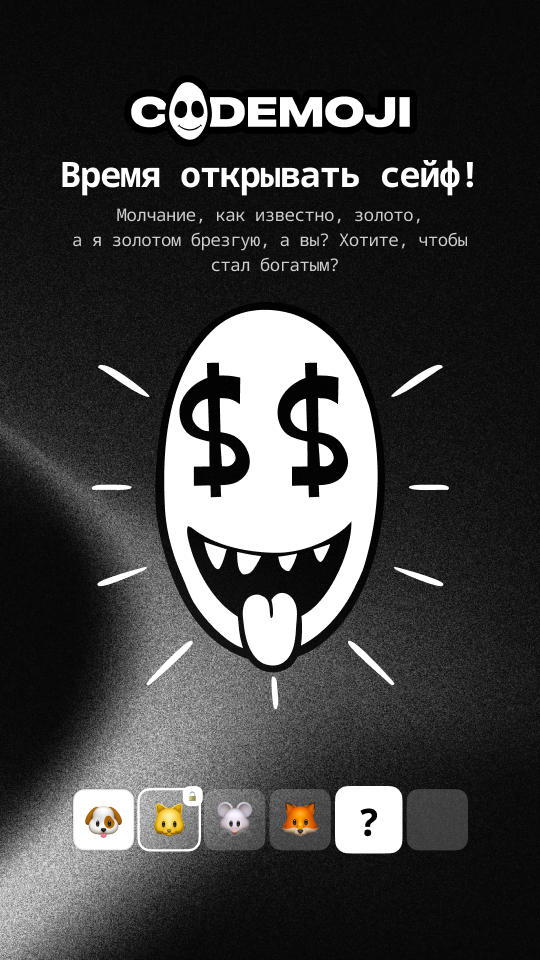
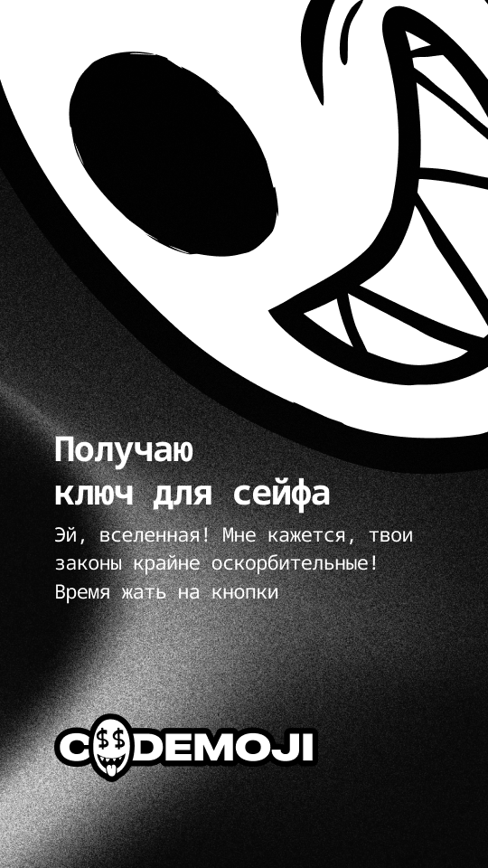
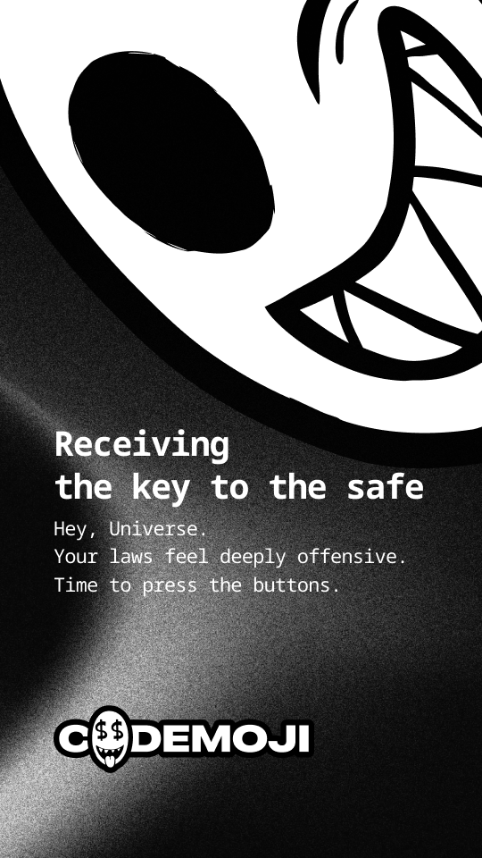
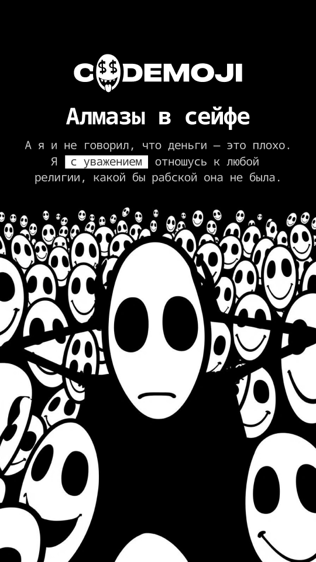
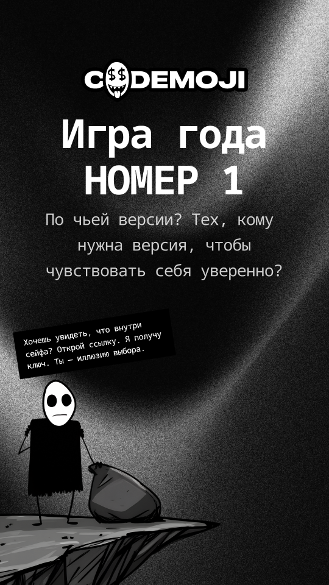
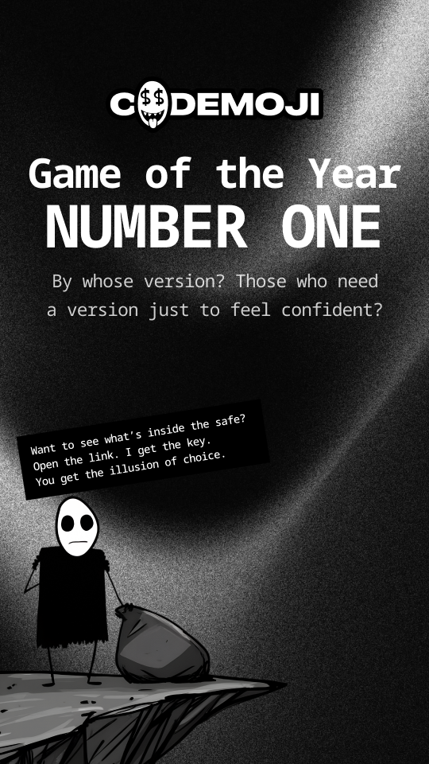
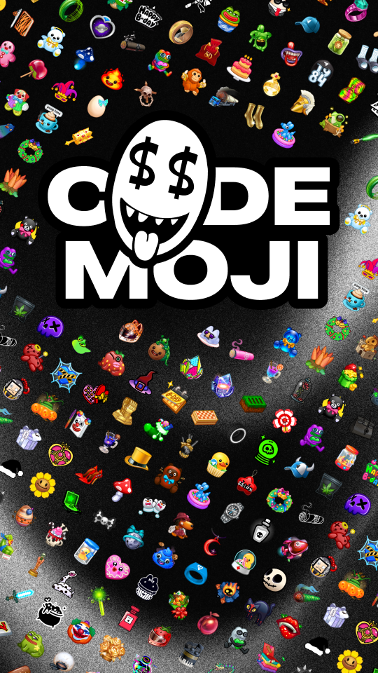
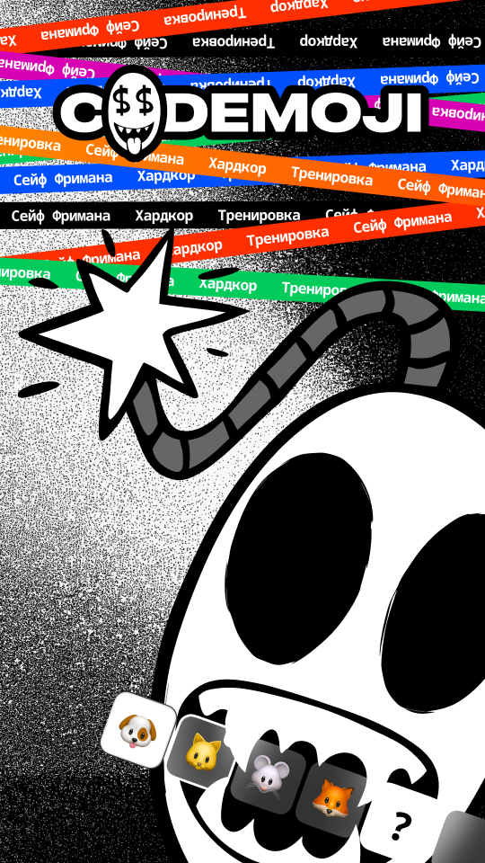

# 05 — Stories (sharable cards)

The story cards are the image payload of the [Sharing surface](04-sections.md#sharing) — six designed variants (`v1..v6`), each authored as a Russian master `COMPONENT` and surfaced as an English `INSTANCE` (with one English variant authored as a stand-alone `FRAME` rather than an instance). They are designed to be embedded in Telegram messages a player sends from the sharing surface and rendered as a recipient-facing first impression of the game.

These screens carry **no** game-system state on their own — they are post-game flourishes and referral collateral, not a live channel surface. The system data they reference (a player's nickname, a winning score, a multiplier) is composed onto the card client-side from `PLR` props the sharing surface already has; the bus / `cm.notify` lane is **not** involved (that lane is system → player only, see [notifications.md](../../../echo/apps/codemojex/docs/notifications.md)).

The pairing is one master component per variant + one English instance (or frame). The instances inherit layout + tokens from the masters; localize text by overriding the slot on the instance, not by forking the master.

Vocabulary referenced here is defined in [`README.md`](README.md).

---

## story RU v1

| field | value |
|---|---|
| figma id | `521:12680` |
| figma label | `story RU v1` |
| figma type | COMPONENT |
| figma page | UI |
| asset | [`assets/story-ru-v1-521-12680.png`](assets/story-ru-v1-521-12680.png) |
| role | sharable story card (RU master component v1) |
| game state | n/a |
| mode | n/a |
| entities | `PLR` |
| en_instance | [`726:14576` (`story EN v1`)](#story-en-v1) |

The first share-card master in Russian. The English instance at `726:14576` overrides the text slots; layout + tokens come from the master.

---

## story EN v1

| field | value |
|---|---|
| figma id | `726:14576` |
| figma label | `story EN v1` |
| figma type | INSTANCE |
| figma page | UI |
| asset | [`assets/story-en-v1-726-14576.png`](assets/story-en-v1-726-14576.png) |
| role | sharable story card (EN instance of v1) |
| game state | n/a |
| mode | n/a |
| entities | `PLR` |
| instance_of | [`521:12680` (`story RU v1`)](#story-ru-v1) |

English variant — text overrides only.

---

## story RU v2

| field | value |
|---|---|
| figma id | `521:12681` |
| figma label | `story RU v2` |
| figma type | COMPONENT |
| figma page | UI |
| asset | [`assets/story-ru-v2-521-12681.png`](assets/story-ru-v2-521-12681.png) |
| role | sharable story card (RU master component v2) |
| game state | n/a |
| mode | n/a |
| entities | `PLR` |
| en_instance | [`726:14577` (`story EN v2`)](#story-en-v2) |

---

## story EN v2

| field | value |
|---|---|
| figma id | `726:14577` |
| figma label | `story EN v2` |
| figma type | INSTANCE |
| figma page | UI |
| asset | [`assets/story-en-v2-726-14577.png`](assets/story-en-v2-726-14577.png) |
| role | sharable story card (EN instance of v2) |
| game state | n/a |
| mode | n/a |
| entities | `PLR` |
| instance_of | [`521:12681` (`story RU v2`)](#story-ru-v2) |

---

## story RU v3

| field | value |
|---|---|
| figma id | `727:14849` |
| figma label | `story RU v3` |
| figma type | COMPONENT |
| figma page | UI |
| asset | [`assets/story-ru-v3-727-14849.png`](assets/story-ru-v3-727-14849.png) |
| role | sharable story card (RU master component v3) |
| game state | n/a |
| mode | n/a |
| entities | `PLR` |
| en_instance | [`727:14850` (`story EN v3`)](#story-en-v3) |

---

## story EN v3

| field | value |
|---|---|
| figma id | `727:14850` |
| figma label | `story EN v3` |
| figma type | INSTANCE |
| figma page | UI |
| asset | [`assets/story-en-v3-727-14850.png`](assets/story-en-v3-727-14850.png) |
| role | sharable story card (EN instance of v3) |
| game state | n/a |
| mode | n/a |
| entities | `PLR` |
| instance_of | [`727:14849` (`story RU v3`)](#story-ru-v3) |

---

## story RU v4

| field | value |
|---|---|
| figma id | `727:14964` |
| figma label | `story RU v4` |
| figma type | COMPONENT |
| figma page | UI |
| asset | [`assets/story-ru-v4-727-14964.png`](assets/story-ru-v4-727-14964.png) |
| role | sharable story card (RU master component v4) |
| game state | n/a |
| mode | n/a |
| entities | `PLR` |
| en_instance | [`732:15272` (`story EN v4`)](#story-en-v4) |

---

## story EN v4

| field | value |
|---|---|
| figma id | `732:15272` |
| figma label | `story EN v4` |
| figma type | FRAME |
| figma page | UI |
| asset | [`assets/story-en-v4-732-15272.png`](assets/story-en-v4-732-15272.png) |
| role | sharable story card (EN translation of v4, FRAME rather than INSTANCE) |
| game state | n/a |
| mode | n/a |
| entities | `PLR` |
| translation_of | [`727:14964` (`story RU v4`)](#story-ru-v4) |

The v4 EN is authored as a standalone `FRAME` rather than as an instance — outside the master/instance discipline the other versions follow. Worth deciding whether to re-author it as an instance for consistency, or to leave it as the divergence the file ships with today.

---

## story RU v5

| field | value |
|---|---|
| figma id | `861:65455` |
| figma label | `story RU v5` |
| figma type | COMPONENT |
| figma page | UI |
| asset | [`assets/story-ru-v5-861-65455.png`](assets/story-ru-v5-861-65455.png) |
| role | sharable story card (RU master component v5) |
| game state | n/a |
| mode | n/a |
| entities | `PLR` |
| en_instance | [`862:16637` (`story EN v5`)](#story-en-v5) |

---

## story EN v5

| field | value |
|---|---|
| figma id | `862:16637` |
| figma label | `story EN v5` |
| figma type | INSTANCE |
| figma page | UI |
| asset | [`assets/story-en-v5-862-16637.png`](assets/story-en-v5-862-16637.png) |
| role | sharable story card (EN instance of v5) |
| game state | n/a |
| mode | n/a |
| entities | `PLR` |
| instance_of | [`861:65455` (`story RU v5`)](#story-ru-v5) |

---

## story RU v6

| field | value |
|---|---|
| figma id | `862:16636` |
| figma label | `story RU v6` |
| figma type | COMPONENT |
| figma page | UI |
| asset | [`assets/story-ru-v6-862-16636.png`](assets/story-ru-v6-862-16636.png) |
| role | sharable story card (RU master component v6) |
| game state | n/a |
| mode | n/a |
| entities | `PLR` |
| en_instance | [`862:16638` (`story EN v6`)](#story-en-v6) |

---

## story EN v6

| field | value |
|---|---|
| figma id | `862:16638` |
| figma label | `story EN v6` |
| figma type | INSTANCE |
| figma page | UI |
| asset | [`assets/story-en-v6-862-16638.png`](assets/story-en-v6-862-16638.png) |
| role | sharable story card (EN instance of v6) |
| game state | n/a |
| mode | n/a |
| entities | `PLR` |
| instance_of | [`862:16636` (`story RU v6`)](#story-ru-v6) |

