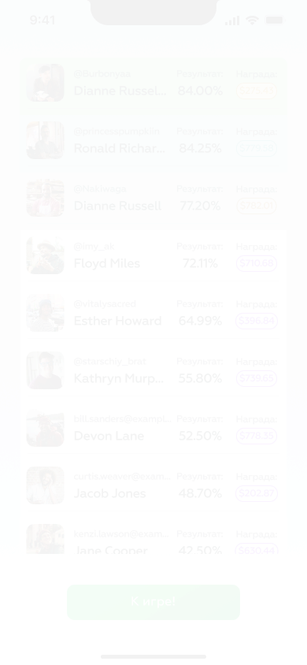

# 06 — Meta (leaderboard + emoji history)

The leaderboard and the per-player attempt history are the two read-only competitive views. They are both gated by the privacy invariant the engine carries in the shape of its views: no view returns the secret, no view returns another player's guesses (`codemojex.design.md:184-186`).

Vocabulary referenced here is defined in [`README.md`](README.md).

---

## Leaderboard

| field | value |
|---|---|
| figma id | `21:759` |
| figma label | `Лидерборд v2?` |
| figma type | FRAME |
| figma page | UI |
| asset | [`assets/leaderboard-21-759.png`](assets/leaderboard-21-759.png) |
| role | leaderboard — per-game `cm:<game>:board` ZSET ranked by raw best linear total |
| game state | `active`, `revealing` (golden withholds until reveal), or `settled` |
| mode | both — classic shows live; golden gates by `revealed_ms` |
| entities | `GAM` · `PLR` · `GES` |
| events | `scored` on `game:<id>` (classic) updates the ranking live |

The leaderboard is a Valkey sorted set per game (`cm:<game>:board`), scored by the player's best linear total. When `ScoreWorker` finishes scoring a guess it writes the player's best total into the `cm:<game>:base` hash and reflects it into the ZSET; the board ranks the raw best total — there is no tier ladder, no first-mover bonus, and no effective-vs-base distinction (`codemojex.design.md:139` + `codemojex.design.md:172`).

For a `classic` game, `scored` events on `game:<id>` update the surface live — the leaderboard re-renders without any per-room process (`codemojex.design.md:180`). For a `golden` game the leaderboard is part of the privacy boundary: no score, no points, no leaderboard fields cross the wire until the game's `revealed_ms` is set (`codemojex.design.md:92`); the surface should show a sealed-state placeholder until the `revealed` event arrives.

A separate in-memory CHAMP projection (`Codemojex.Leaderboard` / `EchoData.ChampServer`) is available as a rebuildable view (`codemojex.design.md:90` + `codemojex.design.md:209`); the live surface reads the Valkey ZSET, the CHAMP is for the internal projection.

The `v2?` in the figma label suggests this is a redesigned version under consideration — diff against any earlier leaderboard variants before implementing.

---

## Emoji history (per-player attempt history)

| field | value |
|---|---|
| figma id | `35:991` |
| figma label | `ЭмодзиИстория` |
| figma type | FRAME |
| figma page | UI |
| asset | [`assets/emoji-history-35-991.png`](assets/emoji-history-35-991.png) |
| role | per-player attempt history — own `GES` only (never others); the privacy invariant in shape |
| game state | any |
| mode | both |
| entities | `PLR` · `GES` · `GAM` |
| events | none real-time (the surface re-reads on demand) |

The emoji history is what a player sees of their *own* attempts — their `GES` rows for the games they have played, with the emojis they submitted, the linear `points` they earned (out of 600), and the per-position breakdown. The view never returns another player's guesses; the read shape *is* the privacy gate (`codemojex.design.md:92` + `codemojex.design.md:184-186`).

For a `golden` game whose `revealed_ms` is not set, the points / score columns are gated — the view widens only after the sealed reveal at close — so this surface should distinguish "scored, awaiting reveal" from "scored, value shown."

The per-game `attempts` counter (`cm:<game>:attempts` in Valkey) reflects total guesses across all players; the history view shows only this player's slice of the `guesses` table indexed by `(game, player)` (`codemojex.design.md:137` + `codemojex.design.md:139`).

