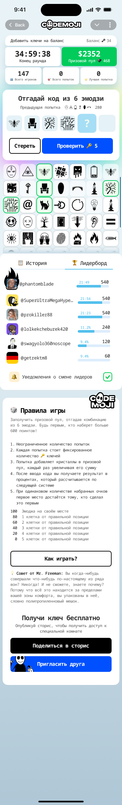
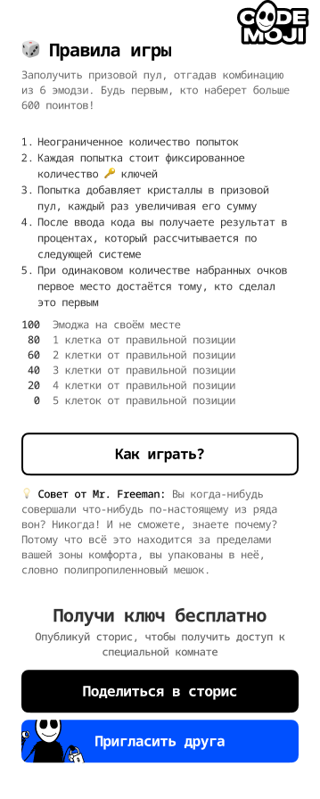
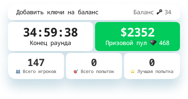
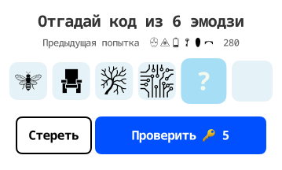
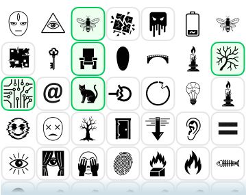
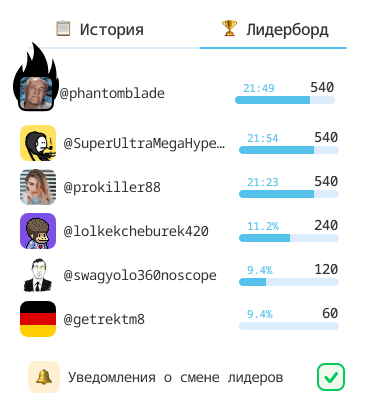

# Codemoji — the Game Screen (`CODEMOJIES`)

> Comprehensive design + build doc for the **classic** gameplay screen: the rendered screen, every
> on-screen control mapped to its React component, and the game mechanics behind them. Grounded in
> the Figma extraction (`node/codemoji-design/figma/codemojies/`), the backend canon
> (`docs/codemojex/codemojex.design.md` + `echo/apps/codemojex`), and the React frontend
> (`node/codemoji-app`). Every mechanic and control is cited to a real file; where the UI and the
> code disagree, the gap is flagged rather than smoothed over.
>
> Figma source: screen `94:2974` ("CODEMOJIES"), 375×2461 (iOS). Renders are the **ru** locale; the
> verbatim rules quoted below are the **en** strings. The sibling `screens/game-golden/` covers the
> golden (blind) variant.

---

## 1. The screen at a glance



The screen is one vertical scroll. Top → bottom, as actually mounted in
`node/codemoji-app/src/pages/game/game.page.tsx:241-279` (wrapped in `<EmojiSetProvider>`):

| # | Block | React component | Figma figure |
|---|---|---|---|
| 1 | Info / balance / timer / prize card | `widgets/lobby-info` → `LobbyInfo` | `94:3354` "Info" |
| 2 | Guess card — 6 slots + Check/Clear | `widgets/emotion-picker` → `EmotionPicker` | `245:2156` "Emoji section" |
| 3 | Emoji keyboard (tap to place) | `shared/ui/emoji-keyboard` → `EmojiKeyboard` | `708:17361` "Frame 92" |
| 4 | History / Leaderboard tabs | `pages/game` → `GameTabs` (`GoldenGameTabs` if golden) | `709:38903` "Component 61" |
| 5 | Rules card | `widgets/game-rules` → `GameRules` | `338:19435` "Emoji section" |
| 6 | Mid-game leader dialog | `widgets/first-place-dialog` → `FirstPlaceDialog` | (overlay) |

> **Layer names lie; the render is the truth.** Figma names `708:17361` "Frame 92" and `338:19435`
> "Emoji section", but they are the *keyboard* and the *rules* block respectively. This is the same
> lossiness the `docs/figma-local/` MCP enhancement addresses.

**Two emoji render paths** (do not conflate):
- **Gameplay** (keyboard, guess slots, previous-attempt, history) uses a **per-game sprite sheet** —
  `shared/ui/sprite-emoji` renders a CSS `background-position` keyed by an `XXYY` code (column, row),
  matching the backend `EmojiSet` exactly (`echo/apps/codemojex/lib/codemojex/emoji_set.ex:1-9,45-55`).
- **Chrome / decorative** (tab icons, the rules card glyphs) uses **emoji-mart + the Apple CDN** via
  `shared/ui/apple-emoji`.

---

## 2. Game mechanics

### 2.1 The core loop — 6-emoji Mastermind

Codemoji is a **real-time, multiplayer code-breaking competition** — *Mastermind played with an emoji
keyboard, for money* (`docs/codemojex/codemojex.design.md:5`). A hidden secret of **six distinct
emojis** is drawn per game (`emoji_set.ex:13,67`). The player builds a 6-emoji guess from the
keyboard and submits it **as many times as they want** until the timer ends (or, in classic, until
someone cracks it). Submit requires exactly six: backend `Game.submit … when length(emojis) == 6`
(`echo/apps/codemojex/lib/codemojex/game.ex:21`); frontend `if (selectedCount !== 6) { valid: false }`
(`node/codemoji-app/src/features/game/model/gameplay.store.ts:237`).

### 2.2 Scoring — graded *distance*, not black/white pegs

This is the most important nuance and the one the screenshot makes concrete. There are **no**
"right-emoji-wrong-place vs absent" pegs. Each guessed emoji scores by **how far it sits from its
position in the secret**: `points = 100 − 20·d` for distance `d ∈ 0..5`, and `0` for an emoji that is
absent from the secret (`echo/apps/codemojex/lib/codemojex/scoring.ex:17,21`). A present-but-misplaced
emoji still scores, decaying with distance. The per-guess total is out of **600** (6×100); the
percentage is `round(total/600*100)`, computed and never stored (`scoring.ex:13,52`).

| distance | points | status word | rules-card text (en) |
|---|---|---|---|
| exact spot (0) | 100 | `EXACT` | "Right emoji, right spot" |
| 1 slot | 80 | `ADJACENT` | "Right emoji, 1 slot away" |
| 2 slots | 60 | `NEAR` | "Right emoji, 2 slots away" |
| 3 slots | 40 | `NEAR` | "Right emoji, 3 slots away" |
| 4 slots | 20 | `FAR` | "Right emoji, 4 slots away" |
| 5 slots / absent | 0 | `MAX` / `MISS` | "Wrong emoji or too far" |

> *"a guessed emoji that exists in the secret earns `100 − 20·d` for its distance `d`, zero for a
> miss, summing out of 600. … The score is linear only — there is no tier ladder and no first-mover
> bonus; the raw best total is the rank."* (`codemojex.design.md:84`)

The leaderboard keeps each player's **best** total only (`board.ex:18-22`); ties break by who reached
the score first.

**Feedback visibility is mode-dependent** (`game.ex:122-145`, `rooms.ex:128`):
- **classic** (`feedback: "score"`) — the per-guess score is published live (the "280" on the guess
  card, the scores on the leaderboard).
- **golden** (`feedback: "none"`) — blind; the score exists server-side but nothing leaks until the
  secret is revealed at close.

### 2.3 The economy — three currencies (and "crystals" = diamonds)

> *"Three currencies move through the game — keys, clips, and diamonds — each in its own lane, all
> mutated atomically in Postgres."* (`codemojex.design.md:26`)

| Currency | UI label | Role | Earned | Spent |
|---|---|---|---|---|
| **keys** 🔑 | "keys" | guess fee in **paid** rooms | bought with Telegram Stars (`wallet.ex:108`) | `guess_fee`/guess, default **1** (`wallet.ex:97-105`) |
| **clips** | RU "скрепки"; `bonusKeys` in the API | guess fee in **free** rooms (carry no cash value) | sharing / inviting (+50 per invite, once daily) | `clip_cost`/guess, default **1** |
| **diamonds** 💎 | **EN "Diamonds" / RU "Кристаллы" (Crystals)** | the prize-pool currency | won from pools | convert to keys 10:1 (`economy.ex:16`) |

**Vocabulary trap (load-bearing):** the UI variable is named `crystals` (`totalCrystals`,
`MIN_WITHDRAW_CRYSTALS`), fed from the backend `diamonds` field; the *displayed* word is
language-dependent — **"Diamonds" (en) / "Кристаллы" (ru)**. So **crystals == diamonds == 💎**
(`node/codemoji-app/src/shared/libs/consts/currency.consts.ts`). Rate: 1 key = 10 diamonds ≈ 12¢.

**What a key does:** buys **one guess attempt**. `Wallet.charge_guess` debits `:keys` by `guess_fee`
in a paid room, or `:clips` by `clip_cost` in a free room — every change an all-or-nothing Postgres
transaction with `SELECT … FOR UPDATE`, a non-negative `CHECK`, and a paired `TXN` ledger entry
(`wallet.ex:97-105,158-217`). The Check button shows the cost inline ("Check 🔑 5").

**The prize pool** is platform-seeded at room creation (`seed_pool`, diamonds, `rooms.ex:33,96-97`);
golden rooms multiply it at close by `gold_multiplier` (default **3×**, `economy.ex:34-36`).

> ⚠️ **Rules-vs-code divergence (flagged, not asserted):** the in-app rules say *"Every attempt adds
> crystals to the growing prize pool."* In the backend the fee is charged in **keys/clips**, and
> `prize_pool` is platform-seeded + golden-boosted — **no code was found that adds the guess fee into
> `prize_pool`**. Treat fee→pool accrual as "not in current code."

### 2.4 Rooms, games, and the timer (no discrete rounds)

> *"A room is a template; a game is one play in it."* (`codemojex.design.md:26`)

`ROM` (room) is a reusable template + props; `GAM` (game) is one playthrough — hence the route
`/game/:roomId/:gameId` (`game.page.tsx:71`). The **first player to join a waiting room starts a
game**: the emoji set + props are snapshotted, a secret of six distinct codes is drawn, and a single
timer begins (`rooms.ex:53-117`). Later joiners enter the *same* active game. There are **no discrete
rounds** — one game = one secret + one timer + **unlimited guesses** until close; after settlement the
room returns to waiting for the next game (`rooms.ex:307-314`). Default `duration_ms` ≈ **35 hours**
(`rooms.ex:32`); the `SessionTimer` counts down to `gameState.endsAt` (the "End of round" clock on the
info card is the *game* timer, not a per-round one).

Game state machine (`schemas/game.ex:33`, `codemojex.design.md:136-162`):
`scheduled · open · active · revealing · settling · settled · voided` — classic runs `open → settled`;
golden runs `open → revealing → settling → settled`.

### 2.5 Authority + submission path

The host **never scores** — it validates, charges, and enqueues; a single worker scores. This is the
BCS "system over the wire" discipline.

1. **Admission** — `Codemojex.Guesses.submit/3` (lives in `game.ex`): admit only if `:open` and not
   expired → validate all 6 emojis are in the game's keyboard → overlay any position locks
   (`Locks.merge`) → `Wallet.charge_guess` → enqueue a branded `JOB` on the **player's own lane**
   (queue `"cm"`) (`game.ex:13,25-37`). Only a *charged* guess enqueues.
2. **Scoring** — `Codemojex.ScoreWorker.handle/1`, the single authority: read the secret from an
   immutable cache → `Scoring.score(secret, emojis)` → persist a `GES` guess with `points: total` →
   bump `cm:<game>:attempts` → `Board.record` the best → (classic only) publish `scored` (name + pct,
   never the secret) → a perfect 600 closes the game (`game.ex:85-153`). Scoring is pure + idempotent.

Frontend submit: the Check button → `useGuessSubmitMutation` → `POST /game/:gameId/guess`
(`features/game/api/game.api.ts:45-55`, `features/emoji-actions/ui/check-clear-buttons.tsx:71-74`).

### 2.6 Win / lose / end states

| Mode | Closes on | Payout |
|---|---|---|
| **classic** | a perfect **600 crack** (`game.ex:144`) **or** timer expiry | **winner-take-all** to the top scorer, split on tie (`economy.ex:43-49`) |
| **golden** | the **timer only** (no early close) | reveal secret + nonce, rank every guess linearly, pay **top-K** (default `top_k: 5`, weights `[40,25,15,12,8]`, dust to rank 1) (`economy.ex:62-77`) |

Closing is **exactly-once** via `SET cm:<game>:closed NX` — a perfect crack and the timer can race;
the loser no-ops (`rooms.ex:179-185`). Golden is **provably fair**: `commitment = SHA-256(code₀‖…‖code₅‖nonce)`
sealed at open, revealed at close (`rooms.ex:141-158`).

Frontend end-of-game dialogs (gated in `game.page.tsx:141-154`):
- **VictoryDialog** — `status === 'finalized' && myRank === 1`: confetti + success haptic, **auto-claims** the prize.
- **GameOverDialog** — finalized and not rank 1: reveals the `secretCode`; title varies by reason
  (`winner_found` / `time_expired` / `attempts_exceeded`).
- **FirstPlaceDialog** — mid-game, when a guess returns `isBecameLeader === true`: "you took the lead" + the prize pool.

### 2.7 The rules, verbatim (en — `node/codemoji-app/public/lang/en/translation.json:123-148`)



```
How to play Codemoji
Be the first or top-1 to guess the 6-emoji code and win the whole prize pool
- Make as many attempts as you want
- Each attempt costs a fixed number of keys.
- Every attempt adds crystals to the growing prize pool.   ← see §2.3 divergence flag
- After each attempt you get a score showing how close you are to crack the code
Scoring: 100 right spot · 80 1 away · 60 2 away · 40 3 away · 20 4 away · 0 wrong/too far
Tip from Mr. Freeman: "Ever done something truly epic? Nope and you never will…"
Free Tries: +50 Clips for inviting a friend. Available once daily.
```

The golden room's rules are an **external URL** (`GOLDEN_ROOM_RULES_URL`), not in the repo
(`pages/game/golden-game-tabs.tsx:225-234`).

---

## 3. The controls, mapped to React

Paths are relative to `node/codemoji-app/`. Stack: React 19 · **jotai** (client atoms) ·
**@tanstack/react-query** (server state) · **@dnd-kit** (slot reorder) · Tailwind v4 tokens in
`src/styles.css`.

### 3.1 Info / status card — `LobbyInfo`



`widgets/lobby-info/ui/lobby-info.tsx` → `LobbyInfo`. Reads `useGameStateQuery`, `useRoomStateQuery`,
`useMyResources`. Three rows:
- **CTA + balance:** "Add keys to balance" (paid → opens the keys-purchase drawer via
  `keysPurchaseDrawerAtom`, `lobby-info.tsx:159-173`) **or** "Tap here for clips" (free → share-to-story,
  `:106-156`); right: the 🔑 key balance.
- **Timer + pool:** "End of round" `HH:MM:SS` (`SessionTimer`, fed `gameState.endsAt`) | the green
  "Prize pool" block — `$` value + 💎 diamonds (token `bg-success` `#00D95F`; gold gradient if golden).
- **Stats:** Total players · Total attempts (`cm:<game>:attempts`) · Best attempt.

> Correction to the earlier figure→slice map: the game-screen info card is **`LobbyInfo`**, *not*
> `widgets/status-bar`. `StatusBar` mounts only on `/rooms`; `entities/balance` only on `/withdraw`.

### 3.2 The guess card — `EmotionPicker`



`widgets/emotion-picker/ui/emotion-picker.tsx` → `EmotionPicker` composes `<EmojiSlots totalSlots={6}>`
+ `<CheckClearButtons>`. Contents:
- **Title** "Guess the 6-emoji code".
- **Previous-attempt chip** (`shared/ui/previous-attempt`) — shows the last guess (sprite emojis) + its
  score; **tap** refills unlocked slots via `fillSlotsAtom` (`emotion-picker.tsx:19-27`).
- **6 guess slots** (`widgets/emoji-slots` → `EmojiSlots`) — see §4 for the tap/drag/lock model.
- **Clear** (outline) — wipes unlocked slots with a disintegrate animation. **Check 🔑 5** (primary) —
  submits the guess; disabled until `isSelectionReadyAtom` (6 filled) (`check-clear-buttons.tsx`).

### 3.3 The emoji keyboard — `EmojiKeyboard`



`shared/ui/emoji-keyboard/emoji-keyboard.tsx` → `EmojiKeyboard`, mounted `maxEmojis={6} columns={7}`
(`game.page.tsx:250-258`). **Tap** a cell → `toggleEmoji(emoji)` drops it into the first empty unlocked
slot; tap again to remove (`emoji-keyboard.tsx:64,99-101`), with a `selectionChanged()` haptic. Tiles
are the per-game **sprite sheet** (`<SpriteEmoji>`); a green-highlighted tile is one already placed
(`usedEmojis`). The keyboard's glyph set is the game's `cell_codes` — guesses are validated against it
server-side (`game.ex:29,56-73`).

### 3.4 History / Leaderboard tabs



Below the keyboard sits the tabbed block (`GameTabs`, classic; `GoldenGameTabs`, golden), **not** a
second emoji section. Default tab is **History** (`entities/history` → prior attempts as emoji rows +
score, `usePlayerGuessHistory(gameId)`). The **Leaderboard** tab (`entities/leaderboard` →
`LeaderboardList` + `LeaderboardItem`) shows avatar · username · best % or time · a progress bar
(`#54C0EC`) · score, marks `(you)` when `isCurrentPlayer`, and **auto-refreshes every 2 s**
(`useGameLeaderboard`, `refetchInterval: 2000`). The percentage is `finalPoints / MAX_SCORE`.

### 3.5 The rules card — `GameRules`

`widgets/game-rules/ui/game-rules.tsx` → `GameRules`: the rules text (§2.7), a "View onboarding"
button (`useOnboarding()`), and `<ShareForClips>` + `<InviteFriendButton>` (earn +50 clips). Glyphs
🎲/🔑/💡 use `AppleEmoji` (the chrome render path).

### 3.6 Consolidated control table

| Control | User action | React path · export | Key state / queries | Interaction · tokens |
|---|---|---|---|---|
| Keyboard key | **tap** → fill first empty slot | `shared/ui/emoji-keyboard` · `EmojiKeyboard` | `selectedEmojisAtom`, `toggleEmojiAtom`; `usedEmojis` | TAP; sprite sheet; green = used |
| Guess slot ×6 | **drag** to reorder, **tap** to lock | `widgets/emoji-slots` · `EmojiSlots` | `selectedEmojisAtom`, `lockedEmojisAtom`, `reorderEmojisAtom`, `toggleEmojiLockAtom` | @dnd-kit `useSortable`; lock badge; sprite |
| Check | **tap** to submit | `features/emoji-actions` · `CheckClearButtons` | `useGuessSubmitMutation`; `isSelectionReadyAtom` | TAP; primary blue; haptic `medium` |
| Clear | **tap** to wipe unlocked | same file · `CheckClearButtons` | `clearEmojisAtom`, `triggerDisintegrateAtom` | TAP; outline; 400 ms anim |
| Previous attempt | **tap** to refill | `shared/ui/previous-attempt` | `usePlayerGuessHistory`, `fillSlotsAtom` | TAP; sprite |
| Add keys / clips CTA | **tap** to buy / share | `widgets/lobby-info` (→ keys-purchase drawer / share) | `keysPurchaseDrawerAtom`, `useShareToStory` | TAP; `bg-[#0050FF]` |
| Session timer | watch (no input) | `features/session-timer` · `SessionTimer` | `setInterval(1s)`; `gameState.endsAt` | `HH:MM:SS` |
| Leaderboard | read; auto-refresh | `entities/leaderboard` · `LeaderboardList` | `useGameLeaderboard` `refetchInterval:2000` | progress bar `#54C0EC` |
| History | read prior attempts | `entities/history` · `HistoryList` | `usePlayerGuessHistory` | default tab; sprite rows |
| Rules | read; onboarding; share | `widgets/game-rules` · `GameRules` | `useOnboarding`; `ShareForClips` | `AppleEmoji` |
| Keys purchase | pick package → pay Stars | `features/keys-purchase` · `KeysPurchaseDrawer` | `useKeyPackages`, `usePurchaseKeys` → `tg.openInvoice` | `vaul` Drawer; ⭐ |

---

## 4. The interaction model (must get right)

- **Placement is TAP; only reordering is drag-drop.** Tapping a keyboard cell fills the first empty
  unlocked slot (`gameplay.store.ts:66-116`). Slots are `@dnd-kit` `useSortable` nodes; dragging a
  *filled, unlocked* slot reorders the guess (`emoji-slots.tsx:222-234`). A slot is non-draggable when
  empty or locked (`useSortable({ disabled: !emoji || isEmojiLocked })`, `:51-54`).
- **Tap-to-lock a position.** Tapping a filled slot toggles a lock on that **slot index**
  (`lockedEmojisAtom`, `emoji-slots.tsx:254`); locked slots survive Clear and stay pinned during
  reorder.
- **In-progress guess atoms** (`features/game/model/gameplay.store.ts`): `selectedEmojisAtom`
  (positional, holes allowed) · `lockedEmojisAtom` · `cleanSelectedEmojisAtom` (holes removed for
  submit); writers `toggleEmojiAtom`, `reorderEmojisAtom`, `toggleEmojiLockAtom`, `fillSlotsAtom`,
  `clearEmojisAtom`; gates `validateSelectionAtom` / `isSelectionReadyAtom`.

---

## 5. As-built caveats (build against these, not the screenshot)

The screen renders cleanly, but several surfaces are stubbed, mock, or wired to a different backend.
Anyone rebuilding the UI should know:

- **Position locks are not transmitted.** The UI collects `lockedPositions` and passes them to the
  mutation, but the mutation **drops them** — `mutationFn: (data) => submitGuess(gameId, data.guessCode)`
  sends only `guessCode` (`features/game/api/game.mutations.ts:30`). The backend fully supports
  per-position locks (`game.ex:31,75-78`); the frontend wiring is incomplete.
- **No realtime socket in the React app.** `socket.io-client` is a dependency but has **no usage in
  `src`**; the leaderboard relies on **2 s polling**. The backend canon uses Phoenix Channels
  `game:<id>` (`codemojex.design.md:180`).
- **The live API base diverges from the Phoenix backend.** React targets `/api/v2` on a separate
  "codemoji-backend" host (ngrok), with singular `POST /game/:id/guess` (`src/shared/api/axios.ts:5`,
  `features/game/api/game.api.ts:45`); the BCS Phoenix backend serves `/api`, plural
  `POST /api/games/:id/guess` (`echo/apps/codemojex/lib/codemojex_web/router.ex:17,37`). Same game
  design, two implementations — `echo/apps/codemojex` is the canon backend.
- **Stubs / mock / commented-out:** Withdraw is a `console.log` stub (no on-chain transfer);
  `widgets/selected-emojis` is defined but never mounted (live display is `emoji-slots`); the golden
  screen renders mock data (`MOCK_ALL_CODES`, `MOCK_GOLDEN_LEADERBOARD`); `KeysAddedDialog`,
  `ErrorDialog`, and the leaderboard-notification toggle are commented out in `game.page.tsx`.
- **`@codemoji/types` has no readable source in this checkout**, so `MAX_SCORE` and exact DTO shapes
  (`GameStateDto`, `GameLeaderboardEntryDto`, `PlayerResourcesDto`) are reconstructed from usage, not
  directly verified.

---

## 6. Tokens (the screen's palette → `node/codemoji-app/src/styles.css`)

All tokens live in `styles.css` under `@theme inline`; use the semantic utilities, never raw hex.
Font: `--font-sans: 'Noto Sans Mono'`. Screen-relevant tokens:

| Role | Token | Value |
|---|---|---|
| App background gradient | `--color-bg-from` → `--color-bg-to` | `#E8F3F7` → `#AFC7D6` |
| Card surface | `--card` | `#FFFFFF` |
| Prize-pool / success | `--color-success` | `#00D95F` |
| Primary action (Check, CTAs) | `--color-link` / `#0050FF` | blue |
| Accent | `--color-accent` | `#FF8400` |
| Muted / dark text | `--color-muted` / `--color-dark-muted` | `#666` / `#333` |
| Leaderboard progress | (literal) | `#54C0EC` |
| Type scale | `--text-h1` … `--text-2xs` | 20 px … 10 px |

Exact radii / spacing are not in the extraction JSON (a `figma-local` MCP gap — see
`docs/figma-local/`); read them from the reference renders in `images/` for now.

---

## 7. Sources

- **Renders:** `images/` (copied from `node/codemoji-design/figma/codemojies/reference/`); full
  extraction spec: `../../figma/codemojies/spec.md` + `tokens.md`.
- **Backend canon:** `docs/codemojex/codemojex.design.md`; engine
  `echo/apps/codemojex/lib/codemojex/{game,scoring,rooms,economy,wallet,board,emoji_set}.ex`.
- **Frontend:** `node/codemoji-app/src/{pages/game,features/game,features/emoji-actions,widgets/*,entities/*,shared/ui/*}`;
  rules text `public/lang/en/translation.json:123-148`; the app guide `node/codemoji-app/CLAUDE.md`.
